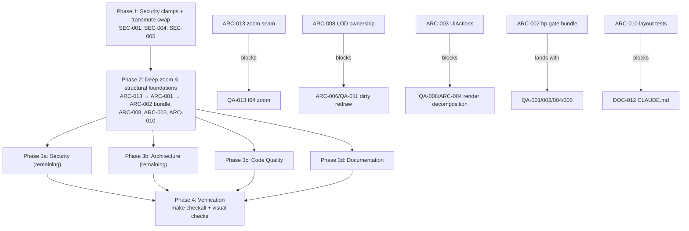

# Project Audit Report

> **Project**: par-fractal — cross-platform GPU-accelerated fractal renderer
> **Date**: 2026-07-16
> **Stack**: Rust (edition 2024, MSRV 1.85+), wgpu 29, winit, egui 0.35, WGSL; native (Metal/Vulkan/DX12) + WASM/WebGPU
> **Audited by**: Claude Code Audit System (4 Fable subagents: architecture, security, code quality, documentation)
> **HEAD at audit**: `8ee42cc` (v0.8.3, clean tree)

---

## Executive Summary

The project is in **fair-to-good** health: module layout, tooling, CI/delivery, and the platform abstraction are genuinely strong, but the two areas the user asked about — performance and infinite zoom — carry the most serious defects. The deep-zoom path has four independent bugs (unreachable `tricorn_hp`, mathematically wrong double-float `abs` in `burning_ship_hp`, a high-precision threshold that engages ~30–50× too late, and FMA-dependent `two_prod` with no fallback) that make zoom degrade one to two orders of magnitude earlier than its double-float math allows, with a hard architectural ceiling near zoom ~1e11 and no perturbation-theory path beyond it. On performance, the frame loop redraws static images at 60 Hz, runs three full-screen bloom passes even when bloom is disabled, and the LOD system is a no-op for 2D fractals while silently clobbering user settings in 3D. Remediating the critical + high issues is roughly 2–3 focused sprints; the perturbation subsystem for true infinite zoom is a separate multi-week project (planned in `docs/fable/ENH-001-perturbation-deep-zoom.md`). Standout strength: the double-float WGSL kernel and compute-accumulation subsystem are textbook-correct in design — the foundations for both fixes and the perturbation upgrade already exist in-repo.

### Issue Count by Severity

| Severity | Architecture | Security | Code Quality | Documentation | Total |
|----------|:-----------:|:--------:|:------------:|:-------------:|:-----:|
| 🔴 Critical | 2 | 0 | 4 | 2 | **8** |
| 🟠 High     | 6 | 2 | 8 | 5 | **21** |
| 🟡 Medium   | 8 | 3 | 10 | 8 | **29** |
| 🔵 Low      | 5 | 5 | 8 | 5 | **23** |
| **Total**   | **21** | **10** | **30** | **20** | **81** |

> Some findings were independently discovered by multiple agents and are cross-referenced rather than merged: ARC-002 ≙ QA-001+QA-004; ARC-011 ≙ QA-007 ≙ SEC-004; ARC-005 ≙ QA-006; ARC-006 ≙ QA-011; ARC-008 ≙ QA-010; ARC-010 ≙ QA-018. Fixing one fixes its twins.

---

## User-Directed Focus: Performance & Infinite Zoom

**Infinite zoom — where it actually breaks today.** Zoom state is a single `zoom_2d: f32` (`src/fractal/mod.rs:47`); the center is `[f64; 2]` split into hi/lo double-float pairs for the shader. The chain fails in stages:

1. **zoom ~3e4** — the plain f32 path visibly pixelates (per-pixel spacing drops below one f32 ulp at 1080p), but high precision doesn't engage until **1e6** (`src/renderer/uniforms.rs:285`) → two decades of corrupted rendering with the fix sitting idle (ARC-002/QA-004).
2. **Any zoom, Tricorn** — `tricorn_hp` is unreachable due to a `fractal_type <= 4u` gate (Tricorn is type 5) (ARC-002/QA-001).
3. **Any deep zoom, Burning Ship** — the double-float `abs` is mathematically wrong, injecting `2|lo|` error per iteration (QA-002).
4. **Backend-dependent** — `two_prod` requires a genuinely fused FMA; without one, hp mode silently collapses to f32 (QA-005).
5. **zoom ~1e10–1e12** — the double-float design's hard ceiling (~48–49 mantissa bits). Going further requires a perturbation-theory subsystem: CPU arbitrary-precision reference orbit + GPU delta iteration + series approximation (ARC-001 → ENH-001).

**Performance — where the frame budget goes.** A static 2D fractal re-renders at monitor rate with no dirty tracking (ARC-006/QA-011); three full-res `Rgba16Float` bloom passes run even with bloom off — the default (ARC-005/QA-006); iteration count *grows* with zoom (`+log2(zoom)×15` per pixel, in ~10–20× costlier DF math exactly where frames are most expensive); the LOD system cannot reduce 2D cost at all (no iteration lever), never registers 2D zoom/pan as motion, exposes a `render_scale` slider that does nothing, and writes derived quality into user-authored, persisted settings (ARC-007/ARC-008/QA-010); LOD motion tracking can NaN-poison itself permanently mid-session (QA-003).

**Priority impact:** these findings raise the priority of the LOD and frame-loop issues above what a generic audit would assign — they gate the deep-zoom experience the user cares about. The remediation ordering in the Remediation Plan reflects this.

---

## 🔴 Critical Issues (Resolve Immediately)

### [ARC-001] Deep-zoom architecture has a hard ceiling near zoom ~1e11–1e12 with no seam for going further
- **Area**: Architecture
- **Location**: `src/fractal/mod.rs:47`, `src/renderer/uniforms.rs:283-301`, `src/shaders/fractal.wgsl:355-465, 2946-2972`
- **Description**: Zoom is `f32`; center is f64 → hi/lo double-float (correctly implemented Knuth `two_sum` / FMA `two_prod`), giving ~48–49 effective mantissa bits. At 1080p pixel-level distinctness is lost at zoom ≈ 1e12, with iteration-error accumulation degrading images from ~1e10–1e11. The f32 `zoom` uniform divides every offset, so even the DF path inherits f32 scale error. No perturbation-theory path, no arbitrary-precision reference orbit. Every extra decade of zoom also *costs* more: `+log2(zoom)×15` iterations per pixel in 10–20× costlier DF arithmetic — maximum GPU cost exactly where precision runs out.
- **Impact**: "Infinite zoom" is architecturally capped at roughly 10^11 magnification.
- **Remedy**: (Foundations, this audit) store zoom as f64 with a single zoom-at-cursor seam (with ARC-013/QA-013); derive the hp threshold instead of hardcoding it. (Subsystem, planned separately) perturbation architecture: CPU arbitrary-precision reference orbit uploaded as a storage buffer (copy the Buddhabrot plumbing in `renderer/compute.rs`), per-pixel f32/f64 delta iteration (`Δz ← 2·Z_n·Δz + Δz² + Δc`), series/BLA iteration skipping, Pauldelbrot glitch detection with reference re-basing. Full plan: `docs/fable/ENH-001-perturbation-deep-zoom.md`.

### [ARC-002] High-precision gating engages ~30× too late and permanently excludes Tricorn
- **Area**: Architecture (independently found as QA-001 + QA-004)
- **Location**: `src/renderer/uniforms.rs:285`, `src/shaders/fractal.wgsl:2946-2972`
- **Description**: (1) DF mode auto-enables at `zoom_2d > 1_000_000.0`, but the f32 path quantizes visibly from zoom ≈ 3e4 (per-pixel spacing < one f32 ulp at |coord|≈1). (2) The gate `high_precision == 1u && fractal_type <= 4u` makes the trailing `else { t = tricorn_hp(...) }` (type 5) unreachable — Tricorn always falls to f32.
- **Impact**: Visible precision break-up two decades before DF activates; Tricorn never benefits from its finished hp implementation.
- **Remedy**: Gate on `fractal_type <= 5u` with an explicit `== 5u` branch; lower the auto-enable threshold to ~1e4 or derive it (`pixel_spacing < K · ulp(|center|)` CPU-side in `Uniforms::update`); name and document the constant. Must land together with QA-002 and QA-005 (see Blocking Relationships).

### [QA-001] Tricorn's high-precision function is unreachable — deep zoom silently falls back to f32
- **Area**: Code Quality (same defect as the second half of ARC-002)
- **Location**: `src/shaders/fractal.wgsl:2946`, `2970-2971`
- **Description**: Types 0–4 have explicit branches inside a `fractal_type <= 4u` gate, so the trailing `else { tricorn_hp }` can never run; Tricorn (type 5) fails the gate itself.
- **Impact**: Tricorn deep zoom pixelates at ~1e4–1e5 despite a complete working `tricorn_hp`.
- **Remedy**: `fractal_type <= 5u` + explicit `== 5u` branch (keep a safe else).

### [QA-002] `burning_ship_hp` double-float absolute value is mathematically wrong
- **Area**: Code Quality
- **Location**: `src/shaders/fractal.wgsl:506`
- **Description**: `let z_abs = df2(abs(z.hi), abs(z.lo) * sign(z.hi));` — correct DF `abs` negates both parts when `hi < 0`: taking `abs(z.lo)` destroys the low word's independent sign. Value `1.0 - 1e-9` (`hi=1.0, lo=-1e-9`) becomes `1.0 + 1e-9`: error of `2|lo|` per iteration, exactly the precision band DF exists to preserve. Also `sign(0.0) == 0.0` in WGSL zeroes `lo` when `hi` is exactly 0.
- **Impact**: High-precision Burning Ship degrades toward f32 quality at depth.
- **Remedy**: `let z_abs = df2(abs(z.hi), z.lo * select(1.0, -1.0, z.hi < vec2(0.0)));` (component-wise negate-when-hi-negative, avoiding `sign(0)`).

### [QA-003] Unclamped `acos` in LOD motion tracking can permanently NaN-poison the LOD system
- **Area**: Code Quality
- **Location**: `src/lod.rs:370`
- **Description**: `prev_camera_forward.dot(camera_forward).acos()` — the dot of two normalized vectors routinely exceeds 1.0 by ulps (especially when identical), and `acos(1.0000001)` is NaN. The NaN enters the EMA (`camera_velocity * 0.7 + NaN * 0.3`) and never leaves; `NaN > threshold` is false, so `is_moving` is permanently false.
- **Impact**: Motion and Hybrid LOD strategies silently die mid-session; quality never drops during camera movement.
- **Remedy**: `.clamp(-1.0, 1.0)` before `.acos()`.

### [QA-004] High-precision auto-enable threshold (zoom > 1e6) engages ~30–50× too late
- **Area**: Code Quality (same defect as the first half of ARC-002)
- **Location**: `src/renderer/uniforms.rs:285`; f32 path at `src/shaders/fractal.wgsl:2975-2978`
- **Description**: Per-pixel spacing is `(2/zoom)·(2/height)`; adjacent pixels collapse to the same f32 coordinate at roughly zoom 2e4–6e4 at 1080p, but hp turns on at 1e6.
- **Impact**: Every 2D fractal shows blocky pixelation across zoom ~3e4 → 1e6.
- **Remedy**: Lower to ~1e4 or compute dynamically from window height and center magnitude.

### [DOC-001] README documents wrong keybindings for core features
- **Area**: Documentation
- **Location**: `README.md` (Key Bindings tables, Command Palette section)
- **Description**: README says F9 = screenshot (F9 actually switches to Kleinian 3D; screenshot is **F12**, `src/app/input.rs:209`); Ctrl/Cmd+P = command palette (actual: **/** or **Ctrl/Cmd+K**; plain P cycles palettes); Space/Shift = 3D up/down (actual: **E/Q**, `src/camera.rs:110-114`); Mouse Wheel = 3D speed (no such handler exists — DOC-007). CONTROLS.md line 96 documents the F9 error in a note instead of it being fixed.
- **Impact**: Every new user following the front-door doc presses keys that do something else entirely.
- **Remedy**: Correct to F12 / "/" or Ctrl+K / E-Q; remove the wheel-speed row; then delete CONTROLS.md's apologetic note (DOC-018).

### [DOC-002] Rust 1.70+ requirement is wrong — project is Edition 2024
- **Area**: Documentation
- **Location**: `README.md` (badge line 6, line 185), `docs/QUICKSTART.md` (lines 21, 32, 54, 457), `CLAUDE.md`; `Cargo.toml` lacks `rust-version`
- **Description**: `Cargo.toml` declares `edition = "2024"` (requires Rust 1.85+); four docs say 1.70+ and QUICKSTART tells users to verify `rustc 1.70.0`.
- **Impact**: Source builds and `cargo install par-fractal` fail for anyone who validated their toolchain per the documented prerequisite, with a confusing edition error.
- **Remedy**: Update all four locations to 1.85+; add `rust-version = "1.85"` to `Cargo.toml` so it is machine-enforced.

---

## 🟠 High Priority Issues

### [ARC-003] `UI::render` is a 288-complexity God method with an 11-element tuple return
- **Location**: `src/ui/mod.rs:373` (file: 3,287 lines); call site `src/app/render.rs:610-628`
- **Description**: One method renders every panel and returns 11 positional values (`(bool, bool, bool, bool, bool, Option<Preset>, Option<(u32,u32)>, Option<CameraBookmark>, bool, bool, bool)`). #1 bridge symbol (betweenness 0.034, out-degree 69), cyclomatic complexity 288 — highest in the repo by 3×.
- **Impact**: Adjacent-bool mixups compile fine; untestable; merge-conflict magnet.
- **Remedy**: Return a `UiActions` struct (or event queue reusing the command-palette action pattern); split panels into submodules like `ui/overlays.rs`.

### [ARC-004] `App::render` mixes six responsibilities in one ~900-line method
- **Location**: `src/app/render.rs:12-908`
- **Description**: Surface acquisition, compute dispatch, 6-pass post pipeline, capture, the entire egui frame including preset loading, bookmark transitions, recorder lifecycle, settings bookkeeping (complexity 63, out-degree 44, #2 bridge symbol). App-logic side effects execute inside the egui closure inside the render path.
- **Remedy**: Extract `dispatch_accumulation`, `run_post_chain`, `render_ui -> UiActions`, `handle_ui_actions` (the last belongs in `update()`).

### [ARC-005] Bloom chain always executes: 3 full-screen passes of dead GPU work per frame when bloom is off
- **Location**: `src/app/render.rs:360-469` (literally `if true { // Always run bloom passes ... }`) — ≙ QA-006
- **Description**: Bright-extract + H-blur + V-blur run unconditionally at full-res `Rgba16Float`; composite merely ignores the result when `bloom_enabled == 0` (the default). ~99 MB of intermediates at 4K.
- **Impact**: Measurable frame-time/bandwidth waste every frame; on iGPUs can cause missed vsync → LOD degrades fractal quality to pay for invisible bloom.
- **Remedy**: Skip the passes when `!bloom_enabled` (clear/bind a trivial bloom target once to keep the composite bind group valid). Consider half-res bloom (ENH-005).

### [ARC-006] Unconditional continuous redraw: full fractal recomputation every frame while idle
- **Location**: `src/main.rs:277-283`, `src/web_main.rs:331` — ≙ QA-011
- **Description**: `AboutToWait` → `request_redraw()` unconditionally; a static 2D image re-runs the full escape-time loop at 60 Hz. No dirty flag, no re-present of cached `scene_texture`, no progressive refinement. The attractor/Buddhabrot path already implements the right model (persistent accumulation, auto-pause, invalidate-on-view-change).
- **Impact**: The single largest GPU/power waste in the app, and the missing keystone for deep zoom (progressive refinement makes arbitrarily expensive views feasible).
- **Remedy**: `scene_dirty` flag; skip scene pass and re-present when clean; then progressive refinement (ENH-002).

### [ARC-007] LOD misses the 2D deep-zoom path entirely: `render_scale` is a UI-exposed no-op, no 2D iteration lever, motion detection is 3D-only
- **Location**: `src/fractal/mod.rs:1000-1013`, `src/lod.rs:43-58, 354-406`, `src/ui/mod.rs:2502`
- **Description**: (1) `render_scale` slider is displayed and editable but never applied. (2) `QualityLevel` has no `max_iterations` field — LOD cannot reduce 2D cost, while `uniforms.rs:300` *adds* zoom-scaled iterations. (3) Motion detection tracks 3D camera only; 2D zoom/pan never registers.
- **Impact**: For deep zoom, LOD can only react via FPS after the frame rate has already collapsed; the UI actively misleads.
- **Remedy**: Dynamic render scale (ENH-003); add `iteration_scale` for 2D; feed `d(log zoom)/dt` into `update_motion`. Until then, hide/annotate the dead slider.

### [ARC-008] LOD writes derived quality into user-authored params, which then get persisted
- **Location**: `src/fractal/mod.rs:1000-1013` (writes), `:296-305` (`to_settings` persists the same fields) — ≙ QA-010
- **Description**: `apply_lod_quality()` overwrites `max_steps`, `min_distance`, `shadow_samples`, `shadow_step_factor`, `ao_step_size`, `dof_samples` on `FractalParams` every frame — the same fields the user edits and the auto-save serializes.
- **Impact**: User slider edits silently clobbered within a frame; degraded mid-motion values can be written to disk as if user-chosen.
- **Remedy**: Keep authored values in `FractalParams`; compute effective values at uniform-build time (`effective = min(params.x, quality.x)`), never mutating params.

### [SEC-001] Unvalidated resource parameters in preset/settings deserialization cause GPU hangs / OOM (DoS)
- **Location**: `src/fractal/mod.rs:361` (`from_settings`), `:523-524` (`load_from_file`), `src/fractal/presets.rs:734-747`, `src/app/capture.rs:855` (`import_from_json`), `src/fractal/settings.rs:45,49,154`
- **CWE**: CWE-1284/CWE-400; OWASP A03/A04
- **Description**: Settings/presets from YAML, imported JSON, and web localStorage flow to GPU uniforms with only `palette_index` sanitized. `max_iterations`, `max_steps`, `attractor_iterations_per_frame`, `zoom_2d`, `min_distance`, `shadow_samples`, `dof_samples` pass through verbatim; `max_iterations` gets a zoom bonus on top; WGSL loops on it in ~13 places. A shared "cool preset" with `max_iterations: 4000000000` triggers the OS GPU watchdog; the debounced auto-save then persists the bad values → DoS survives restart until `--clear-settings`. UI sliders are bounded; file paths bypass the UI.
- **Remedy**: Clamp all resource-driving fields at the trust boundary in `from_settings` (and web preset path), mirroring slider maxima; reject non-finite floats.

### [SEC-002] Mutable `@master` third-party action in the release/publish pipeline (supply chain)
- **Location**: `.github/workflows/release.yml:194`, `.github/workflows/publish-crates.yml:80` (`uses: Ilshidur/action-discord@master`)
- **CWE**: CWE-829; OWASP A08
- **Description**: A moving branch ref on a third-party repo runs in workflows that hold `contents: write` and consume `CARGO_REGISTRY_TOKEN`, `HOMEBREW_TAP_TOKEN`, `DISCORD_WEBHOOK`. All first-party actions are tag-pinned; this is the one outlier.
- **Remedy**: Pin to a full commit SHA (verify it resolves first); scope the notify job's permissions/secrets to minimum.

### [QA-005] `two_prod` relies on a genuinely fused FMA with no Dekker-split fallback
- **Location**: `src/shaders/fractal.wgsl:380-385` (and `two_sum` at 355-360)
- **Description**: `let e = fma(a, b, -p);` extracts the exact multiplication error only if `fma` is truly fused; WGSL permits `a*b + c` evaluation, making `e == 0` always and collapsing `df_mul` to f32. The comment promises a split fallback that doesn't exist. `two_sum`'s error term is algebraically zero and vulnerable to fast-math elimination (verify naga's MSL output on Metal).
- **Impact**: On backends without fused FMA, deep zoom breaks exactly when hp engages — looks like the feature "just doesn't work".
- **Remedy**: Dekker split-based `two_prod` fallback; verify generated MSL/HLSL; add a scripted screenshot regression at zoom 1e8 vs a CPU f64 reference tile (ENH-007).

### [QA-006] Three full-screen bloom passes run every frame even when bloom is disabled
- **Location**: `src/app/render.rs:361` — ≙ ARC-005 (see above for full detail)

### [QA-007] `unsafe { std::mem::transmute }` used 8 times to extend render-pass lifetimes
- **Location**: `src/app/render.rs:311, 350, 383, 413, 460, 492, 522, 890` — ≙ ARC-011, SEC-004
- **Description**: wgpu 29 provides `RenderPass::forget_lifetime()` for exactly this. Removing these gets the codebase to `unsafe`-free.
- **Remedy**: Replace every transmute with `.forget_lifetime()`.

### [QA-008] `App::render` is a 908-line God method (complexity 63) mixing pass encoding, UI event handling, and app-state mutation
- **Location**: `src/app/render.rs:12-907` — ≙ ARC-004; includes a `pollster::block_on` GPU enumeration inside the frame (line 656, ≙ ARC-018) and the 11-tuple from `UI::render` suppressed with `#[allow(clippy::type_complexity)]`.
- **Remedy**: `UiActions` struct; extract `encode_fractal_passes` / `encode_post_passes` / `handle_ui_actions`; background-task GPU enumeration.

### [QA-009] `UI::render` at cyclomatic complexity 288 in a 3,287-line module
- **Location**: `src/ui/mod.rs:373` onward — ≙ ARC-003 (see above)
- **Remedy**: Split per panel into submodules (`ui/command.rs`, `ui/overlays.rs` are the in-repo pattern).

### [QA-010] LOD clobbers user parameters, never restores them, ignores `render_scale`, and is a no-op for 2D
- **Location**: `src/fractal/mod.rs:820-1013`, `src/lod.rs:57` — ≙ ARC-007 + ARC-008, adds: (b) when LOD is disabled the last LOD-written values *remain* (user who disables LOD at Low quality silently stays at 100 steps).
- **Remedy**: As ARC-008 (effective values at uniform build) + restore-on-disable falls out for free; scale `max_iterations` for 2D; implement or delete `render_scale`.

### [QA-011] Unconditional continuous redraw — full recompute every frame when idle
- **Location**: `src/main.rs:282`, `src/renderer/update.rs:191-234` — ≙ ARC-006 (see above)

### [QA-012] User-configurable GPU index panics at startup if stale
- **Location**: `src/renderer/initialization.rs:61` (`adapters.into_iter().nth(gpu_index).unwrap()`); related data-dependent unwraps in `src/app/capture.rs:60, 188, 650` (≙ SEC-005)
- **Description**: If the adapter list shrinks (eGPU unplugged, driver change), startup panics; only recovery is `--clear-settings`.
- **Remedy**: Fall back to default adapter with a logged warning; `let _ = sender.send(...)` in capture callbacks.

### [DOC-003] ARCHITECTURE.md describes an outdated renderer/LOD/compute implementation
- **Location**: `docs/ARCHITECTURE.md`
- **Description**: LOD levels documented as 512/256/128/64 ray steps; code is **325/250/175/100** (`src/lod.rs`). `renderer/compute.rs` described as "not yet integrated" — it is fully live (attractor + Buddhabrot pipelines; four compute shaders absent from diagrams). Says 34 fractal types with index 25 "reserved" — there are 35; Buddhabrot2D *is* 25. `LODState` field names drifted.
- **Remedy**: Sync LOD numbers, rewrite the compute paragraph, add the four shaders to diagrams, fix counts.

### [DOC-004] FRACTALS3D.md performance guidance is stale and partly fictional
- **Location**: `docs/FRACTALS3D.md` (lines 1371-1396, 1346-1349, 128-129, 1433)
- **Description**: Quality profiles list 64/128/256/512 steps and claim profiles switch shading models / disable effects — LOD only adjusts 6 numeric knobs. Epsilon default documented 0.001; actual 0.00035. Wheel-speed control documented; doesn't exist.
- **Remedy**: Copy the correct table from FEATURES.md (which matches `src/lod.rs` to the digit); fix epsilon; remove wheel rows.

### [DOC-005] Deep-zoom precision limits are under-documented user-facing
- **Location**: `docs/FRACTALS2D.md` (lines 81-104, 142, 1132-1144)
- **Description**: Missing: (1) the exact 1e6 auto-enable threshold; (2) that only the *center* is f64/DF while zoom is f32 (the ceiling the "~10¹⁴" claim rests on); (3) automatic iteration scaling (`+log2(zoom)×15`) that makes the manual-iteration guidelines double-count.
- **Remedy**: Add threshold, storage-type split, and auto-iteration note to the High-Precision and Deep Zoom Guidelines sections.

### [DOC-006] docs/README.md (documentation index) is two major versions stale
- **Location**: `docs/README.md`
- **Description**: Says v0.6.0/2025-11-26 (current 0.8.3), 34 types/19 2D (35/20), uniform buffer "784 bytes" (864), "47 static palettes" (48), and never links docs/FEATURES.md.
- **Remedy**: Refresh or drop the version block; fix counts; add FEATURES.md to diagram and Quick Links.

### [DOC-007] "Mouse wheel adjusts 3D camera speed" documented in five places but not implemented
- **Location**: `README.md`, `docs/QUICKSTART.md:255,326`, `docs/FRACTALS3D.md:128-129,1433`, `docs/ARCHITECTURE.md:436`, `CLAUDE.md`
- **Description**: The only `MouseWheel` handler (`src/app/input.rs:606`) adjusts 2D zoom; `CameraController` has no scroll path. CONTROLS.md correctly contradicts the other five docs.
- **Remedy**: Remove the claim everywhere, point to the Camera speed slider (or implement the control — product decision).

---

## 🟡 Medium Priority Issues

### Architecture

- **[ARC-009] Uber-shader**: one 3,119-line WGSL module / single pipeline for 30+ fractals + full 3D lighting (`src/shaders/fractal.wgsl`; `src/renderer/initialization.rs:161-163, 208`). Simple Mandelbrot runs with the register/occupancy footprint of the DoF+shadows ray marcher. → Split 2D/3D entry points; `override`-constant specialization; per-type pipeline cache (ENH-004).
- **[ARC-010] Hand-maintained 864-byte uniform mirror with ~14 manual padding fields** (`src/renderer/uniforms.rs:6-147, 532-535`) — ≙ QA-018. Size assert catches size drift, not offset drift; `CLAUDE.md` still says 784 bytes. → `encase`/`crevice` or offset tests (ENH-008); update CLAUDE.md.
- **[ARC-011] `unsafe transmute` ×8 for render-pass lifetimes** (`src/app/render.rs`) — ≙ QA-007/SEC-004, see High.
- **[ARC-012] Accumulation clear allocates a fresh multi-MB zeroed staging buffer per clear — every frame during zoom/pan in accumulation mode** (`src/renderer/compute.rs:231-270`; trigger `src/app/render.rs:77-108`). ~8.3 MB `vec![0u8]` + mapped buffer + dedicated encoder per view change. → `CommandEncoder::clear_texture` or a reusable zero buffer.
- **[ARC-013] Zoom-at-cursor math triplicated** (`src/app/update.rs:43-71`, `src/app/input.rs:490-510`, `src/app/input.rs:620-645`). The precision-critical code ARC-001/002 must touch is scattered. → Extract `fn zoom_at(params, cursor_ndc, factor, aspect)` — the single seam for the future zoom representation.
- **[ARC-014] Native/web app layer forked into near-duplicate paths instead of using the platform abstraction** (`src/app/mod.rs:69-213` vs `:217-345` (~130 duplicated lines), `main.rs` vs `web_main.rs`, `capture.rs` (715) vs `capture_web.rs` (648)). The two constructors have already drifted (web skips camera-settings load and UI-state restore). → One `App::new` behind the existing `platform::` traits.
- **[ARC-015] `FractalParams` is a God state object** (~100 pub fields: authored settings + LOD runtime + attractor bookkeeping; `src/fractal/mod.rs:20-156`). Undo clones the whole thing including the FPS deque. → Split `RenderSettings` / `LodRuntime` / `AccumulationState`.
- **[ARC-016] `renderer/compute.rs` module docs claim it is unintegrated, under a blanket `#![allow(dead_code)]`** (`src/renderer/compute.rs:16-22`). It is dispatched every accumulation frame; the blanket allow hides real dead code (e.g. `AttractorComputeUniforms.param_c/param_d` always 0.0). → Fix docs, scope the allow.

### Security

- **[SEC-003] Known-vulnerable transitive `quick-xml 0.39.4`** (RUSTSEC-2026-0195, RUSTSEC-2026-0194; both fixed ≥0.41.0) via `winit → smithay-client-toolkit → wayland-scanner` (Linux/Wayland, build-time). → `cargo update -p quick-xml`; add `cargo audit`/`cargo-deny` as a CI gate.
- **[SEC-004] `std::mem::transmute` to `'static` RenderPass** (`src/app/render.rs` ×8) — ≙ QA-007/ARC-011. UB-adjacent, upheld only by manual scope discipline. → `forget_lifetime()`.
- **[SEC-005] `unwrap()` on cross-thread channel results can panic the render loop** (`src/app/capture.rs:60, 72, 128, 188, 200`). Device-lost (e.g. via SEC-001) → panic instead of recoverable error. Web path already handles this gracefully. → `if let Ok(...)` / log-and-return, matching `capture_web.rs`.

### Code Quality

- **[QA-013] `zoom_2d: f32` while `center_2d: [f64; 2]`** (`src/fractal/mod.rs:46-47`; consumers `src/app/update.rs:58-64`, `src/renderer/uniforms.rs:280`). The one f32 in the deep-zoom chain; `zoom_2d *= factor` accumulates f32 rounding every frame. → f64 storage, f32 only at the uniform boundary (after ARC-013 seam).
- **[QA-014] Bounding-sphere acceleration never engages** (`src/shaders/fractal.wgsl:2240-2246`): radius formula yields ~3,250 units with defaults; camera is always inside; empty-space skip is dead in practice. → Per-fractal-type conservative radii (2–10 units).
- **[QA-015] 15-way DE dispatch inside the ray-march inner loop; 28 types in one pipeline** (`fractal.wgsl:2128-2184`, used per step + per normal/shadow/AO sample) — ≙ ARC-009. → Pipeline specialization (ENH-004); prefer `switch`.
- **[QA-016] Smooth-coloring epilogue duplicated ~17×; hp loop skeleton ×5** (`fractal.wgsl:460-464` et al.). → One `smooth_iteration_count()` helper.
- **[QA-017] `Uniforms::update` at complexity 97 from hand-written enum→u32 tables; 8-arm channel match triplicated** (`src/renderer/uniforms.rs:273-519`; 427-456; 307-348). → `#[repr(u32)]` discriminants + `as u32`, or a single `channel_to_u32()`; complexity drops to ~10.
- **[QA-018] Uniform layout guarded only by total-size assert; offsets untested** (`uniforms.rs:532-535` vs `fractal.wgsl:60-147`) — ≙ ARC-010. → `offset_of!` sentinel tests or `encase` (ENH-008); fix CLAUDE.md's 784→864.
- **[QA-019] Test suite is shallow set-then-assert; the numerically hard code has zero tests** (`tests/integration_tests.rs`, `src/fractal/tests.rs`, `src/ui/tests.rs`; 54 tests). Untested: f64→(hi,lo) split (pure, trivially property-testable), zoom→iteration bonus, LOD NaN edge (would have caught QA-003), settings/preset roundtrip, all of `renderer/`. → Start with the pure math tests.
- **[QA-020] Dead code suppressed rather than removed**: `df_add` superseded by `df_add_full` (`fractal.wgsl:363-370`), `is_any_key_pressed` (`src/camera.rs:256`), 13 `#[allow(dead_code)]` sites, 1 TODO (`src/app/mod.rs:247` — web settings-load never implemented). → Delete/wire/scope.
- **[QA-021] Inconsistent logging: 144 `println!/eprintln!` mixed with `log::`** (e.g. all three styles in one function in `render.rs`). `println!` is invisible on wasm. → Standardize on `log::`.
- **[QA-022] Buddhabrot iteration counter truncates u64→u32 per frame** (`src/app/render.rs:128`); wraps within minutes at high iteration rates. → Explicit modulo or frame counter.

### Documentation

- **[DOC-008] Static palette count differs across four docs** (54 / 47 / 46; truth is **48**). → Normalize; canonical list in FEATURES.md only.
- **[DOC-009] CONTROLS.md "Advanced Settings" documents UI that doesn't exist** (Render Resolution multiplier, AA sample count, Float-vs-Double precision toggle; `docs/CONTROLS.md:326-337`). → Delete/rewrite to the real panel.
- **[DOC-010] FEATURES.md presents `render_scale` as active** (`docs/FEATURES.md:450-453`; also ARCHITECTURE.md:866) and claims a "5-point gradient" (palettes are 8-color). → Mark defined-but-unapplied (or update after ENH-003 wires it); fix 5→8.
- **[DOC-011] Stale "34 fractal types" in user docs** (`QUICKSTART.md:187,511`; `CONTROLS.md:360`). Total is 35. → Update; add Buddhabrot notes.
- **[DOC-012] CLAUDE.md stale on multiple facts** (Edition 2021→2024, 13 2D types→20, 784→864 bytes, missing `--quality`, wheel-speed claim) — ≙ ARC-021/QA-029. → Sync with code.
- **[DOC-013] No CONTRIBUTING.md** (README section only; docs/README references nonexistent guidelines). → Add a short one.
- **[DOC-014] README links to a nonexistent anchor** (`README.md:28` → `docs/FEATURES.md#command-line-interface`; actual heading `### CLI Options`). → Fix link or heading.
- **[DOC-015] Rustdoc coverage very low for a published crate** (`src/lib.rs` 0/14 pub items, `camera.rs` 0/32, `video_recorder.rs` 0/13, `renderer/mod.rs` 2/56, `app/mod.rs` 2/6; no `//!` module docs). `lod.rs`/`command_palette.rs` show the standard. → Crate-level docs + public API docs, prioritizing camera/renderer/fractal.

---

## 🔵 Low Priority / Improvements

### Architecture

- **[ARC-017]** All uniform buffers rewritten every frame regardless of change (`src/renderer/update.rs:191-234`); defeats future dirty-tracking; separate animated fields from static.
- **[ARC-018]** Blocking `pollster::block_on(enumerate_gpus)` inside the render path (`src/app/render.rs:656`); move to a task.
- **[ARC-019]** Undo history uses `Vec::remove(0)` with full `FractalParams` clones (`src/ui/history.rs:36-38`); use `VecDeque`.
- **[ARC-020]** Build tooling drift: Makefile macOS `bundle` hardcodes `CFBundleVersion 0.7.0` (Cargo.toml: 0.8.3); no `typecheck` target alias per house convention.
- **[ARC-021]** CLAUDE.md invariants stale (784 bytes; "Rust 1.70+ Edition 2021") — steers agent edits of the highest-risk struct; fix promptly (≙ DOC-012).

### Security

- **[SEC-006]** Imported presets are fully attacker-controlled structs; add schema/range validation with a user-visible "values clamped" toast (`src/app/capture.rs:855`, `src/ui/mod.rs:858`).
- **[SEC-007]** `PresetGallery`/`BookmarkGallery` build paths from raw names; every current caller sanitizes, but the API is traversal-prone by contract (`src/fractal/presets.rs:717,734,750; 170,189,204`). Sanitize inside the gallery functions (CWE-22, defense in depth).
- **[SEC-008]** `ttf-parser 0.25.1` unmaintained (RUSTSEC-2026-0192), transitive via `winit → ab_glyph`. Track upstream.
- **[SEC-009]** No internal resolution clamp in `render_high_resolution`/`_web` (`src/app/capture.rs:233`, `src/app/capture_web.rs:157`); a 16384² request allocates ~1.6 GB of RGBA16F intermediates (CWE-789). Clamp inside the functions.
- **[SEC-010]** Verbose stdout diagnostics; leftover debug line at `src/ui/toast_ui.rs:102`. Migrate to `log` (≙ QA-021).

### Code Quality

- **[QA-023]** `if (t == 0.0)` exact-float sentinel for "inside the set" (`fractal.wgsl:3030`) conflates legitimate 0 with the sentinel; use a flag/negative sentinel.
- **[QA-024]** 50-line manually unrolled 8-color palette copy (`src/app/render.rs:235-284`); `std::array::from_fn`.
- **[QA-025]** Magic numbers duplicated across files: LOD zone defaults `[10, 25, 50]` in `lod.rs:187` and `uniforms.rs:255-257`; EMA constants inline.
- **[QA-026]** `LODState::camera_velocity: Vec3` stores a scalar in `.x` (`lod.rs:386-391`); use `f32`.
- **[QA-027]** `#[allow(deprecated)]` on `event_loop.run` (`main.rs:256`); winit 0.30 `ApplicationHandler` migration pending.
- **[QA-028]** `max_iterations - 1u` underflows if 0 (`fractal.wgsl:456` and clones); shader shouldn't rely on UI floor.
- **[QA-029]** CLAUDE.md fractal-type counts stale (≙ DOC-012).
- **[QA-030]** WGSL `if/else if` chains where `switch` is available (readability).

### Documentation

- **[DOC-016]** CHANGELOG/tag hygiene: v0.8.1 tag with no entry; 0.8.2 entry with no tag; link refs stop at [0.8.0].
- **[DOC-017]** QUICKSTART `$` prompts on copy-paste commands; prose inside `bash` blocks (style-guide violations).
- **[DOC-018]** CONTROLS.md:96 note documenting README's F9 error — remove once DOC-001 lands.
- **[DOC-019]** README "What's New" absent; the project rule references it, but the About window tracks CHANGELOG (which is current). Add the section or amend the rule.
- **[DOC-020]** README understates quick-switch keys ("1-4"; actual 1-0 + F1-F10); Mermaid `style` vs `classDef` inconsistencies.

---

## Detailed Findings

### Architecture & Design (audit-architecture, Fable)

Weighted toward rendering/performance and deep-zoom architecture per user focus. Graph analytics corroborated manual findings: `UI::render` (out-degree 69, CC 288) and `App::render` (out-degree 44, CC 63) are the two structural chokepoints. Issues ARC-001…ARC-021 as detailed above.

**Health**: Fair — module layout, tooling, and delivery are good-to-excellent; the render loop's two God methods and the deep-zoom/performance data flow need structural work. **Key concern**: the deep-zoom pipeline dead-ends at ~1e11 zoom, and true infinite zoom requires a perturbation-theory subsystem; the biggest enabler is first fixing the always-redraw, no-progressive-refinement frame loop.

**Highlights**: correct, well-sourced double-float WGSL math (Knuth two_sum, FMA two_prod, Dekker-style products); clean module layering with genuine platform abstraction (native/web features producing binary + rlib + wasm cdylib); the compute-accumulation subsystem is exactly the progressive-rendering architecture the escape-time path should adopt; thoughtful LOD design on paper (hysteresis, smoothstep transitions, debug overlay); strong tooling/delivery (Makefile with audit/bloat/profile targets, pre-commit, 6 CI workflows, crates.io + Homebrew + Pages, agent-operability flags, compile-time uniform assert).

### Security Assessment (audit-security, Fable)

No secrets in source, no network-facing services, no auth surface. Posture: **Good** for a local GPU desktop/WASM app. Highest risk: untrusted preset/settings values flowing unclamped into GPU iteration counts (SEC-001) — directly in the performance/infinite-zoom path. Issues SEC-001…SEC-010 as detailed above.

**Highlights**: gitleaks + private-key scanning in pre-commit; ffmpeg spawned with argument arrays (no shell injection surface); sound bytemuck usage (`#[repr(C)]` + Pod/Zeroable + compile-time 864 assert); clean WASM capture (Blob + revoked object URLs, no XSS sinks, whitelisted URL params); first-party actions tag-pinned, minimal CI `permissions:`; `palette_index` and CLI quality already clamped — the pattern just needs extending.

### Code Quality (audit-code-quality, Fable)

Focus on performance and infinite zoom. par-mem does not index WGSL, so shader findings come from direct reads; the dead-code list was ~90% false positives (verified by hand; feedback filed). Issues QA-001…QA-030 as detailed above.

**Health**: Fair. **Primary concern**: four independent deep-zoom defects (QA-001/002/004/005) make infinite zoom degrade 1–2 orders of magnitude early, while the frame loop wastes budget on always-on bloom and unconditional redraws.

**Technical debt**: 1 TODO; 29 `#[allow]` sites (13 dead_code, 1 hides the 11-tuple); 16 files >500 lines, concentrated in three god files (`ui/mod.rs` 3287, `fractal.wgsl` 3119, `app/render.rs` 908). **Test coverage**: Low (<30%) — 54 tests, mostly set-then-assert; zero coverage of DF split math, LOD edge cases, serialization roundtrips, `renderer/*`.

**Highlights**: the compile-time uniform-size assert is a genuinely strong cross-language guard with meticulous field-for-field padding docs; the DF split and df2 complex library are textbook-correct in structure (defects are call-site-specific); asymmetric LOD hysteresis (degrade fast, upgrade after 0.5 s stability) is thoughtful; zoom-at-cursor is correctly f64 end-to-end on CPU; clean `app/` decomposition; agent-operability flags make the recommended visual-regression harness cheap to add.

### Documentation Review (audit-documentation, Fable)

All accuracy claims verified against code at HEAD `8ee42cc`. Style guide present and used as the standard. Zero broken file-level links (par-mem verified); one broken anchor found manually. Issues DOC-001…DOC-020 as detailed above.

**Health**: Fair. **Most impactful gap**: the performance docs users would actually tune from (FRACTALS3D quality profiles, ARCHITECTURE LOD/compute) describe an implementation that no longer exists, while the real deep-zoom trigger (auto-hp past 1e6, f32 zoom ceiling, auto-scaled iterations) is documented nowhere user-facing.

**Inventory**: README Fair; API docs largely absent (DOC-015); architecture docs Fair (stale where it matters); changelog present (Keep-a-Changelog, minor tag gaps); contributing guide missing; ops guidance partial but with excellent macOS-quarantine and black-screen troubleshooting; docstrings excellent in `lod.rs`, near-zero elsewhere.

**Highlights**: CONTROLS.md is exceptionally accurate (every keybinding/gesture/constant matched code — the ground-truth doc to reconcile against); FEATURES.md's LOD table matches `src/lod.rs` to the digit; FRACTALS2D's high-precision section is honest and correct as far as it goes; the in-app About window is genuinely maintained and current at v0.8.3; dense cross-referencing with zero broken file links.

---

## Remediation Roadmap

### Immediate Actions (Before Next Deployment)
1. **QA-003** — one-line `.clamp(-1.0, 1.0)` (LOD NaN poisoning)
2. **ARC-002/QA-001/QA-004 + QA-002 + QA-005** — the deep-zoom correctness bundle (threshold, tricorn gate, DF abs, FMA fallback), landed and verified together
3. **SEC-001** — clamp untrusted preset/settings values (persistent GPU DoS)
4. **SEC-002** — pin `Ilshidur/action-discord` to a commit SHA
5. **DOC-001/DOC-002** — README keybindings + MSRV (front-door correctness)

### Short-term (Next 1–2 Sprints)
1. ARC-005/QA-006 (gate bloom), ARC-006/QA-011 (dirty-flag redraw), QA-012 (GPU-index panic)
2. ARC-013 (zoom seam) → QA-013 (f64 zoom) → ARC-008/QA-010 (LOD ownership) → ARC-007 (2D LOD levers)
3. QA-007/ARC-011/SEC-004 (`forget_lifetime`), SEC-005 (capture unwraps), ARC-012 (accumulation clear)
4. ARC-003 (UiActions), then ARC-004/QA-008 (render decomposition)
5. DOC-003…DOC-007 (stale performance/zoom docs)

### Long-term (Backlog)
1. ENH-001 perturbation-theory deep zoom (true infinite zoom)
2. ENH-002 progressive refinement; ENH-003 dynamic render scale; ENH-004 pipeline specialization
3. ARC-014 (native/web dedup), ARC-015 (FractalParams split), QA-009/ARC-003 full UI split
4. QA-019 test suite for the numeric core; ENH-007 visual-regression harness
5. Remaining medium/low items per the Remediation Plan below

---

## Positive Highlights

1. **The double-float WGSL kernel is textbook-correct in design** — Knuth `two_sum`, FMA-based `two_prod`, Dekker-style products; most hobby renderers ship naive splits. The defects are at specific call sites, not in the math library's structure.
2. **The compute-accumulation subsystem (attractor/Buddhabrot) is exactly the progressive-rendering architecture the escape-time path needs** — persistent accumulation, auto-pause, invalidate-on-view-change, all proven in-repo.
3. **Compile-time `size_of::<Uniforms>() == 864` assertion** with meticulous field-for-field padding documentation on both the Rust and WGSL sides.
4. **Clean platform abstraction**: one crate produces a native binary, an rlib, and a wasm cdylib, with real `platform::` traits for storage/capture/dialogs.
5. **Strong delivery pipeline**: 6 CI workflows (crates.io, Homebrew cask, GitHub Pages), pre-commit with gitleaks, comprehensive Makefile including audit/bloat/profile targets.
6. **Agent-operability built in**: `--screenshot-delay`, `--exit-delay`, `--clear-settings`, `--quality` make automated verification and the proposed visual-regression harness cheap.
7. **CONTROLS.md and FEATURES.md are exceptionally accurate** — verified to the digit against code; the in-app About window is current at v0.8.3.
8. **Thoughtful LOD design on paper** — asymmetric hysteresis, smoothstep transitions, quality profiles, and a debug overlay channel plumbed through uniforms.

---

## Audit Confidence

| Area | Files Reviewed | Confidence |
|------|---------------|-----------|
| Architecture | ~20 (all core modules + build/CI) | High |
| Security | ~25 (all trust boundaries + workflows + Cargo.lock audit) | High |
| Code Quality | ~25 (all >500-line files + shader + tests) | High |
| Documentation | All 12 markdown docs + code cross-verification | High |

*All four agents ran on Fable with par-mem graph access; findings were code-verified at HEAD `8ee42cc`, not pattern-matched.*

---

## Remediation Plan

> This section is generated by the audit and consumed directly by `/fix-audit`.
> It pre-computes phase assignments and file conflicts so the fix orchestrator
> can proceed without re-analyzing the codebase.
> Per-issue execution details (exact edits, method, verification) live in
> `AUDIT-REMEDIATION-PLAN.md` — read the matching entry before fixing each issue.

### Phase Assignments

#### Phase 1 — Critical Security (Sequential, Blocking)
<!-- No Critical Security issues exist; these rows are promoted per the conflict rule:
     each modifies a conflict file also targeted by Code Quality/Architecture. -->
| ID | Title | File(s) | Severity |
|----|-------|---------|----------|
| SEC-001 | Clamp untrusted preset/settings resource values | `src/fractal/mod.rs`, `src/fractal/settings.rs`, `src/fractal/presets.rs`, `src/app/capture.rs` | High (promoted) |
| SEC-004 | Replace 8 RenderPass transmutes with `forget_lifetime()` (≙ QA-007/ARC-011) | `src/app/render.rs` | Medium (promoted) |
| SEC-005 | Graceful channel error handling in capture readback | `src/app/capture.rs` | Medium (promoted) |

#### Phase 2 — Critical Architecture (Sequential, Blocking)
| ID | Title | File(s) | Severity | Blocks |
|----|-------|---------|----------|--------|
| ARC-013 | Extract single `zoom_at()` seam (triplicated zoom-at-cursor) | `src/app/update.rs`, `src/app/input.rs`, `src/fractal/mod.rs` | Medium (promoted) | QA-013, ARC-001 |
| ARC-001 | Deep-zoom foundations: f64 zoom storage + derived hp threshold (full perturbation → ENH-001) | `src/fractal/mod.rs`, `src/fractal/settings.rs`, `src/renderer/uniforms.rs` | Critical | QA-013 |
| ARC-002 | Fix hp gate: threshold + Tricorn reachability (land with QA-001/002/004/005 as one bundle) | `src/renderer/uniforms.rs`, `src/shaders/fractal.wgsl` | Critical | QA-001, QA-002, QA-004, QA-005 |
| ARC-008 | Stop LOD mutating `FractalParams`; effective values at uniform build (≙ QA-010) | `src/fractal/mod.rs`, `src/renderer/uniforms.rs`, `src/lod.rs` | High (promoted) | QA-010, QA-011/ARC-006, ARC-007 |
| ARC-003 | Replace `UI::render` 11-tuple with `UiActions` struct | `src/ui/mod.rs`, `src/app/render.rs` | High (promoted) | QA-008, QA-009 |
| ARC-010 | Uniform layout offset tests (or `encase`) + CLAUDE.md byte-count fix (≙ QA-018) | `src/renderer/uniforms.rs`, `CLAUDE.md` | Medium (promoted) | DOC-012 (CLAUDE.md uniform section) |

#### Phase 3 — Parallel Execution

**3a — Security (remaining)**
| ID | Title | File(s) | Severity |
|----|-------|---------|----------|
| SEC-002 | Pin `Ilshidur/action-discord` to commit SHA | `.github/workflows/release.yml`, `.github/workflows/publish-crates.yml` | High |
| SEC-003 | Update `quick-xml`; add `cargo audit` CI gate | `Cargo.lock`, CI workflow | Medium |
| SEC-006 | Range-validate imported presets with clamp toast | `src/app/capture.rs`, `src/ui/mod.rs` | Low |
| SEC-007 | Sanitize filenames inside gallery APIs | `src/fractal/presets.rs` | Low |
| SEC-008 | Track `ttf-parser` advisory (informational) | `Cargo.lock` | Low |
| SEC-009 | Internal resolution clamp in hi-res render paths | `src/app/capture.rs`, `src/app/capture_web.rs` | Low |
| SEC-010 | Migrate diagnostics to `log`; remove debug line (≙ QA-021) | `src/ui/toast_ui.rs`, various | Low |

**3b — Architecture (remaining)**
| ID | Title | File(s) | Severity |
|----|-------|---------|----------|
| ARC-005 | Gate bloom passes on `bloom_enabled` (≙ QA-006) | `src/app/render.rs` | High |
| ARC-006 | Dirty-flag render-on-demand (≙ QA-011; after ARC-008) | `src/main.rs`, `src/web_main.rs`, `src/app/update.rs`, `src/renderer/update.rs` | High |
| ARC-007 | 2D LOD: iteration lever + 2D motion detection; hide dead `render_scale` slider | `src/lod.rs`, `src/fractal/mod.rs`, `src/renderer/uniforms.rs`, `src/ui/mod.rs` | High |
| ARC-004 | Decompose `App::render` (after ARC-003, SEC-004) | `src/app/render.rs` | High |
| ARC-009 | Split 2D/3D pipelines / specialization (scope with ENH-004) | `src/shaders/fractal.wgsl`, `src/renderer/initialization.rs` | Medium |
| ARC-012 | Reusable/`clear_texture` accumulation clear | `src/renderer/compute.rs`, `src/app/render.rs` | Medium |
| ARC-014 | Deduplicate native/web app layer via platform traits | `src/app/mod.rs`, `src/main.rs`, `src/web_main.rs`, `src/app/capture.rs`, `src/app/capture_web.rs` | Medium |
| ARC-015 | Split `FractalParams` (RenderSettings/LodRuntime/AccumulationState) | `src/fractal/mod.rs`, `src/fractal/settings.rs`, `src/ui/history.rs` | Medium |
| ARC-016 | Fix `compute.rs` module docs; scope dead_code allows | `src/renderer/compute.rs` | Medium |
| ARC-017 | Split animated vs static uniform writes | `src/renderer/update.rs` | Low |
| ARC-018 | Non-blocking GPU enumeration | `src/app/render.rs` | Low |
| ARC-019 | `VecDeque` undo history | `src/ui/history.rs` | Low |
| ARC-020 | Makefile bundle version from Cargo.toml; add `typecheck` alias | `Makefile` | Low |
| ARC-021 | CLAUDE.md invariants (with ARC-010, DOC-012) | `CLAUDE.md` | Low |

**3c — Code Quality (all)**
| ID | Title | File(s) | Severity |
|----|-------|---------|----------|
| QA-001 | Tricorn hp reachability (in ARC-002 bundle) | `src/shaders/fractal.wgsl` | Critical |
| QA-002 | Fix `burning_ship_hp` DF abs (in ARC-002 bundle) | `src/shaders/fractal.wgsl` | Critical |
| QA-003 | Clamp `acos` input in LOD motion | `src/lod.rs` | Critical |
| QA-004 | hp threshold (in ARC-002 bundle) | `src/renderer/uniforms.rs` | Critical |
| QA-005 | Dekker-split `two_prod` fallback (in ARC-002 bundle) | `src/shaders/fractal.wgsl` | High |
| QA-006 | Bloom gating (≙ ARC-005) | `src/app/render.rs` | High |
| QA-007 | `forget_lifetime()` (done in Phase 1 as SEC-004) | `src/app/render.rs` | High |
| QA-008 | Decompose `App::render` (≙ ARC-004; after ARC-003) | `src/app/render.rs` | High |
| QA-009 | Split `ui/mod.rs` per panel (after ARC-003; land last for this file) | `src/ui/mod.rs` | High |
| QA-010 | LOD ownership (done in Phase 2 as ARC-008) | `src/fractal/mod.rs`, `src/lod.rs` | High |
| QA-011 | Dirty-flag redraw (≙ ARC-006; after ARC-008) | `src/main.rs`, `src/renderer/update.rs` | High |
| QA-012 | GPU-index fallback; capture unwraps (with SEC-005) | `src/renderer/initialization.rs`, `src/app/capture.rs` | High |
| QA-013 | `zoom_2d` f32→f64 (after ARC-013 & ARC-001) | `src/fractal/mod.rs`, `src/app/update.rs`, `src/renderer/uniforms.rs`, `src/fractal/settings.rs` | Medium |
| QA-014 | Per-type bounding radii | `src/shaders/fractal.wgsl` | Medium |
| QA-015 | Pipeline specialization (with ARC-009/ENH-004) | `src/shaders/fractal.wgsl` | Medium |
| QA-016 | `smooth_iteration_count()` helper | `src/shaders/fractal.wgsl` | Medium |
| QA-017 | `#[repr(u32)]` enum→u32; dedupe channel match | `src/renderer/uniforms.rs`, `src/fractal/types.rs` | Medium |
| QA-018 | Offset tests (done in Phase 2 as ARC-010) | `src/renderer/uniforms.rs` | Medium |
| QA-019 | Numeric-core test suite | `tests/`, `src/renderer/uniforms.rs`, `src/lod.rs` | Medium |
| QA-020 | Remove/wire dead code; scope allows | `src/shaders/fractal.wgsl`, `src/camera.rs`, various | Medium |
| QA-021 | Standardize on `log::` | ~20 files | Medium |
| QA-022 | Explicit Buddhabrot counter wrap | `src/app/render.rs` | Medium |
| QA-023 | Inside-set sentinel flag | `src/shaders/fractal.wgsl` | Low |
| QA-024 | `array::from_fn` palette copy | `src/app/render.rs` | Low |
| QA-025 | Deduplicate magic numbers | `src/lod.rs`, `src/renderer/uniforms.rs` | Low |
| QA-026 | `camera_velocity: f32` | `src/lod.rs` | Low |
| QA-027 | winit `ApplicationHandler` migration | `src/main.rs`, `src/web_main.rs` | Low |
| QA-028 | Guard `max_iterations == 0` underflow | `src/shaders/fractal.wgsl` | Low |
| QA-029 | CLAUDE.md counts (with DOC-012) | `CLAUDE.md` | Low |
| QA-030 | WGSL `switch` readability | `src/shaders/fractal.wgsl` | Low |

**3d — Documentation (all)**
| ID | Title | File(s) | Severity |
|----|-------|---------|----------|
| DOC-001 | Fix README keybindings | `README.md`, `docs/CONTROLS.md` | Critical |
| DOC-002 | MSRV 1.85+ everywhere; add `rust-version` | `README.md`, `docs/QUICKSTART.md`, `CLAUDE.md`, `Cargo.toml` | Critical |
| DOC-003 | Sync ARCHITECTURE.md (LOD/compute/counts) | `docs/ARCHITECTURE.md` | High |
| DOC-004 | Fix FRACTALS3D performance guidance | `docs/FRACTALS3D.md` | High |
| DOC-005 | Document deep-zoom thresholds/limits user-facing | `docs/FRACTALS2D.md` | High |
| DOC-006 | Refresh docs index; link FEATURES.md | `docs/README.md` | High |
| DOC-007 | Remove wheel-speed claim (5 docs) | `README.md`, `docs/QUICKSTART.md`, `docs/FRACTALS3D.md`, `docs/ARCHITECTURE.md`, `CLAUDE.md` | High |
| DOC-008 | Normalize palette count to 48 | `docs/FRACTALS2D.md`, `docs/README.md`, `docs/ARCHITECTURE.md` | Medium |
| DOC-009 | Fix CONTROLS Advanced Settings section | `docs/CONTROLS.md` | Medium |
| DOC-010 | render_scale wording (after ARC-007/ENH-003 decision) | `docs/FEATURES.md`, `docs/ARCHITECTURE.md` | Medium |
| DOC-011 | 35 fractal types in user docs | `docs/QUICKSTART.md`, `docs/CONTROLS.md` | Medium |
| DOC-012 | Sync CLAUDE.md facts (after ARC-010) | `CLAUDE.md` | Medium |
| DOC-013 | Add CONTRIBUTING.md | `CONTRIBUTING.md` (new) | Medium |
| DOC-014 | Fix README anchor link | `README.md` or `docs/FEATURES.md` | Medium |
| DOC-015 | Rustdoc for public API | `src/lib.rs`, `src/camera.rs`, `src/renderer/mod.rs`, `src/app/mod.rs`, `src/video_recorder.rs`, `src/fractal/mod.rs` | Medium |
| DOC-016 | CHANGELOG tag/link hygiene | `CHANGELOG.md` | Low |
| DOC-017 | QUICKSTART style-guide fixes | `docs/QUICKSTART.md` | Low |
| DOC-018 | Remove CONTROLS F9 note (after DOC-001) | `docs/CONTROLS.md` | Low |
| DOC-019 | README What's New / amend rule | `README.md` | Low |
| DOC-020 | Quick-switch keys; Mermaid classDef | `README.md`, various docs | Low |

### File Conflict Map
<!-- Files touched by issues in multiple domains. Fix agents must read current file state
     before editing — a prior agent may have already changed these. -->

| File | Domains | Issues | Risk |
|------|---------|--------|------|
| `src/fractal/mod.rs` | Sec + Arch + QA | SEC-001, ARC-001/007/008/013/015, QA-010/013 | ⚠️ Read before edit — highest-traffic file in the plan |
| `src/renderer/uniforms.rs` | Sec(sink) + Arch + QA | SEC-001, ARC-001/002/008/010, QA-004/017/018/019 | ⚠️ Read before edit — uniform layout contract |
| `src/app/render.rs` | Sec + Arch + QA | SEC-004, ARC-003/004/005/012/018, QA-006/007/008/021/022/024 | ⚠️ Read before edit — sequence within one owner |
| `src/shaders/fractal.wgsl` | Arch + QA | ARC-001/002/009, QA-001/002/005/014/015/016/020/023/028/030 | ⚠️ Read before edit — must stay in sync with uniforms.rs |
| `src/app/capture.rs` | Sec + Arch + QA | SEC-001/005/009, ARC-014, QA-012 | ⚠️ Read before edit |
| `src/lod.rs` | Arch + QA | ARC-007/008, QA-003/010/025/026 | ⚠️ Read before edit |
| `src/ui/mod.rs` | Arch + QA + Sec | ARC-003/007, QA-008/009, SEC-006 | ⚠️ Read before edit — land QA-009 split first or last, not interleaved |
| `src/main.rs` / `src/web_main.rs` | Arch + QA | ARC-006/014, QA-011/027 | ⚠️ Read before edit |
| `src/app/update.rs` | Arch + QA | ARC-013, QA-011/013 | ⚠️ Read before edit |
| `src/fractal/settings.rs` | Sec + Arch + QA | SEC-001, ARC-001/015, QA-013 | ⚠️ Read before edit |
| `src/fractal/presets.rs` | Sec | SEC-001/007 | Sequence SEC-007 before any dedup of gallery methods |
| `src/renderer/initialization.rs` | Arch + QA | ARC-009, QA-012 | ⚠️ Read before edit |
| `src/renderer/update.rs` | Arch + QA | ARC-006/017, QA-011 | ⚠️ Read before edit |
| `src/renderer/compute.rs` | Arch | ARC-012/016 | — |
| `src/camera.rs` | QA + Doc | QA-020, DOC-015 | Low risk (different hunks) |
| `src/video_recorder.rs` | QA + Doc | QA-020, DOC-015 | Low risk |
| `src/app/mod.rs` | Arch + Doc + QA | ARC-014, DOC-015, QA-020(TODO) | ⚠️ Read before edit |
| `CLAUDE.md` | Arch + QA + Doc | ARC-010/021, QA-018/029, DOC-002/007/012 | ⚠️ Single writer — do all CLAUDE.md edits in one pass (DOC-012), after ARC-010 |
| `docs/ARCHITECTURE.md` / `docs/FEATURES.md` | Doc (code-dependent) | DOC-003/007/008/010 | Update after ARC-007/ENH-003 render_scale decision |
| `Cargo.toml` | Doc | DOC-002 (`rust-version`) | — |

### Blocking Relationships
<!-- Format: [blocker issue] → [blocked issue] — reason -->
- ARC-013 → QA-013, ARC-001: extract the single `zoom_at()` seam first so the `zoom_2d` f32→f64 change is a one-place edit
- ARC-001 → QA-013: the f64-zoom representation decision defines QA-013's edit
- ARC-002 bundle (QA-001, QA-002, QA-004, QA-005): must land **together** — lowering the hp threshold without fixing the hp math widens exposure to broken hp paths; build the zoom-1e8 screenshot check first
- SEC-001 → any QA/ARC refactor of settings/preset structs (ARC-015): trust-boundary clamps must not be lost in the reshuffle
- SEC-004/QA-007 → ARC-004/QA-008, ARC-005/QA-006: do the mechanical transmute swap first, then bloom gating, then decomposition — one owner for `render.rs`, never parallel
- SEC-007 → any dedup of gallery methods in `presets.rs`
- ARC-008/QA-010 → ARC-006/QA-011: "did params change" dirty-tracking is only meaningful once LOD stops mutating `FractalParams` every frame
- ARC-008 → ARC-007: 2D LOD levers build on the effective-value merge point
- ARC-003 → QA-008, QA-009: the `UiActions` signature change rewrites the `App::render` call site; UI-file work sequences after
- QA-009 → (exclusive): conflicts with all other `ui/mod.rs` changes — land the split first or last, not interleaved
- ARC-010 → DOC-012: if `encase` is adopted, CLAUDE.md's manual-padding guidance must be rewritten, not just the byte count
- ARC-007/ENH-003 decision → DOC-010: docs describe render_scale as active only if it gets wired
- DOC-001 → DOC-018: remove the CONTROLS.md note only after README's F9 error is fixed
- DOC-007 assumes wheel-speed stays unimplemented; if a UX fix adds it, invert the remedy

### Dependency Diagram

