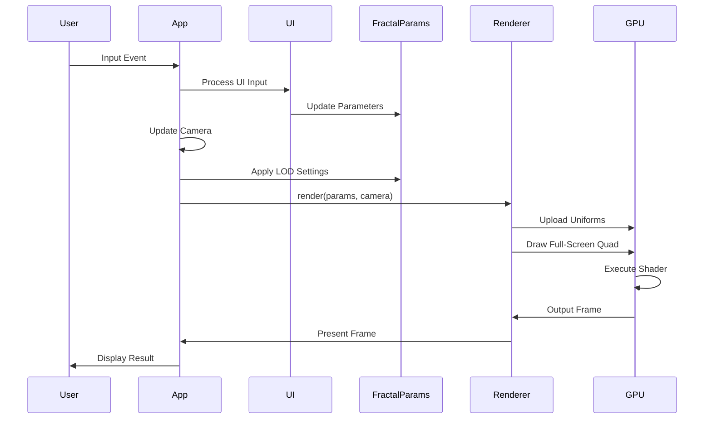

# Architecture

High-level system design and component architecture for Par Fractal, a cross-platform GPU-accelerated fractal renderer.

## Table of Contents
- [Overview](#overview)
- [System Architecture](#system-architecture)
- [Core Components](#core-components)
- [Data Flow](#data-flow)
- [GPU Pipeline](#gpu-pipeline)
- [Uniform Buffer Synchronization](#uniform-buffer-synchronization)
- [Rendering Modes](#rendering-modes)
- [Performance Optimizations](#performance-optimizations)
- [Common Development Tasks](#common-development-tasks)
- [Web/WASM Support](#webwasm-support)
- [Related Documentation](#related-documentation)

## Overview

Par Fractal is built on a modern Rust graphics stack using WebGPU for cross-platform GPU acceleration. The architecture supports both native desktop (Windows, macOS, Linux) and web (WASM) platforms. The system follows a clean separation between:

- **Application Layer** - Event handling, user input, and state management
- **Platform Layer** - Cross-platform abstractions for storage, file dialogs, and capture
- **Rendering Layer** - GPU pipeline management and frame rendering
- **Computation Layer** - WGSL shaders performing fractal calculations
- **UI Layer** - EGUI-based interface for parameter control

**Key Design Principles:**
- GPU-first computation for maximum performance
- Immediate mode UI for responsive parameter adjustments
- Type-safe uniform buffer management
- Cross-platform graphics API abstraction (WebGPU/WGPU)
- Platform-agnostic core with trait-based platform implementations
- Compile-time platform selection via feature flags and conditional compilation

## System Architecture

### High-Level Component Diagram

```mermaid
graph TD
    subgraph "Application Layer"
        Main[main.rs<br/>Entry Point]
        App[app/mod.rs<br/>Core State]
        AppInput[app/input.rs<br/>Input Events]
        AppUpdate[app/update.rs<br/>Frame Updates]
        AppRender[app/render.rs<br/>Render Coord]
        AppCapture[app/capture.rs<br/>Screenshots/Video]
        AppPersist[app/persistence.rs<br/>Settings Save/Load]
        AppTransition[app/camera_transition.rs<br/>Smooth Animations]
    end

    subgraph "UI Layer"
        UI[ui/mod.rs<br/>Main UI Manager]
        UICommand[ui/command.rs<br/>Command Palette]
        UIHistory[ui/history.rs<br/>Undo/Redo]
        UIOverlay[ui/overlays.rs<br/>FPS/Info Display]
        UIToast[ui/toast.rs & toast_ui.rs<br/>Notifications]
        UIMonitor[ui/monitor.rs<br/>Multi-Monitor]
    end

    subgraph "Core Logic"
        Fractal[fractal/mod.rs<br/>FractalParams]
        FractalTypes[fractal/types.rs<br/>Fractal Definitions]
        FractalPalettes[fractal/palettes.rs<br/>Color Palettes]
        FractalPresets[fractal/presets.rs<br/>Preset Gallery]
        FractalSettings[fractal/settings.rs<br/>Serialization]
        FractalUIState[fractal/ui_state.rs<br/>UI State]
        Camera[camera.rs<br/>Camera & Controller]
        LOD[lod.rs<br/>Level of Detail]
        CommandPalette[command_palette.rs<br/>Quick Commands]
    end

    subgraph "Platform Abstraction"
        Platform[platform/mod.rs<br/>Platform Context]
        PlatformNative[platform/native/*<br/>Native Impl]
        PlatformWeb[platform/web/*<br/>Web Impl]
    end

    subgraph "Rendering Layer"
        Renderer[renderer/mod.rs<br/>Main Renderer]
        RendererInit[renderer/initialization.rs<br/>GPU Setup]
        RendererUniforms[renderer/uniforms.rs<br/>Uniform Buffers]
        RendererUpdate[renderer/update.rs<br/>Pipeline Execution]
        VideoRec[video_recorder.rs<br/>Video Capture]
    end

    subgraph "GPU Computation"
        Shader[fractal.wgsl<br/>Fractal Computation]
        PostProc[postprocess.wgsl<br/>Post Effects]
    end

    Main --> App
    App --> AppInput
    App --> AppUpdate
    App --> AppRender
    App --> AppCapture
    App --> AppPersist
    App --> AppTransition

    App --> UI
    UI --> UICommand
    UI --> UIHistory
    UI --> UIOverlay
    UI --> UIToast
    UI --> UIMonitor

    App --> Fractal
    Fractal --> FractalTypes
    Fractal --> FractalPalettes
    Fractal --> FractalPresets
    Fractal --> FractalSettings
    Fractal --> FractalUIState
    Fractal --> LOD

    App --> Camera
    App --> Renderer
    App --> CommandPalette
    App --> Platform
    Renderer --> RendererInit
    Renderer --> RendererUniforms
    Renderer --> RendererUpdate
    Renderer --> Shader
    Renderer --> PostProc
    Renderer --> VideoRec

    Platform --> PlatformNative
    Platform --> PlatformWeb

    UI --> Fractal
    UI --> Camera
    UI --> CommandPalette
    AppPersist -.->|Load/Save| Fractal

    style Main fill:#e65100,stroke:#ff9800,stroke-width:3px,color:#ffffff
    style App fill:#e65100,stroke:#ff9800,stroke-width:3px,color:#ffffff
    style Renderer fill:#0d47a1,stroke:#2196f3,stroke-width:2px,color:#ffffff
    style Shader fill:#1a237e,stroke:#3f51b5,stroke-width:2px,color:#ffffff
    style PostProc fill:#1a237e,stroke:#3f51b5,stroke-width:2px,color:#ffffff
    style UI fill:#1b5e20,stroke:#4caf50,stroke-width:2px,color:#ffffff
    style Fractal fill:#4a148c,stroke:#9c27b0,stroke-width:2px,color:#ffffff
    style Camera fill:#4a148c,stroke:#9c27b0,stroke-width:2px,color:#ffffff
    style VideoRec fill:#880e4f,stroke:#c2185b,stroke-width:2px,color:#ffffff
    style LOD fill:#ff6f00,stroke:#ffa726,stroke-width:2px,color:#ffffff
    style CommandPalette fill:#37474f,stroke:#78909c,stroke-width:2px,color:#ffffff
    style Platform fill:#ff6f00,stroke:#ffa726,stroke-width:2px,color:#ffffff
    style PlatformNative fill:#37474f,stroke:#78909c,stroke-width:2px,color:#ffffff
    style PlatformWeb fill:#37474f,stroke:#78909c,stroke-width:2px,color:#ffffff
```



## Core Components

### Main Entry Point

**File:** `main.rs`

**Responsibilities:**
- Command-line argument parsing
- Environment initialization
- Event loop creation
- Window setup with saved preferences

**Key Features:**
- `--clear-settings` - Reset all saved preferences
- `--preset <name>` - Load specific preset on startup
- `--list-presets` - Display available presets
- `--screenshot-delay <s>` - Automated screenshot capture
- `--exit-delay <s>` - Automated application exit

### Application State

**Module:** `app/`

**Main File:** `app/mod.rs`

**Type:** `App`

**Responsibilities:**
- Main event loop orchestration and state management
- Coordination of all subsystems (rendering, input, UI, capture)

**Submodules:**

**`app/input.rs`** - Input Event Processing
- Keyboard and mouse event handling
- Camera control input processing
- UI interaction detection
- Hotkey management

**`app/update.rs`** - Frame Update Logic
- Frame timing and delta calculations
- Camera updates and movement
- LOD system updates
- FPS tracking and performance monitoring
- Auto-orbit camera movement

**`app/render.rs`** - Rendering Coordination
- Frame rendering orchestration
- EGUI rendering integration
- Surface presentation

**`app/camera_transition.rs`** - Camera Animations
- Smooth camera transitions between positions
- Preset camera bookmark animations
- Interpolated movement

**Note:** The following submodules are only available in native builds (not WASM/web):

**`app/capture.rs`** - Screenshot and Video Capture (Native Only)
- High-resolution screenshot capture
- Custom resolution rendering
- Video recording management
- File saving and auto-opening

**`app/persistence.rs`** - Settings Persistence (Native Only)
- Settings save/load to YAML files
- Automatic periodic saving
- Camera position persistence
- Window size restoration

**Key State:**
```rust
pub struct App {
    window: Arc<Window>,
    renderer: Renderer,
    camera: Camera,
    camera_controller: CameraController,
    fractal_params: FractalParams,
    ui: UI,
    egui_state: egui_winit::State,
    egui_renderer: egui_wgpu::Renderer,
    // Performance tracking
    last_frame_time: Instant,
    frame_count: u32,
    fps_timer: Instant,
    current_fps: f32,
    // Input state
    mouse_pressed: bool,
    last_mouse_pos: Option<(f32, f32)>,
    cursor_pos: (f32, f32),
    shift_pressed: bool,
    // Screenshot and rendering control
    save_screenshot: bool,
    save_hires_render: Option<(u32, u32)>,
    // Settings persistence timing
    camera_last_moved: Instant,
    camera_needs_save: bool,
    settings_last_changed: Instant,
    settings_need_save: bool,
    // Camera transitions
    camera_transition: CameraTransition,
    smooth_transitions_enabled: bool,
    was_auto_orbiting: bool,
    // Animation timing
    start_time: Instant,
    // Video recording (native only)
    video_recorder: VideoRecorder,
    // CLI options
    screenshot_delay: Option<f32>,
    exit_delay: Option<f32>,
    screenshot_taken: bool,
    should_exit: bool,
}
```

**Update Cycle:**
1. Process window events (via `app/input.rs`)
2. Update frame timing and camera (via `app/update.rs`)
3. Apply LOD based on camera movement
4. Update UI with parameter changes
5. Render frame with current parameters (via `app/render.rs`)
6. Handle captures if requested (via `app/capture.rs`)
7. Periodically save settings (via `app/persistence.rs`)

### Fractal Parameters

**Module:** `fractal/`

**Main File:** `fractal/mod.rs`

**Type:** `FractalParams`

**Purpose:** Central configuration struct for all fractal and rendering state

**Submodules:**

**`fractal/types.rs`** - Fractal Type Definitions
- `FractalType` enum (26 fractal types: 13 2D + 13 3D)
- `RenderMode` enum (TwoD, ThreeD)
- `ShadingModel` enum (BlinnPhong, PBR)
- `ColorMode` enum (16 visualization modes)
- `ChannelSource` enum (8 sources: Iterations, Distance, PositionX/Y/Z, Normal, AO, Constant)
- `FogMode` enum (Linear, Exponential, Quadratic)

**`fractal/palettes.rs`** - Color Palette System
- `ColorPalette` struct with predefined palettes
- Custom palette creation and management
- `CustomPalette` and `CustomPaletteGallery` for user palettes
- Palette serialization and import/export

**`fractal/presets.rs`** - Preset Management
- `Preset` struct for saved configurations
- `PresetGallery` for preset library management
- `PresetCategory` enum (All, Mandelbrot, Julia, 3D, Custom)
- Preset import/export functionality
- Built-in example presets

**`fractal/settings.rs`** - Serialization
- `Settings` struct for YAML persistence
- `AppPreferences` for application-level settings
- GPU selection persistence
- Window size and position saving

**`fractal/ui_state.rs`** - UI State Tracking
- `UIState` struct for panel visibility
- UI preferences persistence
- Panel collapse/expand state

**Key Responsibilities:**
- Fractal type and algorithm selection
- Camera parameters for 2D/3D rendering
- Color palette and visual effects configuration
- LOD system integration
- Conversion to GPU-compatible uniform buffer

**Supported Fractals:**

**2D Fractals (13 types):**
- Mandelbrot2D, Julia2D, Sierpinski2D, SierpinskiTriangle2D
- BurningShip2D, Tricorn2D, Phoenix2D
- Celtic2D, Newton2D, Lyapunov2D
- Nova2D, Magnet2D, Collatz2D

**3D Fractals (13 types):**
- Mandelbulb3D, MengerSponge3D, SierpinskiPyramid3D, SierpinskiGasket3D
- JuliaSet3D, Mandelbox3D, TgladFormula3D
- OctahedralIFS3D, IcosahedralIFS3D
- ApollonianGasket3D, Kleinian3D
- HybridMandelbulbJulia3D, QuaternionCubic3D

### Renderer

**Module:** `renderer/`

**Main File:** `renderer/mod.rs`

**Type:** `Renderer`

**Responsibilities:**
- GPU pipeline orchestration and management
- Multi-pass post-processing
- Frame presentation

**Submodules:**

**`renderer/initialization.rs`** - GPU Setup
- WGPU instance and adapter selection
- Device and surface configuration
- Pipeline creation (main render + post-processing)
- Texture and buffer allocation
- Bind group setup
- GPU enumeration and selection

**`renderer/uniforms.rs`** - Uniform Buffer Management
- `Uniforms` struct (832 bytes, matching WGSL exactly)
- `BloomUniforms`, `BlurUniforms`, `PostProcessUniforms`
- Conversion from `FractalParams` to GPU format via `update()` method
- Compile-time size assertions to ensure Rust/WGSL synchronization
- High-precision double-float emulation for deep zoom (zoom > 1,000,000)

**`renderer/update.rs`** - Pipeline Execution
- Uniform buffer updates
- Multi-pass rendering execution:
  1. Main fractal render to scene texture
  2. Bloom extraction pass
  3. Horizontal blur pass
  4. Vertical blur pass
  5. Composite pass (scene + bloom)
  6. FXAA or copy to surface
- Surface presentation

**Pipeline Configuration:**
- **Main Pipeline:** Full-screen quad → Fractal shader
- **Bloom Extract:** Scene → Bright regions
- **Blur Pipeline:** Separable Gaussian blur (H + V passes)
- **Composite Pipeline:** Scene + Bloom → Combined output
- **FXAA Pipeline:** Anti-aliasing post-process
- **Copy Pipeline:** Direct texture copy (when FXAA disabled)
- Output: BGRA8Unorm surface texture

### Camera System

**File:** `camera.rs`

**Types:** `Camera`, `CameraController`

**Camera Responsibilities:**
- View and projection matrix calculation
- Aspect ratio management
- Position and orientation tracking

**CameraController Responsibilities:**
- Keyboard input processing (WASD, QE)
- Mouse look with yaw/pitch
- Movement speed adjustment
- Smooth camera interpolation

**3D Camera Controls:**
- W/S: Forward/Backward
- A/D: Strafe Left/Right
- E/Q: Up/Down
- Mouse Drag: Look around
- Mouse Wheel: Adjust speed

### Command Palette

**File:** `command_palette.rs`

**Type:** `CommandPalette`

**Purpose:** Quick command execution and navigation

**Responsibilities:**
- Command search and filtering
- Keyboard shortcut execution
- Preset loading
- Settings management
- Quick navigation to features

### Platform Abstraction Layer

**Module:** `platform/`

**Purpose:** Cross-platform support for native and web builds

**Platform Traits:**
- `Storage` - Save/load settings, presets, palettes
- `FileDialog` - Open/save file dialogs
- `Capture` - Screenshot saving

**Platform Implementations:**

**`platform/native/`** - Native Platform (Desktop)
- `NativeStorage` - Filesystem-based storage using directories
- `NativeFileDialog` - Native file dialogs using rfd crate
- `NativeCapture` - Save screenshots to Pictures directory

**`platform/web/`** - Web Platform (WASM)
- `WebStorage` - Browser localStorage API
- `WebFileDialog` - Browser download/upload APIs
- `WebCapture` - Download screenshots via browser

**Platform Context:**
The `PlatformContext` struct provides a unified interface that automatically selects the correct implementation based on the target platform (native vs WASM).

### User Interface

**Module:** `ui/`

**Main File:** `ui/mod.rs`

**Type:** `UI`

**Framework:** EGUI (immediate mode GUI)

**Submodules:**

**`ui/command.rs`** - Command Palette UI Integration
- Command palette UI rendering
- Keyboard shortcut handling for command palette
- Integration with `CommandPalette` from `command_palette.rs`

**`ui/history.rs`** - Undo/Redo System
- `HistoryEntry` for parameter snapshots
- Undo/redo stack management
- Automatic history tracking on parameter changes

**`ui/overlays.rs`** - Information Overlays
- FPS display
- Camera position/rotation info
- Performance metrics overlay
- LOD debug visualization

**`ui/toast.rs` & `ui/toast_ui.rs`** - Toast Notifications
- `Toast` struct for notifications
- Toast display and auto-dismiss
- Success/error/info message types

**`ui/monitor.rs`** - Multi-Monitor Support
- `MonitorInfo` struct
- Monitor enumeration
- Multi-monitor wallpaper support

**`ui/tests.rs`** - UI Unit Tests
- UI state testing
- Component interaction tests

**Main Panels:**
- **Fractal Settings** - Type selection, iterations, parameters
- **Camera Controls** - Position, bookmarks, FOV, transitions
- **Visual Settings** - Colors, shading, effects, palettes
- **Performance** - FPS, quality, LOD settings, debug visualization
- **Capture Tools** - Screenshots, video recording, custom resolutions
- **Preset Management** - Save/load/import/export presets
- **Custom Palettes** - Palette editor, import/export
- **GPU Selection** - GPU enumeration and preference

**Interaction Pattern:**
- User modifies UI controls
- Callbacks update `FractalParams` or `Camera`
- Changes applied immediately on next frame
- Undo/redo system tracks parameter history (via `ui/history.rs`)
- Toast notifications provide feedback (via `ui/toast_ui.rs`)

## Data Flow

### Frame Render Pipeline



### Parameter Update Flow


## GPU Pipeline

### Uniform Buffer Structure

The `Uniforms` struct in `renderer/uniforms.rs` must exactly match the `Uniforms` struct in `shaders/fractal.wgsl` for proper GPU data transfer.

**Current Size:** 832 bytes (52 × 16-byte alignment)

**Key Fields:**
- Camera matrices (view-projection, inverse view-projection for 3D ray generation)
- Camera position (3D mode)
- Fractal type (0-25 for 26 fractal types) and render mode (0=2D, 1=3D)
- 2D parameters (center, zoom, iterations with auto-scaling, high-precision center for deep zoom)
- 3D parameters (power, ray steps, min distance, fractal-specific scale/fold/radius parameters)
- Color palette (5 colors × RGBA with palette_offset for animation)
- Color modes (16 visualization modes) and channel sources (8 per-channel sources for RGB)
- Visual effects (AO with intensity/step, soft shadows with samples/softness, fog with mode/density/color, DoF with focal length/aperture/samples)
- Material properties (roughness, metallic, albedo) for PBR shading
- Lighting (azimuth/elevation angles, intensity, ambient)
- Floor rendering (show/height, two colors for checkerboard, reflections with strength)
- Ray marching (adaptive stepping flag, fixed step size, step multiplier, max distance)
- Post-processing (brightness, contrast, saturation, hue shift, bloom threshold/intensity/radius, vignette, FXAA)
- LOD debug visualization (enabled flag, three distance zone thresholds)
- Aspect ratio for correct rendering (stored in vec4 for 16-byte alignment)

### Shader Execution

**File:** `shaders/fractal.wgsl`

**Vertex Shader:**
- Generates full-screen quad
- Passes screen coordinates to fragment shader

**Fragment Shader:**
- Receives pixel coordinates
- Reads uniform buffer
- Dispatches to appropriate fractal algorithm
- Applies coloring and shading
- Returns final pixel color

**2D Algorithm (Escape-Time):**
```
for each pixel:
    map screen coords to complex plane
    iterate fractal equation
    track escape iteration
    apply color palette
```

**3D Algorithm (Ray Marching):**
```
for each pixel:
    generate camera ray
    march ray through space
    use distance estimator
    accumulate lighting
    apply shading model
    return surface color
```

## Uniform Buffer Synchronization

**Critical Requirement:** The Rust `FractalUniforms` struct and WGSL `Uniforms` struct must maintain identical memory layouts.

### Synchronization Checklist

When modifying uniforms:

1. **Update Rust struct** in `renderer/uniforms.rs`
   - Modify `Uniforms` struct fields
   - Update `Uniforms::update()` method to populate new fields
   - Verify field ordering matches WGSL exactly
   - Ensure proper 16-byte alignment with padding fields

2. **Update WGSL struct** in `shaders/fractal.wgsl`
   - Modify `Uniforms` struct at top of shader
   - Match field names and types exactly
   - Maintain 16-byte alignment (WGSL has strict alignment rules)
   - vec3 fields require special padding attention

3. **Verify byte sizes**
   - Both must have identical total size
   - Rust compile-time assertion: `assert!(std::mem::size_of::<Uniforms>() == 832)`
   - Add explicit padding fields as needed
   - Account for WGSL's implicit padding around vec3 fields

4. **Test thoroughly**
   - Run `make checkall` to ensure tests pass
   - Render each fractal type (2D and 3D)
   - Verify all parameters work correctly
   - Check for visual artifacts or rendering glitches
   - Test parameter changes via UI
   - Verify LOD system if affected

### Memory Layout Example

```rust
// renderer/uniforms.rs
#[repr(C)]
#[derive(Copy, Clone, bytemuck::Pod, bytemuck::Zeroable)]
pub(super) struct Uniforms {
    // Camera (3D mode) - 64 bytes (view_proj) + 64 bytes (inv_view_proj) + 16 bytes (camera_pos + padding)
    view_proj: [[f32; 4]; 4],
    inv_view_proj: [[f32; 4]; 4],
    camera_pos: [f32; 3],
    _padding1: f32,

    // 2D parameters - 16 bytes
    center: [f32; 2],
    zoom: f32,
    max_iterations: u32,

    // Julia + fractal type - 16 bytes
    julia_c: [f32; 2],
    fractal_type: u32,
    render_mode: u32,

    // 3D parameters - 32 bytes
    power: f32,
    max_steps: u32,
    min_distance: f32,
    fractal_scale: f32,
    fractal_fold: f32,
    fractal_min_radius: f32,
    _padding2: [f32; 2],

    // ... more fields with explicit padding ...
}

// Compile-time size check
const _: () = assert!(
    std::mem::size_of::<Uniforms>() == 832,
    "Uniforms struct must be exactly 832 bytes"
);
```

```wgsl
// shaders/fractal.wgsl
struct Uniforms {
    view_proj: mat4x4<f32>,      // 64 bytes
    inv_view_proj: mat4x4<f32>,  // 64 bytes
    camera_pos: vec3<f32>,       // 12 bytes
    _padding1: f32,              // 4 bytes (align to 16)

    center: vec2<f32>,           // 8 bytes
    zoom: f32,                   // 4 bytes
    max_iterations: u32,         // 4 bytes

    julia_c: vec2<f32>,          // 8 bytes
    fractal_type: u32,           // 4 bytes
    render_mode: u32,            // 4 bytes

    power: f32,                  // 4 bytes
    max_steps: u32,              // 4 bytes
    min_distance: f32,           // 4 bytes
    fractal_scale: f32,          // 4 bytes
    fractal_fold: f32,           // 4 bytes
    fractal_min_radius: f32,     // 4 bytes
    _padding2: vec2<f32>,        // 8 bytes

    // ... more fields matching Rust exactly ...
};
```

## Rendering Modes

### 2D Mode

**Coordinate Mapping:**
- Screen space → Complex plane
- Supports pan and zoom
- Maintains aspect ratio

**Rendering:**
- Single-pass fragment shader
- Escape-time algorithm
- Smooth coloring with palette interpolation

**Optimization:**
- Early termination on escape
- Adaptive iteration count

### 3D Mode

**Ray Marching:**
- Generate ray per pixel from camera
- March in steps using distance estimator
- Accumulate steps until surface hit or max distance

**Distance Estimation:**
- Each fractal provides SDF (Signed Distance Function)
- Used for ray marching acceleration
- Enables ambient occlusion calculation

**Shading Models:**

**Blinn-Phong:**
- Ambient + Diffuse + Specular
- Fast and efficient
- Classic look

**PBR (Physically Based Rendering):**
- Roughness and metallic workflow
- GGX normal distribution
- Fresnel and geometry terms
- Realistic materials

**Visual Effects:**
- Ambient Occlusion (AO) - Cone tracing
- Soft Shadows - Shadow ray marching
- Depth of Field (DoF) - Focal plane simulation
- Fog - Distance-based atmospheric effect

## Performance Optimizations

### Level of Detail (LOD)

**File:** `lod.rs`

**Purpose:** Dynamically adjust rendering quality based on camera movement and performance

**LOD System Architecture:**

The LOD system provides adaptive quality management through multiple strategies:

**LOD Strategies:**
- **Distance-based:** Adjust quality based on camera distance from fractal
- **Motion-based:** Reduce quality during camera movement
- **Performance-based:** Monitor FPS and adjust quality to maintain target framerate
- **Hybrid:** Combine all strategies for optimal performance

**LOD Configuration (`LODConfig`):**
```rust
pub struct LODConfig {
    pub enabled: bool,                    // Master enable/disable
    pub strategy: LODStrategy,            // Which strategy to use
    pub quality_presets: [Quality; 4],    // Quality levels 0-3
    pub distance_zones: [f32; 3],         // Distance thresholds
    pub motion_threshold: f32,            // Movement threshold for motion detection
    pub motion_sensitivity: f32,          // How sensitive to motion
    pub target_fps: f32,                  // Target FPS for performance mode
    pub transition_duration: f32,         // Smooth transition time between levels
    pub smooth_transitions: bool,         // Enable/disable smooth interpolation
    pub restore_delay: f32,               // Delay before restoring quality after motion stops
    pub min_quality_level: usize,         // Minimum allowed quality level (0-3)
    pub aggressive_mode: bool,            // Drop to lowest quality immediately on motion
    pub debug_visualization: bool,        // Show LOD zones as overlay
}
```

**LOD State (`LODState`):**
```rust
pub struct LODState {
    pub current_level: usize,             // Current LOD level (0-3)
    pub target_level: usize,              // Target LOD level being transitioned to
    pub transition_progress: f32,         // Transition progress (0.0-1.0)
    pub active_quality: Quality,          // Currently active quality (possibly interpolated)
    pub is_moving: bool,                  // Is camera currently moving?
    pub time_since_stopped: f32,          // Time since camera stopped moving
    pub last_camera_pos: Vec3,            // Last camera position for motion detection
    pub last_camera_forward: Vec3,        // Last camera forward vector
    pub current_fps: f32,                 // Current framerate
    pub fps_samples: VecDeque<f32>,       // FPS samples for smoothing
    pub last_performance_level: usize,    // Last performance-based LOD level
    pub fps_stable_time: f32,             // Time FPS has been stable
}
```

**Quality Levels:**
- **Level 0 (Ultra):** Maximum quality - 512 ray steps, smallest min_distance, high shadow/AO samples
- **Level 1 (High):** High quality - 256 ray steps, good detail
- **Level 2 (Medium):** Balanced - 128 ray steps, reduced effects
- **Level 3 (Low):** Performance - 64 ray steps, minimal effects

**Parameters Adjusted per Quality Level:**
- `max_steps`: Ray marching steps (64-512)
- `min_distance`: Ray march termination threshold
- `shadow_samples`: Shadow ray samples
- `shadow_step_factor`: Shadow ray step size
- `ao_step_size`: Ambient occlusion sample step
- `dof_samples`: Depth of field samples
- (Future) `render_scale`: Render resolution scaling

**Integration with FractalParams:**
The LOD system updates `FractalParams` fields directly via `apply_lod_quality()`, which is called during the update cycle. Parameters are smoothly interpolated when `smooth_transitions` is enabled.

**Performance-Based LOD with Hysteresis:**
To prevent thrashing (rapid quality switching), the performance-based strategy uses:
- **Hysteresis bands:** 5% margin around FPS thresholds
- **Stable time requirement:** FPS must be stable for 0.5s before upgrading quality
- **Immediate degradation:** Quality drops immediately when FPS falls
- **Per-level thresholds:** Different thresholds for each quality level

**Debug Visualization:**
When enabled, LOD zones are visualized in 3D space as colored distance rings around the fractal center, helping developers understand and tune LOD behavior.

### GPU Optimization Techniques

**Early Termination:**
- Exit ray march on surface hit
- Exit iteration on escape

**Adaptive Quality:**
- Reduce quality during camera movement
- Restore quality when stationary

**Memory Efficiency:**
- Single uniform buffer
- Packed data structures
- Minimal CPU-GPU transfers

**Shader Optimization:**
- Minimize branching
- Vectorize operations
- Precalculate constants

## Common Development Tasks

### Adding a New Fractal

1. **Add fractal type to enum** in `fractal/types.rs`
   ```rust
   pub enum FractalType {
       // ... existing types ...
       MyNewFractal2D,  // or MyNewFractal3D
   }
   ```

2. **Add filename_safe_name** in `fractal/types.rs`
   ```rust
   impl FractalType {
       pub fn filename_safe_name(&self) -> &'static str {
           match self {
               // ... existing mappings ...
               FractalType::MyNewFractal2D => "my_new_fractal",
           }
       }
   }
   ```

3. **Update fractal type mapping** in `renderer/uniforms.rs`
   ```rust
   self.fractal_type = match params.fractal_type {
       // ... existing mappings (0-25) ...
       crate::fractal::FractalType::MyNewFractal2D => 26,  // Next available index
   };
   ```

4. **Implement shader logic** in `shaders/fractal.wgsl`
   - For 2D fractals: Add case to 2D fractal switch statement in fragment shader
   - For 3D fractals: Add distance estimator function and call from `map()` function
   ```wgsl
   fn de_my_fractal(p: vec3<f32>) -> f32 {
       // Distance estimator implementation
       return dist;
   }
   ```

5. **Add UI controls** (optional) in `ui/mod.rs`
   - Add fractal-specific parameter controls if needed
   - Update `FractalParams` in `fractal/mod.rs` if new parameters are required
   - Ensure settings serialization in `fractal/settings.rs` if adding parameters

6. **Create preset** in `fractal/presets.rs`
   - Add built-in preset showcasing the new fractal
   - Set appropriate default parameters

7. **Test rendering**
   - Build and run: `make r`
   - Test parameter adjustments via UI
   - Test on both native and web builds if applicable
   - Capture screenshots for documentation
   - Run all checks: `make checkall`

8. **Update documentation**
   - Add to FRACTALS2D.md or FRACTALS3D.md
   - Include description, mathematical formula, parameters, and example images

### Modifying Uniforms

1. **Update Rust struct** in `renderer/uniforms.rs`
   - Add new field to `Uniforms` struct with proper alignment
   - Update `Uniforms::new()` with default value
   - Update `Uniforms::update()` to populate from `FractalParams`

2. **Update WGSL struct** in `shaders/fractal.wgsl`
   - Add matching field to `Uniforms` struct at the beginning of the shader file
   - Ensure exact type and alignment match (WGSL has strict alignment rules)
   - Account for WGSL's implicit padding around vec3 fields (aligned to 16-byte boundaries)

3. **Add to FractalParams** in `fractal/mod.rs` (if user-configurable)
   - Add field to `FractalParams` struct
   - Update `Default` implementation
   - Update `to_settings()` and `from_settings()` for persistence

4. **Add UI control** in `ui/mod.rs` (if user-configurable)
   - Add slider, checkbox, or other control
   - Wire up to update `FractalParams`

5. **Verify struct sizes match**
   ```bash
   make checkall  # Compile-time assertion will catch size mismatches
   ```

6. **Test all fractal types**
   - Verify rendering works correctly
   - Check for visual artifacts
   - Test parameter changes

### Adding UI Controls

1. **Modify rendering panel** in `ui/mod.rs`
   - Locate appropriate `CollapsingHeader` or panel
   - Add EGUI widget (slider, checkbox, color picker, etc.)
   ```rust
   ui.add(egui::Slider::new(&mut params.my_param, 0.0..=10.0).text("My Parameter"));
   ```

2. **Update FractalParams** in `fractal/mod.rs`
   - Add new parameter field
   - Update `Default`, `to_settings()`, `from_settings()`

3. **Update Settings persistence** in `fractal/settings.rs`
   - Add field to `Settings` struct for YAML serialization

4. **Add to undo/redo tracking** in `ui/history.rs` (if applicable)
   - Snapshot is automatic via `HistoryEntry`

5. **Test parameter changes**
   - Verify UI updates correctly
   - Test save/load functionality
   - Verify undo/redo works

### Debugging Rendering Issues

**Black Screen:**
1. Check uniform buffer synchronization (Rust vs WGSL)
2. Verify shader compiles without errors: `make checkall`
3. Check console for WGPU validation errors
4. Verify fractal parameters are within valid ranges
5. Test with default parameters / built-in presets

**Visual Artifacts:**
1. Check for uniform alignment issues (vec3 padding)
2. Verify distance estimator correctness
3. Check ray marching parameters (max_steps, min_distance)
4. Test with different quality settings
5. Disable post-processing effects to isolate issue

**Performance Issues:**
1. Switch to release mode: `make r`
2. Enable LOD system in Performance panel
3. Reduce max_iterations or max_steps
4. Disable expensive effects (DoF, soft shadows, AO)
5. Check GPU selection (ensure discrete GPU is used)
6. Profile with GPU debugging tools

**Uniform Buffer Mismatch:**
1. Check compile-time assertion error message
2. Calculate expected size: fields + padding for 16-byte alignment
3. Add explicit padding fields in Rust
4. Account for WGSL implicit vec3 padding
5. Verify both structs have identical byte size (832 bytes)

## Web/WASM Support

Par Fractal supports compilation to WebAssembly (WASM) for running in web browsers.

### Build Configuration

**Feature Flags:**
- `native` - Native desktop build (default)
- `web` - Web/WASM build

**Platform Detection:**
Code uses `#[cfg(target_arch = "wasm32")]` and `#[cfg(not(target_arch = "wasm32"))]` to conditionally compile platform-specific code.

### Platform Differences

**Native Build:**
- Full GPU selection and preferences
- File system access for settings/presets
- Native file dialogs (save/load)
- Video recording support
- Auto-open screenshots/videos

**Web Build:**
- Browser-managed GPU selection
- localStorage for settings/presets
- Browser download/upload for files
- No video recording (stub implementation)
- Screenshots downloaded via browser

### Entry Points

**Native:** `main.rs`
- Creates window with winit
- Runs event loop
- Full CLI argument support

**Web:** `web_main.rs`
- WASM entry point
- Canvas-based rendering
- Limited to URL parameters for configuration

### Platform Abstraction

The `platform/` module provides trait-based abstractions that allow the same core rendering and UI code to work on both platforms:

- `Storage` trait - File system (native) vs localStorage (web)
- `FileDialog` trait - Native dialogs vs browser download/upload
- `Capture` trait - File saving vs browser downloads

This abstraction ensures maximum code reuse while supporting platform-specific capabilities.

## Related Documentation

- [Quick Start Guide](QUICKSTART.md) - Installation and basic usage
- [2D Fractals](FRACTALS2D.md) - Mandelbrot, Julia, and other 2D fractals
- [3D Fractals](FRACTALS3D.md) - Mandelbulb, Menger Sponge, and other 3D fractals
- [Controls Reference](CONTROLS.md) - Complete keyboard and mouse controls
- [Documentation Style Guide](DOCUMENTATION_STYLE_GUIDE.md) - Standards for this documentation
