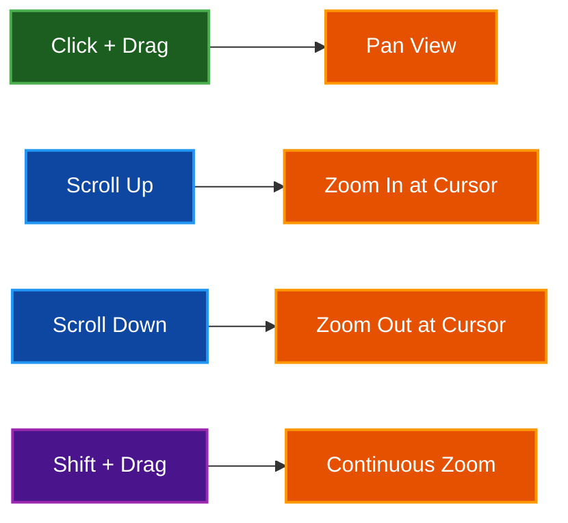

# Controls Reference

Complete reference for all keyboard shortcuts, mouse controls, and UI interactions in Par Fractal.

## Table of Contents
- [Overview](#overview)
- [Global Controls](#global-controls)
- [2D Mode Controls](#2d-mode-controls)
- [3D Mode Controls](#3d-mode-controls)
- [UI Panel Sections](#ui-panel-sections)
- [Command Palette](#command-palette)
- [Keyboard Shortcuts Quick Reference](#keyboard-shortcuts-quick-reference)
- [Mouse Controls Summary](#mouse-controls-summary)
- [Customization](#customization)
- [Related Documentation](#related-documentation)

## Overview

Par Fractal provides intuitive controls for exploring both 2D and 3D fractals. Controls are context-sensitive, changing based on the current fractal type and mode.

**Control Categories:**
- **Global** - Available in all modes
- **2D Mode** - Specific to 2D fractals (mouse/touch controls)
- **3D Mode** - Specific to 3D fractals (keyboard + mouse/touch controls)
- **UI Panel** - Interactive parameter controls
- **Command Palette** - Quick command access

**Platform Differences:**
- **Ctrl** on Windows/Linux
- **Cmd** on macOS
- Documentation uses **Ctrl/Cmd** to indicate platform-specific modifier

**Mobile/Touch Support:**
- Full touch gesture support for iOS, Android, and web browsers
- Single-finger drag for panning (2D) or camera rotation (3D)
- Two-finger pinch-to-zoom for 2D fractals
- Optimized viewport handling for devices with notches (iPhone)

## Global Controls

### Application Controls

| Key | Action | Description |
|-----|--------|-------------|
| **H** | Toggle UI | Show/hide the parameter panel |
| **F** | Toggle FPS | Show/hide FPS counter |
| **V** | Toggle Performance | Show/hide performance overlay |
| **Esc** | Close/Cancel | Close command palette and dialogs |

### Fractal Type Switching - 2D Fractals

| Key | Fractal | Description |
|-----|---------|-------------|
| **1** | Mandelbrot | Classic Mandelbrot set |
| **2** | Julia | Julia set with adjustable constant |
| **3** | Sierpinski Carpet | Sierpinski carpet fractal |
| **4** | Burning Ship | Burning Ship fractal variation |
| **5** | Tricorn | Tricorn (Mandelbar) fractal |
| **6** | Phoenix | Phoenix fractal |
| **7** | Celtic | Celtic fractal variation |
| **8** | Newton | Newton fractal |
| **9** | Lyapunov | Lyapunov fractal |
| **0** | Nova | Nova fractal |

**Note:** Additional 2D fractals accessible via UI and command palette only: Magnet, Collatz, Sierpinski Triangle, and Strange Attractors (Hopalong, Martin, Gingerbreadman, Chip, Quadruptwo, Threeply).

### Fractal Type Switching - 3D Fractals

| Key | Fractal | Description |
|-----|---------|-------------|
| **F1** | Mandelbulb | 3D extension of Mandelbrot |
| **F2** | Menger Sponge | Recursive cube subdivision |
| **F3** | Sierpinski Pyramid | 3D Sierpinski pyramid |
| **F4** | Julia Set 3D | 3D Julia set |
| **F5** | Mandelbox | Box-folding fractal |
| **F6** | Octahedral IFS | Octahedral iterated function system |
| **F7** | Icosahedral IFS | Icosahedral iterated function system |
| **F8** | Apollonian Gasket | Apollonian circle packing |
| **F9** | Kleinian | Kleinian limit set |
| **F10** | Hybrid Mandelbulb-Julia | Hybrid 3D fractal |

**Note:** Additional 3D fractals accessible via UI and command palette only: Quaternion Cubic, Sierpinski Gasket, and Strange Attractors (Pickover, Lorenz, Rossler).

### View Controls

| Key | Action | Description |
|-----|--------|-------------|
| **R** | Reset View | Return to default camera/view position (resets camera in 3D mode) |

### Screenshot and Capture

| Key | Action | Description |
|-----|--------|-------------|
| **F12** | Quick Screenshot | Capture current view as PNG (saved to current directory) |

**Note:** High-resolution screenshots and video recording controls are available via the UI panel and command palette. The README shows **F9** for screenshots, but the actual implementation uses **F12**.

### Color and Appearance

| Key | Action | Description |
|-----|--------|-------------|
| **P** | Next Static Palette | Cycle to next static color palette |
| **Shift+P** | Next Procedural Palette | Cycle to next procedural palette |

### Command Palette

| Key | Action | Description |
|-----|--------|-------------|
| **/** | Open Command Palette | Quick access to all commands (fuzzy search) |
| **Ctrl/Cmd+K** | Open Command Palette | VS Code-style shortcut |

### Effects and Visual Settings

| Key | Action | Description |
|-----|--------|-------------|
| **O** | Toggle Auto-Orbit | Enable/disable automatic camera rotation |
| **[** | Decrease Orbit Speed | Slow down auto-orbit rotation |
| **]** | Increase Orbit Speed | Speed up auto-orbit rotation |
| **L** | Toggle Ambient Occlusion | Enable/disable AO effect |
| **T** | Toggle Depth of Field | Enable/disable DOF effect |
| **G** | Toggle Floor | Show/hide floor plane (3D mode) |
| **B** | Cycle Shadow Mode | Cycle: Off → Hard → Soft shadows |

### Level of Detail (LOD)

| Key | Action | Description |
|-----|--------|-------------|
| **I** | Toggle LOD System | Enable/disable adaptive quality |
| **Shift+D** | LOD Debug Visualization | Show/hide LOD debug overlay |

## 2D Mode Controls

### Mouse Controls

| Action | Effect | Modifier |
|--------|--------|----------|
| **Click + Drag** | Pan view | Move around complex plane |
| **Scroll Up** | Zoom In | At cursor position |
| **Scroll Down** | Zoom Out | At cursor position |
| **Shift + Click + Drag** | Continuous Zoom | Smooth zoom animation |

### Touch Controls (Mobile)

| Gesture | Effect | Description |
|---------|--------|-------------|
| **Single Finger Drag** | Pan view | Move around complex plane |
| **Two Finger Pinch** | Zoom | Pinch in/out to zoom at gesture center |

**Note:** Touch gestures are fully supported on iOS, Android, and web browsers. Pinch-to-zoom automatically calculates the zoom center between your two fingers for intuitive zooming.

### Keyboard Navigation

**Note:** In 2D mode, navigation is primarily mouse-based. Use click-and-drag to pan, and scroll to zoom. Arrow keys are used for camera movement in 3D mode only.

### Parameter Adjustment

| Key | Action | Description |
|-----|--------|-------------|
| **-** (Minus) | Decrease Iterations | Lower max iterations by 32 (min: 32) |
| **=** (Equal/Plus) | Increase Iterations | Raise max iterations by 32 (max: 2048) |
| **,** (Comma) | Decrease Power | Lower power parameter by 0.5 (min: 2.0) |
| **.** (Period) | Increase Power | Raise power parameter by 0.5 (max: 16.0) |

## 3D Mode Controls

### Camera Movement (WASD)

| Key | Action | Speed | Description |
|-----|--------|-------|-------------|
| **W** | Move Forward | Camera speed | Move toward view direction |
| **S** | Move Backward | Camera speed | Move away from view direction |
| **A** | Strafe Left | Camera speed | Move left perpendicular to view |
| **D** | Strafe Right | Camera speed | Move right perpendicular to view |
| **E** | Move Up | Camera speed | Move along world Y axis up |
| **Q** | Move Down | Camera speed | Move along world Y axis down |

**Alternative Keys:**
- **Arrow Keys** work same as WASD
  - Up/Down arrows: Forward/Backward
  - Left/Right arrows: Strafe Left/Right

### Camera Look

| Action | Effect | Sensitivity |
|--------|--------|-------------|
| **Mouse Drag** | Rotate View | Fixed at 0.003 |
| **Mouse X** | Yaw (horizontal) | Left/right rotation |
| **Mouse Y** | Pitch (vertical) | Up/down rotation |

**Pitch Limits:**
- Clamped to ±89° to avoid gimbal lock

### Touch Controls (Mobile)

| Gesture | Effect | Description |
|---------|--------|-------------|
| **Single Finger Drag** | Rotate View | Look around in 3D space |

**Note:** Touch gestures are fully supported on mobile devices and web browsers for 3D camera rotation. WASD movement is keyboard-only (unavailable on touch devices without physical keyboard).

### Camera Speed

**Note:** Camera speed is adjusted via the UI slider in the Camera section. There are no keyboard shortcuts for speed control in 3D mode.

**Speed Range:** 0.1 to 10.0 units/second (adjustable via UI)

### 3D-Specific Settings

| Key | Action | Description |
|-----|--------|-------------|
| **-** (Minus) | Decrease Ray Steps | Lower max steps by 10 (min: 30) |
| **=** (Equal/Plus) | Increase Ray Steps | Raise max steps by 10 (max: 500) |
| **,** (Comma) | Decrease Power | Lower power parameter by 0.5 (min: 2.0) |
| **.** (Period) | Increase Power | Raise power parameter by 0.5 (max: 16.0) |

**Note:** Additional 3D effects (lighting modes, shading models, etc.) are available via the UI panel and command palette.

## UI Panel Sections

### Fractal Settings

**Parameters:**
- **Fractal Type** - Dropdown selector for fractal algorithm
- **Max Iterations** - Slider (2D) or input (3D)
- **Render Mode** - 2D vs 3D toggle

**2D Specific:**
- **Center X/Y** - Complex plane coordinates
- **Zoom** - Magnification level
- **Julia Constant** - For Julia sets (real, imaginary)

**3D Specific:**
- **Power** - Mandelbulb power parameter
- **Ray Steps** - Maximum ray marching iterations
- **Epsilon** - Surface precision threshold

### Camera Section

**2D Mode:**
- **Center** - Display/input complex coordinates
- **Zoom** - Display/input zoom level
- **Reset View** - Button to reset

**3D Mode:**
- **Position** - X, Y, Z coordinates
- **Target** - Look-at point
- **FOV** - Field of view angle
- **Speed** - Movement speed multiplier
- **Save/Load Bookmarks** - Bookmark management

### Visual Settings

**Color Palette:**
- **Palette Selector** - Dropdown menu
- **Palette Preview** - Color gradient display
- **Custom Palette** - Create custom color schemes
- **Import/Export** - Palette file operations

**Shading (3D):**
- **Shading Model** - Blinn-Phong or PBR
- **Material Properties:**
  - Roughness (0.0-1.0)
  - Metallic (0.0-1.0)
  - Albedo Color (RGB)

**Effects (3D):**
- **Ambient Occlusion**
  - Enable toggle
  - Strength slider
  - Iterations
- **Soft Shadows**
  - Enable toggle
  - Softness parameter
- **Depth of Field**
  - Enable toggle
  - Focal distance
  - Aperture size
- **Fog**
  - Enable toggle
  - Density
  - Color

### Performance Section

**Quality Settings:**
- **Quality Profile** - Dropdown (Low/Medium/High/Ultra)
- **LOD Enabled** - Toggle automatic quality adjustment
- **FPS Display** - Toggle frame rate overlay
- **GPU Selection** - Choose GPU (multi-GPU systems)

**LOD Configuration:**
- **Zone Thresholds** - Movement speed triggers
- **Quality Multipliers** - Per-zone settings

### Capture Section

**Screenshot:**
- **Quick Capture** - F12 keyboard shortcut or button
- **Custom Resolution** - Width × Height input
- **File Format** - PNG (automatic filename generation)
- **Save Location** - Current working directory

**Video Recording:**
- **Format** - MP4 or GIF
- **Frame Rate** - 30 or 60 FPS
- **Quality** - Compression settings
- **Duration Limit** - Maximum recording time
- **Start/Stop** - Recording controls

### Preset Management

**Preset Browser:**
- **Category Filter** - 2D/3D/IFS/Apollonian/All
- **Preset List** - Scrollable preset gallery
- **Thumbnail Preview** - Visual preset preview
- **Load Preset** - Apply selected preset
- **Description** - Preset information

**Preset Operations:**
- **Save Current** - Create new preset
- **Delete** - Remove preset
- **Import** - Load from file
- **Export** - Save to file
- **Share** - Generate shareable link

### Advanced Settings

**Rendering:**
- **Render Resolution** - Internal resolution multiplier
- **Anti-Aliasing** - Sample count
- **Precision Mode** - Float vs Double precision

**Debug Visualization:**
- **Show Normals** - Visualize surface normals
- **Show Ray Steps** - Color by iteration count
- **Distance Field** - Visualize distance estimator
- **LOD Zones** - Show LOD zone colors

## Command Palette

### Opening the Palette

**Keyboard:**
- `/` (Slash key)
- `Ctrl/Cmd+K` (VS Code-style)

### Using the Palette

**Navigation:**
- **Type** to search commands (fuzzy matching)
- **Arrow Keys** (↑↓) to navigate results
- **Enter** to execute selected command
- **Esc** to close

**Command Categories:**

The command palette provides access to all application features through fuzzy search:

**Fractal Commands:**
- All 34 fractal types (19 2D and 15 3D)
- Quick switching with aliases (e.g., "mb" for Mandelbrot)

**Effect Commands:**
- Toggle Ambient Occlusion, Soft Shadows, Depth of Field, Fog
- Toggle Bloom, Vignette, FXAA, Screen-Space Reflections

**Color Mode Commands:**
- Palette Coloring, Normal Visualization, Ray Steps
- Distance Field Debug, Depth Debug, Convergence Debug
- Lighting Only Debug, Shadow Map Debug, LOD Debug

**LOD Commands:**
- Toggle LOD System, LOD Debug Visualization
- LOD Profiles: Balanced, Quality First, Performance First, Distance Only, Motion Only

**UI Commands:**
- Toggle UI, Toggle Performance Overlay, Toggle Theme

**Camera Commands:**
- Reset View

**Recording Commands:**
- Take Screenshot
- Start/Stop MP4/WebM/GIF Recording

**Settings Commands:**
- Save Preset, Export/Import Settings, Reset All Settings

**Search Tips:**
- Commands are scored by relevance
- Supports fuzzy matching (e.g., "mdb" finds "Mandelbulb")
- Alias matching (e.g., "ao" finds "Ambient Occlusion")
- Top 10 results displayed, sorted by match score

## Keyboard Shortcuts Quick Reference

### Essential Shortcuts

```
H              Toggle UI Panel
F              Toggle FPS Counter
V              Toggle Performance Overlay
R              Reset View/Camera
F12            Screenshot
/              Command Palette
Ctrl/Cmd+K     Command Palette (VS Code style)
Esc            Close Command Palette/Dialogs
```

### Fractal Switching

```
2D Fractals (Digit Keys):
1              Mandelbrot      2              Julia
3              Sierpinski      4              Burning Ship
5              Tricorn         6              Phoenix
7              Celtic          8              Newton
9              Lyapunov        0              Nova

3D Fractals (Function Keys):
F1             Mandelbulb      F2             Menger Sponge
F3             Sierpinski 3D   F4             Julia Set 3D
F5             Mandelbox       F6             Octahedral IFS
F7             Icosahedral IFS F8             Apollonian
F9             Kleinian        F10            Hybrid Mandelbulb-Julia
```

### 2D Navigation

```
Drag                  Pan View
Scroll                Zoom (at cursor position)
Shift + Drag          Continuous Zoom In
```

### 3D Navigation

```
WASD           Move (Forward/Left/Back/Right)
Arrow Keys     Alternative movement (Up/Down/Left/Right)
E              Move Up (world Y axis)
Q              Move Down (world Y axis)
Mouse Drag     Look Around (rotate camera)
```

### Parameter Adjustment

```
-/+            Iterations (2D) or Ray Steps (3D)
,/.            Power Parameter
[/]            Orbit Speed (when auto-orbit active)
```

### Effects and Visuals

```
P              Next Static Palette
Shift+P        Next Procedural Palette
O              Toggle Auto-Orbit
L              Toggle Ambient Occlusion
T              Toggle Depth of Field
G              Toggle Floor
B              Cycle Shadow Mode (Off/Hard/Soft)
I              Toggle LOD System
Shift+D        LOD Debug Visualization
```

## Mouse Controls Summary

### 2D Mode Mouse



### 3D Mode Mouse


**Note:** In 3D mode, the mouse wheel does not control camera speed. Camera speed is adjusted via the UI slider in the Camera section.

### Touch Controls Summary

**2D Mode Touch:**
- **Single Finger Drag** - Pan around complex plane
- **Two Finger Pinch** - Zoom in/out (zoom center calculated between fingers)

**3D Mode Touch:**
- **Single Finger Drag** - Rotate camera (look around)
- **Note:** WASD movement requires physical keyboard (not available on touchscreen-only devices)

**Touch Gesture Details:**
- Touch events work on iOS, Android, and WebGPU-enabled browsers
- Automatic gesture detection (no mode switching required)
- Smooth transitions between single-touch and multi-touch gestures
- Touch state properly managed to prevent conflicts with UI interactions

## Customization

### Mouse Sensitivity

**Camera Sensitivity (3D):**
- Look-around sensitivity is fixed at 0.003 (controls rotation speed)
- Defined in `src/camera.rs` in `CameraController::new()` as `rotate_speed: 0.003`

**Zoom Sensitivity (2D):**
- Zoom factor is 1.1 per scroll step
- Defined in `src/app/input.rs` in `handle_2d_input()` as `1.1f32.powf(zoom_delta)`

**Note:** Mouse sensitivity settings are not exposed in the UI and require code modification to adjust.

### UI Panel Layout

**Customization:**
- Collapse/expand sections by clicking section headers
- Panel position is fixed to the right side
- Panel width adjusts automatically based on content

**Note:** The UI panel uses egui with collapsible sections for organizing controls.

## Related Documentation

- [Quick Start Guide](QUICKSTART.md) - Get started quickly
- [2D Fractals](FRACTALS2D.md) - 2D fractal exploration
- [3D Fractals](FRACTALS3D.md) - 3D fractal navigation
- [Architecture](ARCHITECTURE.md) - Technical details
