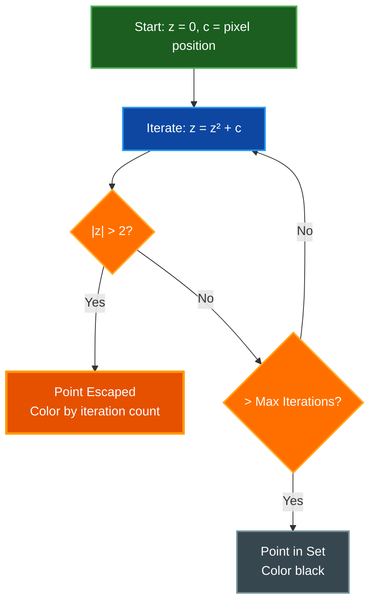

# 2D Fractals Guide

Complete guide to all 20 2D fractals available in Par Fractal, including mathematical background, usage, and exploration tips.

**Available 2D Fractals:**

**Escape-Time Fractals (13 types):**
1. Mandelbrot Set - The iconic fractal with infinite self-similar detail
2. Julia Set - Dynamic fractal that morphs with parameter C
3. Sierpinski Carpet - Classic square-based geometric fractal with perfect self-similarity
4. Sierpinski Triangle - Triangular geometric fractal using barycentric subdivision
5. Burning Ship - Ship-shaped fractal using absolute values
6. Tricorn (Mandelbar) - Complex conjugate variant with three-fold symmetry
7. Phoenix - Two-step iteration creating flowing organic patterns
8. Celtic - Celtic knot-like patterns with vertical symmetry
9. Newton - Root-finding visualization showing basins of attraction
10. Lyapunov - Population dynamics stability visualization
11. Nova - Hybrid Newton-Mandelbrot fractal
12. Magnet - Physics-inspired rational iteration formula
13. Collatz - Experimental complex number extension of 3n+1 problem

**Density Visualization (1 type):**
14. Buddhabrot - Mandelbrot escape trajectory probability distribution

**Strange Attractors (6 types):**
15. Hopalong - Barry Martin's hopalong attractor with chaotic point clouds
16. Martin - Barry Martin's original strange attractor
17. Gingerbreadman - Chaotic 2D map with cookie-like patterns
18. Chip - Chip attractor variant
19. Quadruptwo - Quadruptwo strange attractor
20. Threeply - Threeply strange attractor

## Table of Contents
- [Overview](#overview)
- [Common Controls](#common-controls)
- [Escape-Time Algorithm](#escape-time-algorithm)
- [Mandelbrot Set](#mandelbrot-set)
- [Julia Set](#julia-set)
- [Sierpinski Carpet](#sierpinski-carpet)
- [Sierpinski Triangle](#sierpinski-triangle)
- [Burning Ship](#burning-ship)
- [Tricorn (Mandelbar)](#tricorn-mandelbar)
- [Phoenix](#phoenix)
- [Celtic Fractal](#celtic-fractal)
- [Newton Fractal](#newton-fractal)
- [Lyapunov Fractal](#lyapunov-fractal)
- [Nova Fractal](#nova-fractal)
- [Magnet Fractal](#magnet-fractal)
- [Collatz Fractal](#collatz-fractal)
- [Buddhabrot](#buddhabrot)
- [Strange Attractors](#strange-attractors)
  - [Hopalong](#hopalong)
  - [Martin](#martin)
  - [Gingerbreadman](#gingerbreadman)
  - [Chip](#chip)
  - [Quadruptwo](#quadruptwo)
  - [Threeply](#threeply)
- [Color Techniques](#color-techniques)
- [Exploration Tips](#exploration-tips)
- [Related Documentation](#related-documentation)

## Overview

2D fractals in Par Fractal are computed using GPU-accelerated escape-time algorithms. Each pixel on screen maps to a point in the complex plane, and the fractal equation is iterated to determine if the point belongs to the fractal set.

**Key Features:**
- Real-time GPU computation
- High-precision zoom mode (emulated double-float precision on GPU)
- Smooth continuous coloring (eliminates banding)
- 54 built-in color palettes plus custom palette support
- Multiple coloring modes (palette, orbit traps, position-based, etc.)
- Interactive parameter adjustment with instant preview
- Screenshot and video capture support

**Navigation:**
- Mouse drag to pan
- Mouse wheel to zoom
- Zoom centers on cursor position
- Double-click to center and zoom

## High-Precision Zoom Mode

Par Fractal implements emulated double-precision arithmetic on the GPU to enable extremely deep zooms beyond the limits of standard 32-bit float precision.

**Supported Fractals:**
- Mandelbrot (fractal_type 0)
- Julia (fractal_type 1)
- Sierpinski Carpet (fractal_type 2)
- Sierpinski Triangle (fractal_type 3)
- Burning Ship (fractal_type 4)

**How It Works:**
- Each coordinate is stored as a pair of floats (hi, lo) representing value = hi + lo
- Provides approximately 14 decimal digits of precision vs 7 for standard f32
- Uses double-float arithmetic operations for addition, multiplication, and squaring
- Automatically enabled for deep zooms on supported fractals

**Performance:**
High-precision mode is more computationally intensive than standard mode, but the GPU parallelization keeps frame rates interactive even at extreme zoom levels.

**Zoom Limits:**
- Standard precision: ~10⁷ zoom (visual artifacts beyond this)
- High precision: ~10¹⁴ zoom (tested successfully)

## Common Controls

### Mouse Controls

| Action | Effect |
|--------|--------|
| **Click + Drag** | Pan view |
| **Scroll Up** | Zoom in (at cursor) |
| **Scroll Down** | Zoom out (at cursor) |
| **Double Click** | Center and zoom in |

### Keyboard Shortcuts

| Key | Action |
|-----|--------|
| **1** | Switch to Mandelbrot |
| **2** | Switch to Julia |
| **3** | Switch to Sierpinski Carpet |
| **4** | Switch to Burning Ship |
| **5** | Switch to Tricorn |
| **6** | Switch to Phoenix |
| **7** | Switch to Celtic |
| **8** | Switch to Newton |
| **9** | Switch to Lyapunov |
| **0** | Switch to Nova |
| **R** | Reset to default view |
| **H** | Toggle UI panel |
| **F** | Toggle FPS display |
| **V** | Toggle performance overlay |
| **P** | Cycle color palettes |
| **F12** | Take screenshot |

### UI Parameters

**Common to All 2D Fractals:**
- **Max Iterations** - Maximum iteration count before considering a point in the set (range: 50-2000, default: 80)
- **Center X/Y** - Complex plane coordinates (high precision for deep zooms)
- **Zoom** - Magnification level (can reach 10¹⁴ with high-precision mode)
- **Color Palette** - Choose from 54 built-in palettes or load custom palettes
- **Palette Offset** - Animate or shift color mapping (0.0-1.0, wraps around)
- **Orbit Trap Scale** - Scale factor for orbit trap coloring modes

**Color Modes:**
- **Palette** (mode 0) - Standard palette-based coloring (default)
- **Iteration Visualization** (mode 1) - Color-coded iteration count (similar to ray steps in 3D)
- **Grayscale** (mode 2) - Simple grayscale iteration visualization
- **Orbit Trap XYZ** (mode 3) - Color based on coordinate components during iteration using palette
- **Orbit Trap Radial** (mode 4) - Color based on distance from origin during iteration using palette
- **Position-Based** (modes 5 & 6) - Color from fractal-space coordinates (x, y, x+y)

**Fractal-Specific Parameters:**
- **Julia sets:** Julia constant C (real: -2.0 to 2.0, imaginary: -2.0 to 2.0)
- **Nova:** Uses Julia C parameter for hybrid Newton-Mandelbrot behavior
- **Phoenix:** Fixed phoenix parameter p = (0.5667, 0.0) (hardcoded in shader)
- **Newton/Lyapunov/Magnet/Collatz:** No additional parameters (algorithm-specific behavior)

## Escape-Time Algorithm

### How It Works



### Mathematical Foundation

For most 2D fractals:

1. **Initialize:** z₀ = 0, c = pixel coordinate
2. **Iterate:** zₙ₊₁ = f(zₙ, c)
3. **Check:** If |zₙ| > escape radius, point escapes
4. **Color:** Based on iteration count or other properties

**Escape Condition:**
- Most fractals: |z| > 2
- Some (Magnet): Custom conditions

**Smooth Coloring:**
- Use continuous iteration count
- Interpolate between colors
- Eliminates banding artifacts

## Mandelbrot Set

### Description

The Mandelbrot set is the most famous fractal, discovered by Benoit Mandelbrot in 1980. It exhibits infinite complexity and self-similarity at all scales.

**Mathematical Definition:**
```
z₀ = 0
zₙ₊₁ = zₙ² + c
```
Where c is the complex coordinate of the pixel.

**Key Features:**
- Main cardioid body
- Circular bulb to the left
- Infinite spiraling tendrils
- Self-similar mini-Mandelbrots
- Seahorse valley patterns

### How to Explore

**Start Position:**
- Center: (0.0, 0.0)
- Zoom: 1.0
- Max Iterations: 80
- Shows full Mandelbrot set

**Interesting Regions:**

1. **Seahorse Valley**
   - Center: (-0.75, 0.1)
   - Zoom: 100+
   - Max Iterations: 200-500
   - Intricate spiraling patterns

2. **Elephant Valley**
   - Center: (0.3, 0.0)
   - Zoom: 50+
   - Max Iterations: 150-300
   - Elephant-shaped formations

3. **Mini-Mandelbrot Deep Zoom**
   - Center: (-0.7435, 0.1314)
   - Zoom: 10000+
   - Max Iterations: 500-1000+
   - Complete Mandelbrot replica at miniature scale

**UI Parameters:**
- **Max Iterations:** 80 (default), 200-1000 (deep zooms), 1000-2000 (extreme zooms)
- **Zoom:** Unlimited with high-precision mode (tested to 10¹⁴)
- **High-Precision Mode:** Automatically enabled for Mandelbrot

**Tips:**
- Zoom into edges of the main set
- Look for buds and connection points
- Increase iterations when image looks blocky
- Use Fire or Rainbow palette for best contrast

## Julia Set

### Description

Julia sets are related to the Mandelbrot set but use a fixed constant c while iterating from the pixel position as z₀.

**Mathematical Definition:**
```
z₀ = pixel coordinate
zₙ₊₁ = zₙ² + c
```
Where c is a complex constant (julia_c parameter).

**Key Features:**
- Highly symmetric patterns
- Dramatic changes with small c adjustments
- Connected vs disconnected sets
- Dendrite formations
- Spiraling arms

### How to Explore

**Start Position:**
- Center: (0.0, 0.0)
- Zoom: 1.0
- Julia C: (-0.7, 0.27015) (default value)
- Max Iterations: 80

**Julia Constant Exploration:**

**Connected Sets (c inside Mandelbrot):**
- `c = (-0.4, 0.6)` - Dendrite
- `c = (0.285, 0.01)` - Double spiral
- `c = (-0.8, 0.156)` - Seahorse

**Disconnected Sets (c outside Mandelbrot):**
- `c = (-1.0, 0.0)` - Dust pattern
- `c = (0.3, 0.5)` - Scattered islands

**UI Parameters:**
- **Julia Constant X** (julia_c.x): Real part (-2.0 to 2.0)
- **Julia Constant Y** (julia_c.y): Imaginary part (-2.0 to 2.0)
- **Max Iterations:** 100-500

**Interactive Technique:**
1. Start with default c value
2. Adjust julia_c.x slider slowly
3. Watch fractal morph in real-time
4. Find interesting patterns
5. Fine-tune julia_c.y

**Tips:**
- Values near Mandelbrot boundary give best results
- Try symmetrical values (x, 0) for horizontal symmetry
- Small changes create dramatic effects
- Use Ocean palette for ethereal look

## Burning Ship

### Description

The Burning Ship fractal, discovered by Michelitsch and Rossler in 1992, uses absolute values in its iteration formula, creating ship-like structures.

**Mathematical Definition:**
```
z₀ = 0
zₙ₊₁ = (|Re(zₙ)| + i|Im(zₙ)|)² + c
```

**Key Features:**
- Ship-shaped main structure
- Asymmetric (not origin-symmetric)
- Ornate spires and masts
- Different from Mandelbrot despite similarity

### How to Explore

**Start Position:**
- Center: (-0.5, -0.5)
- Zoom: 1.0

**Interesting Regions:**
- Main ship structure
- Detailed masts and sails
- Ornate decorative elements

**UI Parameters:**
- **Max Iterations:** 200-500

**Tips:**
- Explore upper-left quadrant
- Look for architectural details
- Higher iterations reveal fine structure

## Tricorn (Mandelbar)

### Description

The Tricorn uses the complex conjugate in its iteration, creating a variation of the Mandelbrot set.

**Mathematical Definition:**
```
z₀ = 0
zₙ₊₁ = z̄ₙ² + c
```
Where z̄ is the complex conjugate of z.

**Key Features:**
- Three-fold symmetry (hence "tricorn")
- Different structure from Mandelbrot
- Unique patterns and formations

### How to Explore

**Start Position:**
- Center: (0.0, 0.0)
- Zoom: 1.0

**Tips:**
- Notice three-fold symmetry
- Explore edges for detail
- Compare with Mandelbrot structure

## Phoenix

### Description

The Phoenix fractal uses two previous iteration values, creating unique patterns.

**Mathematical Definition:**
```
zₙ₊₁ = zₙ² + c + p·zₙ₋₁
```

**Key Features:**
- Depends on phoenix parameter p
- Creates flowing, organic patterns
- Different behavior than standard escape-time

### How to Explore

**Start Position:**
- Center: (0.0, 0.0)
- Zoom: 1.0
- Max Iterations: 80

**Implementation Notes:**
- Phoenix parameter p is currently hardcoded to (0.5667, 0.0) in the shader
- This value produces aesthetically pleasing flowing patterns
- Future versions may expose this as an adjustable parameter

**UI Parameters:**
- Standard 2D parameters (center, zoom, iterations, palette)
- No phoenix-specific UI controls (parameter is fixed)

## Celtic Fractal

### Description

The Celtic fractal uses absolute value of the real part of z² in its iteration, creating patterns reminiscent of Celtic knots and interlacing designs.

**Mathematical Definition:**
```
z₀ = 0
zₙ₊₁ = (|Re(z²)| + i·Im(z²)) + c
```
Where z² is computed first, then the real part is made absolute, and finally c is added.

**Key Features:**
- Celtic knot-like patterns and interlacing structures
- Vertical symmetry due to absolute value operation
- Smooth escape-time coloring
- Different from Burning Ship (which uses |Re(z)| + i|Im(z)|)

### How to Explore

**Start Position:**
- Center: (0.0, 0.0)
- Zoom: 1.0
- Max Iterations: 80

**Tips:**
- Look for intricate knot-like patterns
- Explore vertical structures created by the symmetry
- Compare with Burning Ship to see the difference in abs() application
- Higher iterations reveal finer detail in the interlacing patterns

## Newton Fractal

### Description

Newton fractals visualize the basins of attraction for Newton's root-finding method applied to the polynomial z³ - 1. Each pixel shows which root the iteration converges to and how quickly.

**Mathematical Definition:**
```
f(z) = z³ - 1
f'(z) = 3z²
zₙ₊₁ = zₙ - f(zₙ)/f'(zₙ)
```

**The Three Roots:**
- Root 1: (1.0, 0.0) - Real positive root
- Root 2: (-0.5, 0.866025) - Complex root (upper)
- Root 3: (-0.5, -0.866025) - Complex root (lower)

**Key Features:**
- Three-fold rotational symmetry from the cubic polynomial
- Colors represent which root is found and iteration count
- Boundaries between basins of attraction show fractal behavior
- Convergence tolerance: 0.000001
- Non-escape-time algorithm (convergence-based instead)

### How to Explore

**Start Position:**
- Center: (0.0, 0.0)
- Zoom: 1.0
- Max Iterations: 80

**Coloring:**
- The fractal uses a hybrid coloring approach:
  - Base offset (0.0, 0.33, or 0.66) depending on which root converges
  - Iteration count contribution for smooth gradients
- Formula: `(iteration / max_iterations) * 0.5 + root_offset * 0.5`

**Tips:**
- The three-fold symmetry creates beautiful patterns
- Zoom into the boundaries between basin regions for complex fractal detail
- Different roots create different colored regions
- Very different from escape-time fractals - based on convergence instead

## Lyapunov Fractal

### Description

Lyapunov fractals visualize the stability of population models based on the logistic map. They show regions where iterative population models exhibit stable, periodic, or chaotic behavior. This fractal uses an alternating sequence of two different growth rate parameters.

**Mathematical Definition:**
```
x₀ = 0.5
xₙ₊₁ = r·xₙ·(1 - xₙ)
```
Where r alternates between values a and b based on a 12-step sequence (AAAAAABBBBBB - six a's followed by six b's).

**Parameter Mapping:**
- a = pixel.x × 2 + 2 (maps x-coordinate to [0,4] range)
- b = pixel.y × 2 + 2 (maps y-coordinate to [0,4] range)

**Lyapunov Exponent:**
- λ = (1/N) × Σ log|r × (1 - 2x)|
- Accumulated over max_iterations steps
- Derivative threshold: 0.0001 (prevents log of very small values)

**Key Features:**
- Different from escape-time fractals - based on dynamical stability analysis
- 12-step alternating sequence between a and b parameters (6-6 pattern)
- Color interpretation:
  - λ < 0: Stable/convergent regions (mapped to 0.0-0.5 range)
  - λ > 0: Chaotic regions (mapped to 0.5-1.0 range)
- Symmetrical across origin due to symmetric parameter mapping
- Non-escape algorithm - uses stability measure instead

### How to Explore

**Start Position:**
- Center: (0.0, 0.0)
- Zoom: 1.0
- Max Iterations: 80 (used for Lyapunov exponent accumulation)
- Visible range typically covers parameter space [0,4] × [0,4]

**Color Mapping:**
- Lyapunov exponent is normalized and clamped
- Negative λ: `0.5 - clamp(-λ * 0.5, 0.0, 0.5)` → darker colors
- Positive λ: `0.5 + clamp(λ * 0.5, 0.0, 0.5)` → brighter colors

**Tips:**
- Brighter areas indicate chaotic behavior (positive Lyapunov exponent)
- Darker areas indicate stable periodic orbits (negative Lyapunov exponent)
- The parameter space ranges from 0 to 4 (classic logistic map range)
- This fractal has a very different interpretation than escape-time fractals
- Try exploring different regions to find boundaries between order and chaos

## Nova Fractal

### Description

Nova fractals combine Newton's method with the addition of a constant, creating unique patterns. The algorithm applies Newton's method to find roots of z³ - 1, then adds a Julia-like constant after each iteration.

**Mathematical Definition:**
```
z₀ = pixel coordinate
zₙ₊₁ = zₙ - R·f(zₙ)/f'(zₙ) + c
```
Where f(z) = z³ - 1, R is the relaxation parameter (fixed at 1.0), and c is the Julia constant.

**Key Features:**
- Hybrid of Newton and Julia approaches
- Uses the Julia C parameter (uniforms.julia_c) for the additive constant
- Complex symmetrical patterns with chaotic boundaries
- Three-fold symmetry from cubic polynomial
- Escape-time coloring with smooth iteration count

### How to Explore

**Start Position:**
- Center: (0.0, 0.0)
- Zoom: 1.0
- Julia C: (-0.7, 0.27015) (default, or experiment with different values)
- Max Iterations: 16 (default for Nova)

**UI Parameters:**
- **Julia Constant C:** Controls the additive offset after Newton step
  - Real component (julia_c.x): -2.0 to 2.0
  - Imaginary component (julia_c.y): -2.0 to 2.0
- Try values similar to Julia set exploration
- Small changes create dramatic pattern differences

**Tips:**
- Experiment with different Julia C values to create varied patterns
- The fractal escapes when |z| > 2 (standard escape radius)
- Uses smooth coloring for band-free gradients
- Three-fold symmetry creates beautiful kaleidoscopic patterns

## Magnet Fractal

### Description

Based on magnetic renormalization transformations from theoretical physics. The Magnet Type 1 fractal arises from studying the behavior of magnetic systems near critical points.

**Mathematical Definition:**
```
z₀ = 0
zₙ₊₁ = ((zₙ² + c - 1) / (2zₙ + c - 2))²
```

**Key Features:**
- Unique rational iteration formula (involves division)
- Different escape condition: |z| > 10000 (larger than typical fractals)
- Convergence test: Points that converge to z = 1 are in the set
- Creates patterns distinct from polynomial fractals
- More computationally intensive due to complex division

### How to Explore

**Start Position:**
- Center: (0.0, 0.0)
- Zoom: 1.0
- Max Iterations: 80

**Tips:**
- Experiment with different regions
- Patterns are more scattered than Mandelbrot
- Increase iterations for fine detail

## Collatz Fractal

### Description

Based on the famous Collatz conjecture (3n+1 problem) extended to complex numbers. This fractal visualizes the behavior of a complex generalization of the Collatz map using a smooth analytical formula.

**Mathematical Definition:**
```
z₀ = pixel coordinate
zₙ₊₁ = 0.25 × (2 + 7z - (2 + 5z) × cos(πz))
```

**Complex Cosine Implementation:**
For complex z = x + iy:
```
cos(πz) = cos(πx) × cosh(πy) - i × sin(πx) × sinh(πy)
```
Where cosh(x) = (eˣ + e⁻ˣ)/2 and sinh(x) = (eˣ - e⁻ˣ)/2

**Key Features:**
- Experimental visualization of number theory concept
- Complex trigonometric iteration formula involving hyperbolic functions
- Dual escape/convergence behavior:
  - Escape condition: |z| > 10000
  - Tracks minimum distance to origin during iteration
- Unique coloring approach:
  - Escaped points: `fract((iteration + 1 - smooth_nu) / 50.0)`
  - Converged points: `fract(min_distance × 2.0)`
- Highly experimental and produces unique, organic patterns
- Very different behavior from polynomial fractals

### How to Explore

**Start Position:**
- Center: (0.0, 0.0)
- Zoom: 1.0
- Max Iterations: 80

**Coloring Details:**
- Points that escape use smooth escape-time coloring (like Mandelbrot)
- Points that don't escape are colored based on their minimum distance to the origin
- The fract() function creates repeating color bands
- Escape normalization uses division by 50 for varied color distribution

**Tips:**
- This is a highly experimental fractal with unpredictable behavior
- Patterns are very different from classic polynomial fractals
- Try zooming into different regions to find interesting structures
- Increase iterations to capture more detail in complex regions
- The minimum distance coloring creates unique organic textures
- Expect asymmetric and non-self-similar patterns

## Sierpinski Carpet

### Description

The Sierpinski Carpet is a classic square-based fractal pattern created through recursive subdivision.

**Algorithm:**
1. Start with a unit square
2. Divide into 3×3 grid
3. Remove the center square
4. Recursively repeat for each remaining square

**Key Features:**
- Perfect self-similarity at all scales
- Square-based recursive pattern
- Deterministic (not based on iteration/escape)
- Infinite fractal detail
- Different coloring: based on subdivision level rather than escape time
- High-precision zoom support for extremely deep exploration

### How to Explore

**Start Position:**
- Center: (0.0, 0.0)
- Zoom: 1.0
- Visible range: [-1, 1] × [-1, 1]

**How It Works:**
- The algorithm checks if each pixel falls in a "removed" region at any subdivision level
- Iterates up to max_iterations subdivision levels
- Stops early when scale exceeds pixel precision (~10⁶)
- Returns 0.0 (black) for removed regions, or subdivision level / max_iterations for remaining regions

**Tips:**
- Perfect example of geometric self-similarity
- Zoom in anywhere to see identical pattern at smaller scale
- Unlike escape-time fractals, this has a deterministic structure
- Try different color palettes to highlight the subdivision levels
- Supports high-precision mode for deep zooms

## Sierpinski Triangle

### Description

The Sierpinski Triangle is a classic triangular fractal pattern created through barycentric coordinate subdivision. This creates the iconic triangular fractal with holes at every scale.

**Algorithm:**
1. Start with an equilateral triangle
2. Identify the center region using barycentric coordinates
3. Remove the center triangular region
4. Recursively repeat for each remaining triangle

**Key Features:**
- Perfect triangular self-similarity at all scales
- Triangle-based recursive pattern using barycentric subdivision
- Deterministic geometric structure
- Different from Sierpinski Carpet (square-based version)
- Smooth coloring based on iteration depth and distance to hole edges
- High-precision zoom support for deep exploration

### How to Explore

**Start Position:**
- Center: (0.0, 0.0)
- Zoom: 1.0
- Max Iterations: 30 (default)
- Visible triangle with vertices at (0,0), (1,0), and (0.5, √3/2)

**How It Works:**
- Uses barycentric coordinates (u, v, w) to represent position within the triangle
- At each iteration, checks if the point is in the center hole (all coordinates < 0.5)
- If in a hole, returns a color based on iteration depth
- Otherwise, transforms coordinates to the appropriate corner sub-triangle
- Provides smooth coloring using the maximum barycentric coordinate

**Mathematical Foundation:**
```
Initial triangle vertices:
v0 = (0.0, 0.0)           // Bottom-left
v1 = (1.0, 0.0)           // Bottom-right
v2 = (0.5, √3/2)          // Top

Barycentric subdivision rule:
- If u ≥ 0.5: transform to bottom-left corner
- If v ≥ 0.5: transform to bottom-right corner
- If w ≥ 0.5: transform to top corner
- If all < 0.5: point is in a hole
```

**Tips:**
- Beautiful example of triangular self-similarity
- Zoom in on any edge to see the same triangular pattern repeated
- Try different palettes to visualize the iteration depths
- Supports high-precision mode for extremely deep zooms
- Different coloring than Sierpinski Carpet - uses smooth iteration-based shading

## Buddhabrot

### Description

The Buddhabrot is a probability distribution visualization of escape trajectories from the Mandelbrot set, discovered by Melinda Green in 1993. Unlike traditional Mandelbrot rendering which colors each pixel based on escape time, the Buddhabrot traces the full trajectory of escaping points and accumulates hit counts at each pixel, creating an image that resembles a seated Buddha figure.

**Algorithm:**
1. Sample random c values in the complex plane
2. Test if c escapes the Mandelbrot iteration (|z| > 2)
3. If it escapes, trace the full escape trajectory
4. For each point z in the trajectory, increment the pixel counter at that location
5. Points that don't escape (inside Mandelbrot set) are discarded

**Mathematical Definition:**
```
z₀ = 0
zₙ₊₁ = zₙ² + c
```
For random c values, if the sequence escapes, plot all intermediate zₙ values.

**Key Features:**
- Density-based visualization (not escape-time)
- Uses GPU compute shaders for real-time accumulation
- Higher iterations reveal more detail but sparser structures
- Image builds up progressively over time as more samples are traced
- Resembles a seated Buddha figure in meditation pose

### How to Explore

**Start Position:**
- Center: (-0.5, 0.0)
- Zoom: 0.35 (zoomed out to see full figure)
- Max Iterations: 1000

**UI Parameters:**
- **Max Iterations:** Controls detail level - higher values show more intricate trajectories but sparser density (try 500-5000)
- **Iterations/Frame:** Number of random samples tested per frame (higher = faster convergence)
- **Log Scale:** Adjusts visualization contrast for density display

**Rendering Notes:**
- The Buddhabrot uses accumulation-based rendering like strange attractors
- Image quality improves over time as more samples are accumulated
- Panning or zooming clears the accumulation buffer and restarts sampling
- Higher iteration counts create more detailed but sparser images

**Tips:**
- Start with lower max iterations (500-1000) for faster initial visualization
- Let the image accumulate for 10-30 seconds to see detail emerge
- Try increasing max iterations to 2000-5000 for finer filament structures
- The "Nebulabrot" technique uses different iteration counts for RGB channels
- Use Log Scale to adjust visibility of faint trajectory structures

### Nebulabrot Coloring

The Nebulabrot is a color variation discovered by Melinda Green where different maximum iteration counts are used for the red, green, and blue color channels (e.g., R=5000, G=500, B=50). This creates false-color images similar to astronomical nebula photographs.

**Note:** The current implementation uses a single iteration count. Future versions may add per-channel iteration control for full Nebulabrot support.

## Strange Attractors

Strange attractors are chaotic dynamical systems that create intricate, non-repeating patterns through iterative point plotting. Unlike escape-time fractals, these use accumulation-based rendering where millions of orbit points are plotted to reveal the attractor's structure.

**Key Differences from Escape-Time Fractals:**
- Use iterative mapping functions (not complex iteration)
- Render via point accumulation (density visualization)
- No "escape" condition - orbits are bounded
- Chaotic behavior creates fractal-like patterns
- Require many iterations (typically 1000+ per frame) for detail

**Rendering Approach:**
Strange attractors use a specialized compute shader accumulation system that tracks point densities across frames. Each frame adds more orbit points, gradually revealing the attractor's intricate structure.

**Controls:**
- Accessed via UI fractal type selector (no dedicated keyboard shortcuts)
- Parameters (a, b, c, etc.) controlled via julia_c and power sliders
- Center and zoom work differently than escape-time fractals
- Max iterations controls orbit length per frame

### Hopalong

Barry Martin's hopalong attractor creates flowing, organic patterns with chaotic trajectories.

**Mathematical Definition:**
```
x₀ = 0, y₀ = 0
xₙ₊₁ = yₙ - sign(xₙ) × √(|b×xₙ - c|)
yₙ₊₁ = a - xₙ
```

**Parameters:**
- a = julia_c.x (default: 0.4)
- b = julia_c.y (default: 1.0)
- c = 0.0 (hardcoded)

**Default View:**
- Center: (0.5, 0.5)
- Zoom: 0.3
- Max Iterations: 1000

**Tips:**
- Try varying parameter 'a' between -1.0 and 2.0
- Parameter 'b' controls the shape (try 0.5 to 2.0)
- Produces flowing, organic trails
- Very sensitive to parameter changes

### Martin

Barry Martin's original strange attractor with simple but elegant chaotic dynamics.

**Mathematical Definition:**
```
x₀ = 0, y₀ = 0
xₙ₊₁ = yₙ - sin(xₙ)
yₙ₊₁ = a - xₙ
```

**Parameters:**
- a = julia_c.x (default: π ≈ 3.14159)

**Default View:**
- Center: (0.0, 0.0)
- Zoom: 0.05
- Max Iterations: 1000

**Tips:**
- Classic value a = π creates the most well-known pattern
- Try values near π (2.5 to 4.0) for variations
- Creates swirling, spiral-like structures
- Very compact and self-contained

### Gingerbreadman

A chaotic 2D map producing scattered "cookie-like" patterns.

**Mathematical Definition:**
```
x₀ = 0, y₀ = 0
xₙ₊₁ = 1 - yₙ + |xₙ|
yₙ₊₁ = xₙ
```

**Parameters:**
- No adjustable parameters (fixed formula)

**Default View:**
- Center: (2.0, 2.0)
- Zoom: 0.15
- Max Iterations: 1000

**Tips:**
- Parameter-free - pure chaotic dynamics
- Creates scattered, organic patterns
- Named for its resemblance to gingerbread cookies
- Exhibits interesting clustering behavior

### Chip

The Chip attractor variant with adjustable parameters for varied patterns.

**Mathematical Definition:**
```
x₀ = 0, y₀ = 0
xₙ₊₁ = yₙ - sign(xₙ) × √(|a×xₙ - b|)
yₙ₊₁ = c - xₙ
```

**Parameters:**
- a = julia_c.x (default: -15.0)
- b = julia_c.y (default: -19.0)
- c = power (default: 1.0)

**Default View:**
- Center: (0.0, 0.0)
- Zoom: 0.002
- Max Iterations: 1000

**Tips:**
- Highly sensitive to parameter changes
- Try extreme negative values for 'a' and 'b'
- Creates dense, chip-like patterns
- Very small features require high zoom

### Quadruptwo

The Quadruptwo strange attractor with complex parameter interactions.

**Mathematical Definition:**
```
x₀ = 0, y₀ = 0
xₙ₊₁ = yₙ - sign(xₙ) × √(|a×xₙ - b|)
yₙ₊₁ = c - xₙ
```

**Parameters:**
- a = julia_c.x (default: 34.0)
- b = julia_c.y (default: 1.0)
- c = power (default: 5.0)

**Default View:**
- Center: (15.0, 17.0)
- Zoom: 0.01
- Max Iterations: 1000

**Tips:**
- Large positive parameter values
- Creates intricate, interleaved patterns
- Requires appropriate centering for viewing
- Experiment with 'c' parameter (power slider)

### Threeply

The Threeply strange attractor with unique chaotic dynamics.

**Mathematical Definition:**
```
x₀ = 0, y₀ = 0
xₙ₊₁ = yₙ - sign(xₙ) × √(|a×xₙ - b|)
yₙ₊₁ = c - xₙ
```

**Parameters:**
- a = julia_c.x (default: -55.0)
- b = julia_c.y (default: -1.0)
- c = power (default: -42.0)

**Default View:**
- Center: (0.0, 0.0)
- Zoom: 1.0
- Max Iterations: 1000

**Tips:**
- Uses large negative parameter values
- Creates three-fold layered patterns (hence "threeply")
- Dramatic changes with small adjustments
- Centered at origin for default view

## Color Techniques

### Color Modes

**Palette Mode (Default):**
- Maps iteration count to color palette
- Smooth interpolation between colors
- 8-color gradients for rich color transitions

**Available Palettes:**

Par Fractal includes 54 built-in color palettes organized into several categories:

*Classic Palettes (6):*
- Fire - Black → Purple → Red → Orange → Yellow
- Ocean - Deep Blue → Dark Blue → Blue → Light Blue → Cyan
- Rainbow - Red → Yellow → Green → Blue → Purple
- Forest - Dark Green → Green → Light Green → Yellow-Green → Pale Green
- Sunset - Purple → Pink → Orange → Light Orange → Yellow
- Grayscale - Black → Dark Gray → Gray → Light Gray → White

*Scientific Visualization (4):*
- Viridis - Dark Purple → Purple → Teal → Green → Yellow
- Plasma - Deep Blue → Purple → Magenta → Orange → Yellow
- Inferno - Black → Dark Purple → Red → Orange → Yellow
- Magma - Black → Purple → Pink-Red → Orange → Pale Yellow

*Temperature Palettes (4):*
- Copper - Black → Dark Brown → Brown → Copper → Light Copper
- Cool - Cyan → Light Blue → Blue-Purple → Purple → Magenta
- Hot - Black → Dark Red → Orange → Yellow → White
- Lava - Almost Black → Dark Red → Red → Orange → Yellow-Orange

*Artistic Palettes (7):*
- Neon - Magenta → Cyan → Green → Yellow → Pink (bright neon colors)
- Purple Dream - Dark Purple → Purple → Violet → Lavender → Pale Purple
- Earth - Dark Brown → Brown → Tan → Olive → Beige-Green
- Ice - Pale Blue → Light Blue → Blue → Deep Blue → Dark Blue
- Galaxy - Deep Space Blue → Purple → Violet → Pink-Purple → Pink
- Mint - Dark Teal → Teal → Mint → Light Mint → Pale Mint
- Cherry - Dark Red → Cherry Red → Red-Pink → Pink → Pale Pink

*XFractint Classic Palettes (33):*
- XF Altern - Alternating color bands
- XF Blues - Blue gradient variations
- XF Chroma - Chromatic color progression
- XF Default - Classic XFractint default palette
- XF DefaultW - White-based default variant
- XF Firestrm - Fire storm effect
- XF Froth3 - Froth pattern variant 3
- XF Froth316 - Froth pattern 3-16
- XF Froth6 - Froth pattern variant 6
- XF Froth616 - Froth pattern 6-16
- XF Gamma1 - Gamma correction variant 1
- XF Gamma2 - Gamma correction variant 2
- XF Glasses1 - Glasses color scheme 1
- XF Glasses2 - Glasses color scheme 2
- XF Goodega - EGA-style retro colors
- XF Green - Green gradient variations
- XF Grey - Grayscale variations
- XF Grid - Grid-like color pattern
- XF Headach2 - High-contrast psychedelic variant 2
- XF Headache - High-contrast psychedelic colors
- XF Landscap - Landscape-inspired earth tones
- XF Lyapunov - Optimized for Lyapunov fractals
- XF Neon - XFractint bright neon palette
- XF Paintjet - Paintjet printer color set
- XF Royal - Royal purple and blue tones
- XF Topo - Topographic map colors
- XF Volcano - Volcanic lava colors

### Smooth Coloring

Par Fractal uses continuous iteration count for smooth, band-free coloring:

```
smooth_iteration = iteration + 1 - log2(log2(|z|))
```

This eliminates color banding and creates smooth gradients.

### Custom Palettes

Par Fractal supports creating and importing custom color palettes.

**Creating Custom Palettes:**
1. Open UI panel (H key)
2. Go to "Palette" section
3. Adjust 8 color stops using color pickers
4. See results in real-time
5. Save palette to `~/.config/par-fractal/palettes/` (Linux/macOS) or `%APPDATA%\par-fractal\palettes\` (Windows)

**Importing Palettes:**

Supports multiple palette file formats:
- **JASC-PAL format** - Standard palette format with RGB values (0-255)
- **Simple text format** - One RGB color per line (0-255 integers or 0.0-1.0 floats)
- **YAML format** - Par Fractal's native format

The importer automatically samples 8 evenly-spaced colors from palettes with more than 8 colors.

**Loading Saved Palettes:**
1. Place palette file in config directory
2. Restart application or reload palettes
3. Select from palette list in UI

## Exploration Tips

### Finding Interesting Regions

**Technique 1: Edge Exploration**
1. Zoom to edge of main set
2. Look for spirals and tendrils
3. Follow them deeper
4. Find mini-sets

**Technique 2: Systematic Search**
1. Grid search at medium zoom
2. Mark interesting coordinates
3. Return and zoom deeper
4. Document findings

**Technique 3: Parameter Variation**
1. Start with known good value
2. Make small adjustments
3. Watch for sudden changes
4. Save interesting configurations

### Deep Zoom Guidelines

**Zoom Level vs Iterations:**
- Zoom < 100: 100-200 iterations
- Zoom 100-1000: 200-500 iterations
- Zoom 1000-10000: 500-1000 iterations
- Zoom > 10000: 1000-2000 iterations

**Performance:**
- Higher iterations = slower rendering
- Reduce iterations while actively exploring and zooming
- Increase iterations for final detailed view or screenshots
- GPU parallelization keeps 2D rendering fast even at high iteration counts

### Screenshot Best Practices

**For Best Quality:**
1. Position view carefully
2. Set high iteration count
3. Choose appropriate palette
4. Hide UI (press H)
5. Ensure fractal has finished rendering (may take a moment at high iteration counts)
6. Press F12 to capture

**Screenshot Details:**
- Screenshots are saved to the current working directory
- Filename format: `{fractal_type}_{width}x{height}_{timestamp}.png`
- Example: `mandelbrot_1920x1080_20231123_143022.png`
- Resolution matches current window size
- Captures the rendered framebuffer exactly as displayed

**High Resolution Capture:**
The UI includes a "Capture at Resolution" feature:
1. Open UI panel (H)
2. Navigate to capture section
3. Select resolution preset (720p, 1080p, 1440p, 4K, 8K) or custom
4. Set max iterations high for quality (1000+ recommended)
5. Click "Capture at Resolution"
6. Wait for render to complete (may take longer for high resolutions)
7. Image saved automatically to working directory

## Related Documentation

- [Quick Start Guide](QUICKSTART.md) - Get started quickly
- [3D Fractals](FRACTALS3D.md) - Explore 3D fractal types
- [Controls Reference](CONTROLS.md) - Complete control reference
- [Architecture](ARCHITECTURE.md) - Technical implementation details
