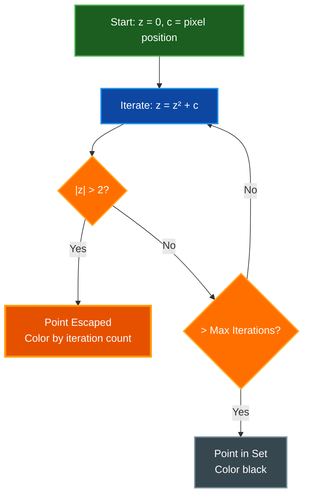

# 2D Fractals Guide

Complete guide to all 12 2D fractals available in Par Fractal, including mathematical background, usage, and exploration tips.

**Available 2D Fractals:**
1. Mandelbrot Set - The iconic fractal with infinite self-similar detail
2. Julia Set - Dynamic fractal that morphs with parameter C
3. Sierpinski Carpet - Classic geometric fractal with perfect self-similarity
4. Burning Ship - Ship-shaped fractal using absolute values
5. Tricorn (Mandelbar) - Complex conjugate variant with three-fold symmetry
6. Phoenix - Two-step iteration creating flowing organic patterns
7. Celtic - Celtic knot-like patterns with vertical symmetry
8. Newton - Root-finding visualization showing basins of attraction
9. Lyapunov - Population dynamics stability visualization
10. Nova - Hybrid Newton-Mandelbrot fractal
11. Magnet - Physics-inspired rational iteration formula
12. Collatz - Experimental complex number extension of 3n+1 problem

## Table of Contents
- [Overview](#overview)
- [Common Controls](#common-controls)
- [Escape-Time Algorithm](#escape-time-algorithm)
- [Mandelbrot Set](#mandelbrot-set)
- [Julia Set](#julia-set)
- [Burning Ship](#burning-ship)
- [Tricorn (Mandelbar)](#tricorn-mandelbar)
- [Phoenix](#phoenix)
- [Celtic Fractal](#celtic-fractal)
- [Newton Fractal](#newton-fractal)
- [Lyapunov Fractal](#lyapunov-fractal)
- [Nova Fractal](#nova-fractal)
- [Magnet Fractal](#magnet-fractal)
- [Collatz Fractal](#collatz-fractal)
- [Sierpinski Carpet](#sierpinski-carpet)
- [Color Techniques](#color-techniques)
- [Exploration Tips](#exploration-tips)
- [Related Documentation](#related-documentation)

## Overview

2D fractals in Par Fractal are computed using GPU-accelerated escape-time algorithms. Each pixel on screen maps to a point in the complex plane, and the fractal equation is iterated to determine if the point belongs to the fractal set.

**Key Features:**
- Real-time GPU computation
- High-precision zoom mode (emulated double-float precision on GPU)
- Smooth continuous coloring (eliminates banding)
- 21 built-in color palettes plus custom palette support
- Multiple coloring modes (palette, orbit traps, position-based, etc.)
- Interactive parameter adjustment with instant preview
- Screenshot and video capture support

**Navigation:**
- Mouse drag to pan
- Mouse wheel to zoom
- Zoom centers on cursor position
- Double-click to center and zoom

## High-Precision Zoom Mode

Par Fractal implements emulated double-precision arithmetic on the GPU to enable extremely deep zooms beyond the limits of standard 32-bit float precision.

**Supported Fractals:**
- Mandelbrot (fractal_type 0)
- Julia (fractal_type 1)
- Burning Ship (fractal_type 3)
- Tricorn (fractal_type 4)

**How It Works:**
- Each coordinate is stored as a pair of floats (hi, lo) representing value = hi + lo
- Provides approximately 14 decimal digits of precision vs 7 for standard f32
- Uses double-float arithmetic operations for addition, multiplication, and squaring
- Automatically enabled for deep zooms on supported fractals

**Performance:**
High-precision mode is more computationally intensive than standard mode, but the GPU parallelization keeps frame rates interactive even at extreme zoom levels.

**Zoom Limits:**
- Standard precision: ~10⁷ zoom (visual artifacts beyond this)
- High precision: ~10¹⁴ zoom (tested successfully)

## Common Controls

### Mouse Controls

| Action | Effect |
|--------|--------|
| **Click + Drag** | Pan view |
| **Scroll Up** | Zoom in (at cursor) |
| **Scroll Down** | Zoom out (at cursor) |
| **Double Click** | Center and zoom in |

### Keyboard Shortcuts

| Key | Action |
|-----|--------|
| **1** | Switch to Mandelbrot |
| **2** | Switch to Julia |
| **R** | Reset to default view |
| **H** | Toggle UI panel |
| **P** | Cycle color palettes |
| **F12** | Take screenshot |

### UI Parameters

**Common to All 2D Fractals:**
- **Max Iterations** - Maximum iteration count before considering a point in the set (range: 50-2000, default: 80)
- **Center X/Y** - Complex plane coordinates (high precision for deep zooms)
- **Zoom** - Magnification level (can reach 10¹⁴ with high-precision mode)
- **Color Palette** - Choose from 21 built-in palettes or load custom palettes
- **Palette Offset** - Animate or shift color mapping (0.0-1.0, wraps around)
- **Orbit Trap Scale** - Scale factor for orbit trap coloring modes

**Color Modes:**
- **Palette** - Standard palette-based coloring (default)
- **Orbit Trap XYZ** - Color based on coordinate components during iteration
- **Orbit Trap Radial** - Color based on distance from origin during iteration
- **Position-Based** - Color from fractal-space coordinates
- **Iterations** - Visualize iteration counts directly
- **Grayscale** - Simple grayscale iteration visualization

**Fractal-Specific Parameters:**
- **Julia sets:** Julia constant C (real: -2.0 to 2.0, imaginary: -2.0 to 2.0)
- **Nova:** Uses Julia C parameter for hybrid Newton-Mandelbrot behavior
- **Phoenix:** Fixed phoenix parameter p = (0.5667, 0.0) (hardcoded in shader)
- **Newton/Lyapunov/Magnet/Collatz:** No additional parameters (algorithm-specific behavior)

## Escape-Time Algorithm

### How It Works



### Mathematical Foundation

For most 2D fractals:

1. **Initialize:** z₀ = 0, c = pixel coordinate
2. **Iterate:** zₙ₊₁ = f(zₙ, c)
3. **Check:** If |zₙ| > escape radius, point escapes
4. **Color:** Based on iteration count or other properties

**Escape Condition:**
- Most fractals: |z| > 2
- Some (Magnet): Custom conditions

**Smooth Coloring:**
- Use continuous iteration count
- Interpolate between colors
- Eliminates banding artifacts

## Mandelbrot Set

### Description

The Mandelbrot set is the most famous fractal, discovered by Benoit Mandelbrot in 1980. It exhibits infinite complexity and self-similarity at all scales.

**Mathematical Definition:**
```
z₀ = 0
zₙ₊₁ = zₙ² + c
```
Where c is the complex coordinate of the pixel.

**Key Features:**
- Main cardioid body
- Circular bulb to the left
- Infinite spiraling tendrils
- Self-similar mini-Mandelbrots
- Seahorse valley patterns

### How to Explore

**Start Position:**
- Center: (0.0, 0.0)
- Zoom: 1.0
- Max Iterations: 80
- Shows full Mandelbrot set

**Interesting Regions:**

1. **Seahorse Valley**
   - Center: (-0.75, 0.1)
   - Zoom: 100+
   - Max Iterations: 200-500
   - Intricate spiraling patterns

2. **Elephant Valley**
   - Center: (0.3, 0.0)
   - Zoom: 50+
   - Max Iterations: 150-300
   - Elephant-shaped formations

3. **Mini-Mandelbrot Deep Zoom**
   - Center: (-0.7435, 0.1314)
   - Zoom: 10000+
   - Max Iterations: 500-1000+
   - Complete Mandelbrot replica at miniature scale

**UI Parameters:**
- **Max Iterations:** 80 (default), 200-1000 (deep zooms), 1000-2000 (extreme zooms)
- **Zoom:** Unlimited with high-precision mode (tested to 10¹⁴)
- **High-Precision Mode:** Automatically enabled for Mandelbrot

**Tips:**
- Zoom into edges of the main set
- Look for buds and connection points
- Increase iterations when image looks blocky
- Use Fire or Rainbow palette for best contrast

## Julia Set

### Description

Julia sets are related to the Mandelbrot set but use a fixed constant c while iterating from the pixel position as z₀.

**Mathematical Definition:**
```
z₀ = pixel coordinate
zₙ₊₁ = zₙ² + c
```
Where c is a complex constant (julia_c parameter).

**Key Features:**
- Highly symmetric patterns
- Dramatic changes with small c adjustments
- Connected vs disconnected sets
- Dendrite formations
- Spiraling arms

### How to Explore

**Start Position:**
- Center: (0.0, 0.0)
- Zoom: 1.0
- Julia C: (-0.7, 0.27015) (default value)
- Max Iterations: 80

**Julia Constant Exploration:**

**Connected Sets (c inside Mandelbrot):**
- `c = (-0.4, 0.6)` - Dendrite
- `c = (0.285, 0.01)` - Double spiral
- `c = (-0.8, 0.156)` - Seahorse

**Disconnected Sets (c outside Mandelbrot):**
- `c = (-1.0, 0.0)` - Dust pattern
- `c = (0.3, 0.5)` - Scattered islands

**UI Parameters:**
- **Julia Constant X** (julia_c.x): Real part (-2.0 to 2.0)
- **Julia Constant Y** (julia_c.y): Imaginary part (-2.0 to 2.0)
- **Max Iterations:** 100-500

**Interactive Technique:**
1. Start with default c value
2. Adjust julia_c.x slider slowly
3. Watch fractal morph in real-time
4. Find interesting patterns
5. Fine-tune julia_c.y

**Tips:**
- Values near Mandelbrot boundary give best results
- Try symmetrical values (x, 0) for horizontal symmetry
- Small changes create dramatic effects
- Use Ocean palette for ethereal look

## Burning Ship

### Description

The Burning Ship fractal, discovered by Michelitsch and Rossler in 1992, uses absolute values in its iteration formula, creating ship-like structures.

**Mathematical Definition:**
```
z₀ = 0
zₙ₊₁ = (|Re(zₙ)| + i|Im(zₙ)|)² + c
```

**Key Features:**
- Ship-shaped main structure
- Asymmetric (not origin-symmetric)
- Ornate spires and masts
- Different from Mandelbrot despite similarity

### How to Explore

**Start Position:**
- Center: (-0.5, -0.5)
- Zoom: 1.0

**Interesting Regions:**
- Main ship structure
- Detailed masts and sails
- Ornate decorative elements

**UI Parameters:**
- **Max Iterations:** 200-500

**Tips:**
- Explore upper-left quadrant
- Look for architectural details
- Higher iterations reveal fine structure

## Tricorn (Mandelbar)

### Description

The Tricorn uses the complex conjugate in its iteration, creating a variation of the Mandelbrot set.

**Mathematical Definition:**
```
z₀ = 0
zₙ₊₁ = z̄ₙ² + c
```
Where z̄ is the complex conjugate of z.

**Key Features:**
- Three-fold symmetry (hence "tricorn")
- Different structure from Mandelbrot
- Unique patterns and formations

### How to Explore

**Start Position:**
- Center: (0.0, 0.0)
- Zoom: 1.0

**Tips:**
- Notice three-fold symmetry
- Explore edges for detail
- Compare with Mandelbrot structure

## Phoenix

### Description

The Phoenix fractal uses two previous iteration values, creating unique patterns.

**Mathematical Definition:**
```
zₙ₊₁ = zₙ² + c + p·zₙ₋₁
```

**Key Features:**
- Depends on phoenix parameter p
- Creates flowing, organic patterns
- Different behavior than standard escape-time

### How to Explore

**Start Position:**
- Center: (0.0, 0.0)
- Zoom: 1.0
- Max Iterations: 80

**Implementation Notes:**
- Phoenix parameter p is currently hardcoded to (0.5667, 0.0) in the shader
- This value produces aesthetically pleasing flowing patterns
- Future versions may expose this as an adjustable parameter

**UI Parameters:**
- Standard 2D parameters (center, zoom, iterations, palette)
- No phoenix-specific UI controls (parameter is fixed)

## Celtic Fractal

### Description

The Celtic fractal uses absolute value of the real part in its iteration.

**Mathematical Definition:**
```
z₀ = 0
zₙ₊₁ = (|Re(zₙ)| + i·Im(zₙ))² + c
```

**Key Features:**
- Celtic knot-like patterns
- Vertical symmetry
- Intricate interlacing structures

### How to Explore

**Start Position:**
- Center: (0.0, 0.0)
- Zoom: 1.0

**Tips:**
- Look for knot patterns
- Explore vertical structures

## Newton Fractal

### Description

Newton fractals visualize the basins of attraction for Newton's root-finding method applied to polynomials.

**Mathematical Definition:**
```
zₙ₊₁ = zₙ - f(zₙ)/f'(zₙ)
```

**Key Features:**
- Colors represent which root is found
- Boundaries show chaotic behavior
- Often three-fold or higher symmetry

### How to Explore

**Start Position:**
- Center: (0.0, 0.0)
- Zoom: 1.0

**Tips:**
- Colors indicate different roots
- Boundaries are fractal
- High symmetry patterns

## Lyapunov Fractal

### Description

Lyapunov fractals visualize the stability of population models based on the logistic map. They show regions where iterative population models exhibit stable, periodic, or chaotic behavior.

**Mathematical Definition:**
```
x₀ = 0.5
xₙ₊₁ = r·xₙ·(1 - xₙ)
```
Where r alternates between values a and b based on a sequence (AAAAAABBBBBB in this implementation, 6-6 pattern).

**Key Features:**
- Visualizes Lyapunov exponent: λ = (1/N)·Σ log|r·(1-2x)|
- a = pixel.x * 2 + 2 (maps to [0,4] range)
- b = pixel.y * 2 + 2 (maps to [0,4] range)
- Color interpretation:
  - λ < 0: Stable/convergent regions (darker colors)
  - λ > 0: Chaotic regions (brighter colors)
- 12-step alternating sequence between a and b parameters
- Different from escape-time fractals - based on dynamical stability

### How to Explore

**Start Position:**
- Center: (0.0, 0.0)
- Zoom: 1.0
- Max Iterations: 80 (used for Lyapunov exponent accumulation)

**Tips:**
- Brighter areas indicate chaotic behavior
- Darker areas indicate stable periodic orbits
- The parameter space ranges from 0 to 4 (classic logistic map range)
- This fractal has a very different interpretation than escape-time fractals

## Nova Fractal

### Description

Nova fractals combine Newton's method with the addition of a constant, creating unique patterns. The algorithm applies Newton's method to find roots of z³ - 1, then adds a Julia-like constant after each iteration.

**Mathematical Definition:**
```
z₀ = pixel coordinate
zₙ₊₁ = zₙ - R·f(zₙ)/f'(zₙ) + c
```
Where f(z) = z³ - 1, R is relaxation parameter (1.0), and c is the Julia constant.

**Key Features:**
- Hybrid of Newton and Julia approaches
- Uses Julia C parameter for the additive constant
- Complex symmetrical patterns with chaotic boundaries
- Three-fold symmetry from cubic polynomial

### How to Explore

**Start Position:**
- Center: (0.0, 0.0)
- Zoom: 1.0
- Julia C: (-0.7, 0.27015) (or experiment with different values)
- Max Iterations: 80

**UI Parameters:**
- **Julia Constant C:** Controls the additive offset after Newton step
- Try values similar to Julia set exploration
- Small changes create dramatic pattern differences

## Magnet Fractal

### Description

Based on magnetic renormalization transformations from theoretical physics. The Magnet Type 1 fractal arises from studying the behavior of magnetic systems near critical points.

**Mathematical Definition:**
```
z₀ = 0
zₙ₊₁ = ((zₙ² + c - 1) / (2zₙ + c - 2))²
```

**Key Features:**
- Unique rational iteration formula (involves division)
- Different escape condition: |z| > 10000 (larger than typical fractals)
- Convergence test: Points that converge to z = 1 are in the set
- Creates patterns distinct from polynomial fractals
- More computationally intensive due to complex division

### How to Explore

**Start Position:**
- Center: (0.0, 0.0)
- Zoom: 1.0
- Max Iterations: 80

**Tips:**
- Experiment with different regions
- Patterns are more scattered than Mandelbrot
- Increase iterations for fine detail

## Collatz Fractal

### Description

Based on the famous Collatz conjecture (3n+1 problem) extended to complex numbers. This fractal visualizes the behavior of a complex generalization of the Collatz map.

**Mathematical Definition:**
```
z₀ = pixel coordinate
zₙ₊₁ = 0.25 * (2 + 7z - (2 + 5z) * cos(πz))
```

**Key Features:**
- Experimental visualization of number theory concept
- Complex trigonometric iteration formula
- Uses cos(πz) for complex z (involves hyperbolic functions)
- Escape condition: |z| > 10000
- Colors based on minimum distance to origin during iteration
- Highly experimental and produces unique patterns

### How to Explore

**Start Position:**
- Center: (0.0, 0.0)
- Zoom: 1.0
- Max Iterations: 80

**Tips:**
- This is a highly experimental fractal
- Patterns are very different from classic fractals
- Try zooming into different regions to find structure
- Increase iterations for more detail

## Sierpinski Carpet

### Description

The Sierpinski Carpet is a classic fractal pattern created through recursive subdivision. Note: Despite the fractal type being named "Sierpinski2D", this implementation creates a Sierpinski Carpet (square-based), not a Sierpinski Triangle.

**Algorithm:**
1. Start with a unit square
2. Divide into 3×3 grid
3. Remove the center square
4. Recursively repeat for each remaining square

**Key Features:**
- Perfect self-similarity at all scales
- Square-based recursive pattern
- Deterministic (not based on iteration/escape)
- Infinite fractal detail
- Different coloring: based on subdivision level rather than escape time

### How to Explore

**Start Position:**
- Center: (0.0, 0.0)
- Zoom: 1.0
- Visible range: [-1, 1] × [-1, 1]

**How It Works:**
- The algorithm checks if each pixel falls in a "removed" region at any subdivision level
- Iterates up to max_iterations subdivision levels
- Stops early when scale exceeds pixel precision (~10⁶)
- Returns 0.0 (black) for removed regions, or subdivision level / max_iterations for remaining regions

**Tips:**
- Perfect example of geometric self-similarity
- Zoom in anywhere to see identical pattern at smaller scale
- Unlike escape-time fractals, this has a deterministic structure
- Try different color palettes to highlight the subdivision levels

## Color Techniques

### Color Modes

**Palette Mode (Default):**
- Maps iteration count to color palette
- Smooth interpolation between colors
- 5-color gradients

**Available Palettes:**

*Classic Palettes:*
- Fire - Black → Purple → Red → Orange → Yellow
- Ocean - Deep Blue → Dark Blue → Blue → Light Blue → Cyan
- Rainbow - Red → Yellow → Green → Blue → Purple
- Forest - Dark Green → Green → Light Green → Yellow-Green → Pale Green
- Sunset - Purple → Pink → Orange → Light Orange → Yellow
- Grayscale - Black → Dark Gray → Gray → Light Gray → White

*Scientific Visualization:*
- Viridis - Dark Purple → Purple → Teal → Green → Yellow
- Plasma - Deep Blue → Purple → Magenta → Orange → Yellow
- Inferno - Black → Dark Purple → Red → Orange → Yellow
- Magma - Black → Purple → Pink-Red → Orange → Pale Yellow

*Temperature Palettes:*
- Copper - Black → Dark Brown → Brown → Copper → Light Copper
- Cool - Cyan → Light Blue → Blue-Purple → Purple → Magenta
- Hot - Black → Dark Red → Orange → Yellow → White
- Lava - Almost Black → Dark Red → Red → Orange → Yellow-Orange

*Artistic Palettes:*
- Neon - Magenta → Cyan → Green → Yellow → Pink
- Purple Dream - Dark Purple → Purple → Violet → Lavender → Pale Purple
- Earth - Dark Brown → Brown → Tan → Olive → Beige-Green
- Ice - Pale Blue → Light Blue → Blue → Deep Blue → Dark Blue
- Galaxy - Deep Space Blue → Purple → Violet → Pink-Purple → Pink
- Mint - Dark Teal → Teal → Mint → Light Mint → Pale Mint
- Cherry - Dark Red → Cherry Red → Red-Pink → Pink → Pale Pink

### Smooth Coloring

Par Fractal uses continuous iteration count for smooth, band-free coloring:

```
smooth_iteration = iteration + 1 - log2(log2(|z|))
```

This eliminates color banding and creates smooth gradients.

### Custom Palettes

Par Fractal supports creating and importing custom color palettes.

**Creating Custom Palettes:**
1. Open UI panel (H key)
2. Go to "Palette" section
3. Adjust 5 color stops using color pickers
4. See results in real-time
5. Save palette to `~/.config/par-fractal/palettes/` (Linux/macOS) or `%APPDATA%\par-fractal\palettes\` (Windows)

**Importing Palettes:**

Supports multiple palette file formats:
- **JASC-PAL format** - Standard palette format with RGB values (0-255)
- **Simple text format** - One RGB color per line (0-255 integers or 0.0-1.0 floats)
- **YAML format** - Par Fractal's native format

The importer automatically samples 5 evenly-spaced colors from palettes with more than 5 colors.

**Loading Saved Palettes:**
1. Place palette file in config directory
2. Restart application or reload palettes
3. Select from palette list in UI

## Exploration Tips

### Finding Interesting Regions

**Technique 1: Edge Exploration**
1. Zoom to edge of main set
2. Look for spirals and tendrils
3. Follow them deeper
4. Find mini-sets

**Technique 2: Systematic Search**
1. Grid search at medium zoom
2. Mark interesting coordinates
3. Return and zoom deeper
4. Document findings

**Technique 3: Parameter Variation**
1. Start with known good value
2. Make small adjustments
3. Watch for sudden changes
4. Save interesting configurations

### Deep Zoom Guidelines

**Zoom Level vs Iterations:**
- Zoom < 100: 100-200 iterations
- Zoom 100-1000: 200-500 iterations
- Zoom 1000-10000: 500-1000 iterations
- Zoom > 10000: 1000-2000 iterations

**Performance:**
- Higher iterations = slower rendering
- Reduce iterations while actively exploring and zooming
- Increase iterations for final detailed view or screenshots
- GPU parallelization keeps 2D rendering fast even at high iteration counts

### Screenshot Best Practices

**For Best Quality:**
1. Position view carefully
2. Set high iteration count
3. Choose appropriate palette
4. Hide UI (press H)
5. Ensure fractal has finished rendering (may take a moment at high iteration counts)
6. Press F12 to capture

**Screenshot Details:**
- Screenshots are saved to the current working directory
- Filename format: `{fractal_type}_{width}x{height}_{timestamp}.png`
- Example: `mandelbrot_1920x1080_20231123_143022.png`
- Resolution matches current window size
- Captures the rendered framebuffer exactly as displayed

**High Resolution Capture:**
The UI includes a "Capture at Resolution" feature:
1. Open UI panel (H)
2. Navigate to capture section
3. Select resolution preset (720p, 1080p, 1440p, 4K, 8K) or custom
4. Set max iterations high for quality (1000+ recommended)
5. Click "Capture at Resolution"
6. Wait for render to complete (may take longer for high resolutions)
7. Image saved automatically to working directory

## Related Documentation

- [Quick Start Guide](QUICKSTART.md) - Get started quickly
- [3D Fractals](FRACTALS3D.md) - Explore 3D fractal types
- [Controls Reference](CONTROLS.md) - Complete control reference
- [Architecture](ARCHITECTURE.md) - Technical implementation details
