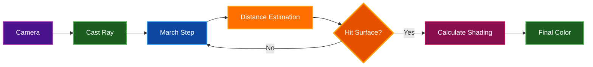

# 3D Fractals Guide

Complete guide to all 3D fractals in Par Fractal, including ray marching techniques, camera controls, and visual effects.

## Table of Contents
- [Overview](#overview)
- [Ray Marching Fundamentals](#ray-marching-fundamentals)
- [Camera Controls](#camera-controls)
- [Mandelbulb](#mandelbulb)
- [Menger Sponge](#menger-sponge)
- [Sierpinski Pyramid](#sierpinski-pyramid)
- [Sierpinski Gasket](#sierpinski-gasket)
- [Julia Set 3D](#julia-set-3d)
- [Mandelbox](#mandelbox)
- [Tglad Formula](#tglad-formula)
- [Octahedral IFS](#octahedral-ifs)
- [Icosahedral IFS](#icosahedral-ifs)
- [Apollonian Gasket](#apollonian-gasket)
- [Kleinian Groups](#kleinian-groups)
- [Hybrid Mandelbulb-Julia](#hybrid-mandelbulb-julia)
- [Quaternion Cubic](#quaternion-cubic)
- [Shading Models](#shading-models)
- [Visual Effects](#visual-effects)
- [Lighting](#lighting)
- [Performance Tuning](#performance-tuning)
- [Exploration Techniques](#exploration-techniques)
- [Related Documentation](#related-documentation)

## Overview

3D fractals in Par Fractal are rendered using GPU-accelerated ray marching with distance estimation. Unlike 2D fractals which map pixels directly to the complex plane, 3D fractals require casting rays through 3D space and iteratively finding surface intersections.

**Key Features:**
- Real-time 3D navigation
- Multiple shading models (Blinn-Phong, PBR)
- Advanced lighting effects (AO, soft shadows)
- Depth of field
- Dynamic level of detail
- Camera bookmarks

**Rendering Technique:**
- Ray marching with distance estimation
- Sphere tracing for acceleration
- Normal calculation via finite differences
- Multiple lighting passes

## Ray Marching Fundamentals

### How Ray Marching Works



### Distance Estimation

Each fractal provides a **distance estimator (DE)** function that returns the minimum distance from a point to the fractal surface.

**Algorithm:**
```
1. Start at camera position
2. March along ray direction
3. Query distance estimator at current position
4. Move forward by that distance
5. Repeat until:
   - Distance < epsilon (surface hit)
   - Max steps reached (ray escaped)
   - Distance > max distance (background)
```

**Benefits:**
- Guaranteed not to overshoot surface
- Adaptive step size (large steps in open space)
- Efficient convergence

### Surface Normal Calculation

Normals are calculated using **central differences**:

```
normal.x = DE(p + (ε, 0, 0)) - DE(p - (ε, 0, 0))
normal.y = DE(p + (0, ε, 0)) - DE(p - (0, ε, 0))
normal.z = DE(p + (0, 0, ε)) - DE(p - (0, 0, ε))
```

Where ε is a small epsilon value (typically 0.001).

## Camera Controls

### Movement Keys

| Key | Action | Direction |
|-----|--------|-----------|
| **W** | Move Forward | Along view direction |
| **S** | Move Backward | Opposite view direction |
| **A** | Strafe Left | Perpendicular to view |
| **D** | Strafe Right | Perpendicular to view |
| **E** | Move Up | Vertical (world Y axis) |
| **Q** | Move Down | Vertical (world Y axis) |

### Mouse Controls

| Action | Effect |
|--------|--------|
| **Mouse Drag** | Look around (rotate view) |
| **Mouse Wheel Up** | Increase movement speed |
| **Mouse Wheel Down** | Decrease movement speed |

### Camera Speed

**Default Speed:** 2.0 units/second

**Adjusting Speed:**
- Scroll wheel while in 3D mode
- UI slider: "Camera Speed"
- Speed range: 0.1 to 10.0

**Speed Guidelines:**
- Slow (0.5-1.0): Close-up detail exploration
- Medium (2.0-3.0): General navigation
- Fast (5.0-10.0): Large-scale movement

### Camera Bookmarks

Save and restore favorite camera positions:

**Saving:**
1. Navigate to desired view
2. Click "Save Camera Bookmark"
3. Enter bookmark name
4. Click Save

**Loading:**
1. Open "Camera Bookmarks" section
2. Select bookmark from list
3. Click "Load Bookmark"
4. Camera smoothly transitions to saved position

**Management:**
- Delete unwanted bookmarks
- Export bookmarks to file
- Import bookmarks from file

## Mandelbulb

### Description

The Mandelbulb is a 3D extension of the Mandelbrot set, discovered by Daniel White and Paul Nylander in 2009. It uses spherical coordinates to extend the complex squaring operation to three dimensions.

**Mathematical Definition:**
```
v₀ = 0
vₙ₊₁ = vₙᵖ + c
```

Where the power operation is defined using spherical coordinates:
```
r' = rᵖ
θ' = θ × p
φ' = φ × p
```

**Key Features:**
- Adjustable power parameter (typically 8)
- Intricate 3D structure
- Self-similar details at all scales
- Bulbous, organic appearance

### How to Explore

**Start Position:**
- Camera: (0, 0, 3)
- Target: (0, 0, 0)
- Power: 8

**UI Parameters:**
- **Power** (2-20): Higher = more complex structure
  - Power 2: Sphere
  - Power 8: Classic Mandelbulb (most interesting)
  - Power 16: Highly detailed, sharp edges

**Interesting Features:**

**External View:**
1. Start at default position
2. Orbit around using A/D keys
3. Look for bulbs and valleys
4. Note 8-fold symmetry (for power 8)

**Internal Exploration:**
1. Move forward (W key) into structure
2. Look up/down while inside
3. Find tunnels and chambers
4. Observe recursive patterns

**Recommended Powers:**
- **Power 8** - Classic, most explored
- **Power 9** - Slightly more complex
- **Power 12** - Very intricate details
- **Power 16** - Sharp, crystalline structures

**Effects Settings:**
- **Enable AO** - Essential for depth perception
- **Soft Shadows** - Adds realism
- **Higher Ray Steps** (256-512) - Better quality
- **PBR Shading** - More realistic materials

### Distance Estimator

```wgsl
// Simplified power-8 Mandelbulb distance estimator
fn mandelbulb_de(pos: vec3<f32>) -> f32 {
    var z = pos;
    var dr = 1.0;
    var r = 0.0;

    for (var i = 0; i < iterations; i++) {
        r = length(z);
        if (r > 2.0) { break; }

        // Convert to spherical coordinates
        let theta = acos(z.z / r);
        let phi = atan2(z.y, z.x);

        // Power operation
        let zr = pow(r, power);
        dr = pow(r, power - 1.0) * power * dr + 1.0;

        // Convert back to Cartesian
        z = zr * vec3<f32>(
            sin(theta * power) * cos(phi * power),
            sin(theta * power) * sin(phi * power),
            cos(theta * power)
        ) + pos;
    }

    return 0.5 * log(r) * r / dr;
}
```

## Menger Sponge

### Description

The Menger Sponge is a 3D generalization of the Cantor set and Sierpinski carpet, created through recursive subdivision of a cube.

**Construction:**
1. Start with a solid cube
2. Subdivide into 3×3×3 = 27 smaller cubes
3. Remove the center cube and face-centered cubes (7 total)
4. Repeat for remaining 20 cubes
5. Infinite recursion creates the fractal

**Key Features:**
- Infinite surface area
- Zero volume (in the limit)
- Perfect self-similarity
- Box-like structure

### How to Explore

**Start Position:**
- Camera: (3, 3, 3)
- Target: (0, 0, 0)

**UI Parameters:**
- **Iterations** (1-8): Number of subdivision levels
  - 1-2: Basic structure visible
  - 3-4: Fractal nature apparent
  - 5-6: Fine details emerge
  - 7-8: Very detailed (slow)

**Exploration Techniques:**

**External View:**
1. Orbit around the structure
2. Observe cubic symmetry
3. Note recursive hole patterns
4. Count removed sections at each level

**Internal View:**
1. Move into one of the tunnels
2. Look through multiple layers
3. Observe infinite regression
4. Find interesting angle views

**Zooming Detail:**
1. Position camera looking at corner
2. Zoom in slowly
3. Same pattern repeats infinitely
4. Perfect self-similarity

**Visual Settings:**
- **Wireframe Mode** - See structure clearly
- **High Contrast Colors** - Emphasize geometry
- **Edge Detection** - Highlight boundaries

## Sierpinski Pyramid

### Description

The 3D Sierpinski pyramid (tetrahedron) is created by recursively folding and subdividing space into a tetrahedral fractal structure. This is a 3D extension of the famous Sierpinski triangle.

**Mathematical Approach:**
- Tetrahedral folding operations
- Conditional folds along tetrahedron planes:
  - If x+y < 0: fold
  - If x+z < 0: fold
  - If y+z < 0: fold
- Scale by 2.0 and translate after each iteration
- Creates perfect tetrahedral symmetry

**Construction Analogy:**
Similar to removing the center pyramid from a tetrahedron, then repeating for each remaining sub-tetrahedron, but implemented via folding in distance estimation.

**Key Features:**
- Perfect tetrahedral (4-fold) symmetry
- Recursive subdivision pattern
- Self-similar at all scales
- Sharp geometric edges
- Classic fractal structure

### How to Explore

**UI Parameters:**
- **Fractal Scale** (0.5-5.0): Initial scale factor
  - Higher values = larger fractal
  - Default: 2.0
- **Max Iterations** (1-10): Recursion depth
  - More iterations = finer detail
  - 5-8 iterations recommended
  - Default: varies

**Start Position:**
- Camera: (2, 2, 2)
- Target: (0, 0, 0)

**Recommended Settings:**
- **Low Detail**: Scale = 2.0, Iterations = 4
- **Medium Detail**: Scale = 2.0, Iterations = 6
- **High Detail**: Scale = 2.0, Iterations = 8

**Exploration Tips:**
- View from different angles to see tetrahedral symmetry
- Observe perfect 4-fold symmetry
- Look for self-similar patterns at different scales
- Position camera at corners to see through structure
- Enable AO to emphasize depth
- Wireframe mode can reveal internal structure
- Each iteration doubles complexity

## Sierpinski Gasket

### Description

The Sierpinski Gasket is a tetrahedral IFS (Iterated Function System) fractal that combines tetrahedral folding with sphere inversion to create intricate "gasket" structures with holes. Unlike the Sierpinski Pyramid which uses pure tetrahedral folding, the Gasket variant adds sphere folding to create more complex sphere-packing patterns.

**Mathematical Approach:**
- Tetrahedral folding operations (same as Sierpinski Pyramid):
  - If x+y < 0: fold
  - If x+z < 0: fold
  - If y+z < 0: fold
- Sphere inversion folding creates "gasket" holes:
  - Inverts points inside minimum radius sphere
  - Creates recursive hole patterns
- Iterative scaling and translation
- Creates tetrahedral structure with sphere-packed features

**Key Features:**
- Perfect tetrahedral (4-fold) base symmetry
- Sphere packing patterns create holes and voids
- Combines geometric and organic characteristics
- More complex than pure Sierpinski Pyramid
- Self-similar at all scales
- Beautiful interplay between tetrahedral and spherical geometry

### How to Explore

**UI Parameters:**
- **Fractal Scale** (0.5-5.0): Overall size control
  - Higher values = larger fractal
  - Default: 1.5
- **Fractal Fold** (0.5-3.0): Controls scaling intensity
  - Base scale factor = 2.0 + fold × 0.5
  - Range: 2.0-3.0 effective scale
  - Higher values = tighter, more complex structure
  - Default: 1.0 (effective scale 2.25)
- **Fractal Min Radius** (0.1-2.0): Sphere folding parameter
  - Controls size of gasket holes
  - Lower values = smaller holes, more delicate structure
  - Higher values = larger holes, more open structure
  - Default: 0.5
- **Max Iterations** (1-10): Recursion depth
  - More iterations = finer detail
  - 6-8 iterations recommended for good detail
  - Default: 8

**Start Position:**
- Camera: (3.5, 3.0, 3.5)
- Target: (0, 0, 0)

**Recommended Settings:**
- **Delicate Structure**: Scale = 1.5, Fold = 1.0, Min Radius = 0.3, Iterations = 8
- **Balanced**: Scale = 1.5, Fold = 1.0, Min Radius = 0.5, Iterations = 8
- **Open Holes**: Scale = 1.5, Fold = 1.0, Min Radius = 0.8, Iterations = 6
- **Dense Complex**: Scale = 1.8, Fold = 1.5, Min Radius = 0.4, Iterations = 10

**Exploration Tips:**
- Adjust Min Radius to see dramatic structural changes
- Compare with Sierpinski Pyramid to see sphere folding effects
- Enable AO with high intensity (1.3-1.5) to emphasize holes
- Use soft shadows to reveal depth in gasket voids
- Look for both tetrahedral and spherical patterns
- Zoom into hole boundaries to see recursive structure
- Close-ups reveal how spheres pack into tetrahedral framework
- PBR shading works well with low roughness (0.3-0.5)
- Try different Fold values to vary complexity

**Comparison with Sierpinski Pyramid:**
- Pyramid: Pure tetrahedral folding, sharp edges
- Gasket: Adds sphere inversion, creates holes and organic features
- Gasket has three adjustable parameters vs Pyramid's two
- Gasket structure is generally more intricate and varied

## Julia Set 3D

### Description

Extension of 2D Julia sets to three dimensions using quaternion mathematics. Uses the classic Julia iteration formula q² + c with quaternion algebra.

**Mathematical Definition:**
```
q₀ = (pos.x, pos.y, pos.z, 0)  // 3D position as quaternion
qₙ₊₁ = qₙ² + c

Where c is a quaternion constant: (julia_c.x, julia_c.y, 0, 0.2)
```

**Quaternion Squaring:**
For quaternion q = (x, y, z, w):
```
q² = (x² - y² - z² - w²,
      2xy,
      2xz,
      2xw)
```

**Distance Estimation:**
Uses the derivative method common in quaternion fractals:
- Track both q and dq (derivative)
- dq = 2·q·dq at each iteration
- Distance = 0.5 · r · log(r) / |dq|

**Key Features:**
- True quaternion (4D) mathematics
- Rich, organic 3D structures
- Quadratic iteration (q²)
- Highly adjustable via Julia constant
- Can create smooth, bulbous surfaces
- Can create intricate, detailed structures
- Different from Quaternion Cubic (which uses q³)

### How to Explore

**UI Parameters:**
- **Julia C** [x, y]: First two components of quaternion constant
  - z-component fixed at 0.0
  - w-component fixed at 0.2
  - Controls overall structure
  - Try: [-0.4, 0.6] for beautiful forms
  - Default: [-0.7, 0.27]
- **Fractal Scale** (0.5-3.0): Overall size control
  - Default: 1.0
- **Iterations**: Fixed at 16 for this fractal

**Recommended Settings:**
- **Classic Julia**: Julia C = [-0.4, 0.6]
- **Smooth Organic**: Julia C = [-0.2, 0.8]
- **Detailed Structure**: Julia C = [-0.6, 0.4]

**Exploration Tips:**
1. Start with default parameters
2. Adjust Julia C.x component slowly (-1.0 to 0.0)
3. Then adjust Julia C.y component (0.0 to 1.0)
4. Small changes create dramatically different structures
5. Find symmetric configurations
6. Look for both smooth and fractal regions
7. Enable DoF to emphasize specific features
8. AO reveals surface complexity
9. PBR shading works well with low roughness

**Interesting Julia C Values:**
- [-0.4, 0.6] - Balanced, detailed
- [-0.2, 0.8] - Smooth, organic
- [-0.7, 0.27] - Classic (default)
- [-0.5, 0.5] - Symmetric
- [-0.3, 0.7] - Complex tendrils

## Mandelbox

### Description

The Mandelbox is a 3D fractal defined by folding and scaling operations in space, discovered by Tom Lowe in 2010.

**Mathematical Operations:**
1. Box folding - reflects points outside a box boundary
2. Sphere folding - inverts points based on radial distance
3. Scaling - uniform scale applied after folding
4. Translation - offset applied to create Mandelbrot-like behavior

**Key Features:**
- Box-like folding operations create cubic symmetry
- Sphere folding creates rounded features
- Scale parameter controls structure complexity
- Can create both rounded and sharp features
- Highly detailed at all scales

### How to Explore

**UI Parameters:**
- **Fractal Scale** (0.5-5.0): Overall size control
  - Higher values = larger fractal
  - Default: 1.5
- **Fractal Fold** (0.5-2.0): Controls internal scaling
  - Classic Mandelbox uses fold = 1.0 (resulting in scale -2.0)
  - Higher values = more complex structure
  - Default: 1.0
- **Fractal Min Radius** (0.1-2.0): Minimum sphere folding radius
  - Controls the size of small-scale features
  - Default: 0.5

**Recommended Settings:**
- **Classic Mandelbox**: Scale = 1.5, Fold = 1.0, Min Radius = 0.5
- **Rounded Features**: Scale = 2.0, Fold = 0.8, Min Radius = 0.4
- **Sharp Details**: Scale = 1.2, Fold = 1.5, Min Radius = 0.3

**Tips:**
- Scale around 1.5-2.0: Good starting range
- Adjust Fold to vary complexity
- Lower Min Radius = finer details
- Enable AO for depth perception
- Use soft shadows to enhance 3D appearance

## Tglad Formula

### Description

A 3D fractal using iterative folding and scaling operations to create intricate geometric structures.

**Mathematical Approach:**
- Absolute value folding (octahedral symmetry)
- Coordinate swapping for additional symmetry
- Box folding with adjustable parameter
- Iterative scaling and translation

**Key Features:**
- Smooth organic surfaces with geometric elements
- Octahedral base symmetry
- Unusual geometric patterns from combined folding operations
- Highly detailed structure at all scales

### How to Explore

**UI Parameters:**
- **Fractal Scale** (0.1-5.0): Overall size control
  - Higher values = larger fractal
  - Default: 2.0
- **Fractal Fold** (0.5-2.0): Box folding intensity
  - Higher values = tighter folding, more complex structure
  - Default: 1.0

**Recommended Settings:**
- Scale: 1.5-2.5 for best detail
- Fold: 0.8-1.5 for interesting structures
- Enable AO to reveal surface complexity
- Use 200+ ray steps for quality

## Octahedral IFS

### Description

Iterated Function System (IFS) with octahedral symmetry, creating kaleidoscopic 8-fold symmetric fractals through iterative folding and scaling.

**Mathematical Approach:**
- Absolute value folding creates initial symmetry
- Coordinate swapping enforces octahedral symmetry (8 faces)
- Iterative scaling and translation
- Box-based distance estimation

**Octahedral Symmetry:**
The octahedron has 8 triangular faces and creates 8-fold rotational symmetry. The folding operations mirror points across the planes of the octahedron, creating kaleidoscopic reflections.

**Key Features:**
- Perfect 8-fold symmetry
- Kaleidoscopic reflections
- Recursive geometric patterns
- Crystalline, faceted appearance
- Sharp geometric edges

### How to Explore

**UI Parameters:**
- **Fractal Scale** (0.5-5.0): Overall size control
  - Higher values = larger fractal
  - Default: 2.0
- **Fractal Fold** (0.5-3.0): Controls scaling intensity
  - fold + 1.0 = effective scale factor
  - Range 2.0-3.0 works well (fold 1.0-2.0)
  - Higher values = tighter, more complex structure
  - Default: 1.2

**Recommended Settings:**
- **Kaleidoscope Effect**: Scale = 2.0, Fold = 1.2
- **Tight Crystal**: Scale = 1.5, Fold = 2.5
- **Open Lattice**: Scale = 2.5, Fold = 1.5

**Exploration Tips:**
- Enable AO for structure clarity
- Use metallic materials (0.8-1.0) for crystalline look
- High ray step count (256+) for clean edges
- Rotate to see all 8 symmetric faces
- Look for recursive patterns at different scales
- Close-ups reveal intricate self-similar details

## Icosahedral IFS

### Description

Iterated Function System (IFS) with icosahedral symmetry, creating the most complex kaleidoscopic fractal with 20-fold symmetry. Uses the golden ratio (φ ≈ 1.618) to define reflection planes.

**Mathematical Approach:**
- Absolute value folding creates base symmetry
- Reflection across icosahedral planes using golden ratio
- Three primary reflection planes:
  - (1, φ, 0) / ||...||
  - (0, 1, φ) / ||...||
  - (φ, 0, 1) / ||...||
- Additional coordinate swapping for full symmetry
- Iterative scaling and translation

**Icosahedral Symmetry:**
The icosahedron has 20 triangular faces and is one of the five Platonic solids. Its construction relies on the golden ratio, creating pentagonal patterns. This is the highest symmetry achievable with triangle-faced polyhedra.

**Key Features:**
- Perfect 20-fold symmetry (highest complexity)
- Golden ratio-based geometry
- Pentagonal patterns visible
- Kaleidoscopic reflections with spherical appearance
- Most intricate of the IFS fractals
- Beautiful balance of order and complexity

### How to Explore

**UI Parameters:**
- **Fractal Scale** (0.5-5.0): Overall size control
  - Higher values = larger fractal
  - Default: 1.7
- **Fractal Fold** (0.5-3.0): Controls scaling intensity
  - fold + 1.0 = effective scale factor
  - Higher values = more complex structure
  - Default: 1.5

**Recommended Settings:**
- **Balanced Kaleidoscope**: Scale = 1.7, Fold = 1.5
- **Dense Cathedral**: Scale = 1.4, Fold = 2.0
- **Open Geometry**: Scale = 2.2, Fold = 1.1

**Exploration Tips:**
- Rotate slowly to see all 20 faces
- Look for pentagonal patterns (signature of golden ratio)
- Zoom into surface details to see recursive structure
- Enable AO with high intensity (1.2-1.5) for depth
- Soft shadows reveal the intricate geometry
- PBR shading with metallic = 0.7-0.9 for best appearance
- Try different viewing angles - each reveals different symmetries
- Close-ups show how golden ratio creates perfect patterns

## Apollonian Gasket

### Description

3D extension of the Apollonian gasket, created by packing spheres recursively using sphere inversion and folding operations.

**Mathematical Approach:**
- Sphere inversion based on radial distance
- Box folding for additional structure
- Iterative scaling creates nested sphere patterns
- Classic circle-packing fractal extended to 3D

**Key Features:**
- Sphere packing patterns with perfect tangency
- Infinite recursion of nested spheres
- Beautiful circular patterns at all scales
- Complex interweaving sphere arrangements

### How to Explore

**UI Parameters:**
- **Fractal Scale** (0.5-3.0): Overall size control
  - Higher values = larger fractal
  - Default: 1.3
- **Fractal Fold** (0.8-2.0): Scale multiplier for complexity
  - Controls recursion intensity
  - Default: 1.35
- **Fractal Min Radius** (0.5-2.0): Packing parameter
  - Controls tightness of sphere packing
  - Higher values = denser packing
  - Lower values = more delicate, wispy structures
  - Default: 1.12

**Recommended Settings:**
- **Dense Packing**: Scale = 1.4, Fold = 1.3, Min Radius = 1.2
- **Classic**: Scale = 1.3, Fold = 1.35, Min Radius = 1.12
- **Wispy Structure**: Scale = 1.3, Fold = 1.5, Min Radius = 0.8

**Viewing Angles:**
- Face-on: See circular patterns and tangent points
- Edge-on: See depth recursion
- Internal: Navigate sphere corridors
- Close-up: Observe perfect tangency of spheres

**Tips:**
- Enable AO with high intensity (1.5-2.0) to emphasize sphere boundaries
- Use soft shadows to reveal depth
- Higher ray steps (256+) for smooth sphere surfaces
- Adjust Min Radius for dramatic structural changes

## Kleinian Groups

### Description

Fractals based on Kleinian groups from hyperbolic geometry, also known as "Amazing Surface" or "Pseudo-Kleinian" fractals. These use a combination of box folding, sphere inversion, and scaling to create intricate limit set approximations.

**Mathematical Approach:**
- Iterated folding operations (octahedral symmetry)
- Sphere inversion with clamping
- Box folding with adjustable size
- Translation for limit set positioning
- Fixed 12 iterations for stability

**Key Features:**
- Hyperbolic geometry characteristics
- Intricate limit set patterns
- Multiple scales of detail
- Organic yet geometric appearance

### How to Explore

**UI Parameters:**
- **Fractal Scale** (0.5-3.0): Overall size control
  - Higher values = larger fractal
  - Default: 1.0
- **Fractal Fold** (0.5-2.0): Controls internal scaling
  - Affects structure complexity
  - Default: 1.2
- **Fractal Min Radius** (0.5-3.0): Translation parameter
  - Controls limit set positioning
  - Higher values = more spread structure
  - Default: 1.5

**Recommended Settings:**
- **Classic Limit Set**: Scale = 1.0, Fold = 1.2, Min Radius = 1.5
- **Dense Structure**: Scale = 1.2, Fold = 1.5, Min Radius = 1.0
- **Open Pattern**: Scale = 0.8, Fold = 1.0, Min Radius = 2.0

**Tips:**
- Enable AO to reveal intricate surface details
- Use PBR shading for realistic appearance
- Soft shadows enhance depth perception
- Explore from multiple angles to see different limit set projections

## Hybrid Mandelbulb-Julia

### Description

Combines Mandelbulb and 3D Julia set algorithms by alternating between them during iteration. Even iterations use Mandelbulb-style (add original position), odd iterations use Julia-style (add constant).

**Mathematical Approach:**
```
For each iteration i:
  1. Apply spherical power operation (same as Mandelbulb)
  2. If i is even: z = z^p + pos (Mandelbulb behavior)
     If i is odd:  z = z^p + c   (Julia behavior)
```

This creates a fascinating hybrid that exhibits characteristics of both fractals.

**Key Features:**
- Alternating iteration scheme creates unique structures
- Combines self-similar (Mandelbrot) and constant (Julia) behaviors
- Power parameter controls geometric complexity
- Julia constant controls overall shape
- Complex parameter space with emergent patterns

### How to Explore

**UI Parameters:**
- **Power** (2.0-16.0): Spherical power operation
  - 8.0 is classic and most interesting
  - Higher values = more complex geometry
  - Default: 8.0
- **Julia C** [x, y]: Julia set constant (2 components)
  - Controls overall structure
  - z-component fixed at 0.3
  - Try: [-0.2, 0.8] for interesting results
  - Default: [-0.7, 0.27]
- **Max Iterations** (8-32): Number of hybrid iterations
  - More iterations = more detail
  - Default: 12
- **Fractal Scale** (0.5-3.0): Overall size control
  - Default: 1.0

**Recommended Settings:**
- **Balanced Hybrid**: Power = 8.0, Julia C = [-0.2, 0.8], Iterations = 12
- **Julia-Dominant**: Power = 6.0, Julia C = [-0.4, 0.6], Iterations = 16
- **Bulb-Dominant**: Power = 9.0, Julia C = [-0.1, 0.4], Iterations = 10

**Exploration Tips:**
- Small changes to Julia C can produce dramatic results
- Observe how structure differs from pure Mandelbulb
- Look for regions where alternating pattern is visible
- Enable AO and soft shadows for best detail
- Try different powers (6, 8, 9, 12) for variety

## Quaternion Cubic

### Description

A 4D quaternion Julia set using the cubic iteration formula z³ + c, rendered as a 3D slice. Quaternion algebra extends complex numbers to four dimensions, creating rich and unique 3D structures.

**Mathematical Definition:**
```
q₀ = (pos.x, pos.y, pos.z, 0)  // 3D position as quaternion with w=0
qₙ₊₁ = qₙ³ + c

Where quaternion cubing is computed as:
q³ = q × (q × q)
Using quaternion multiplication rules
```

**Quaternion Multiplication:**
```
(a, b, c, d) × (e, f, g, h) =
  (ae - bf - cg - dh,
   af + be + ch - dg,
   ag - bh + ce + df,
   ah + bg - cf + de)
```

**Key Features:**
- True 4D fractal rendered as 3D slice
- Quaternion algebra creates unique symmetries
- Cubic power (z³) instead of quadratic (z²)
- Julia set style (constant c)
- Complex internal structures
- Smooth surfaces with intricate details

### How to Explore

**UI Parameters:**
- **Julia C** [x, y]: Quaternion constant (first 2 components)
  - z-component fixed at 0.3
  - w-component fixed at 0.0
  - Controls overall structure
  - Try: [-0.2, 0.6] for interesting forms
  - Default: [-0.7, 0.27]
- **Max Iterations** (8-32): Number of quaternion iterations
  - More iterations = more detail
  - Default: 16
- **Fractal Scale** (0.5-3.0): Overall size control
  - Default: 1.0

**Recommended Settings:**
- **Classic Cubic**: Julia C = [-0.2, 0.6], Iterations = 16
- **Detailed**: Julia C = [-0.3, 0.5], Iterations = 20
- **Smooth**: Julia C = [-0.1, 0.7], Iterations = 12

**Exploration Tips:**
- Small Julia C changes create very different forms
- Look for smooth, bulbous regions
- Search for sharp, crystalline regions
- Interior tunnels often have beautiful structure
- Enable AO to reveal surface complexity
- Use soft shadows for realistic depth
- PBR shading works well with metallic settings

**Interesting Julia C Values:**
- [-0.2, 0.6] - Balanced, smooth structure
- [-0.3, 0.8] - Complex, detailed
- [-0.1, 0.4] - Open, wispy
- [0.0, 0.5] - Symmetric patterns

## Shading Models

### Blinn-Phong Shading

**Description:** Classic lighting model with ambient, diffuse, and specular components.

**Components:**
```
Ambient: Base lighting (always present)
Diffuse: Light based on surface normal
Specular: Highlights based on view angle
```

**When to Use:**
- Fast rendering needed
- Classic appearance desired
- Lower-end hardware

**Parameters:**
- **Ambient Strength** (0.0-1.0)
- **Diffuse Strength** (0.0-1.0)
- **Specular Strength** (0.0-1.0)
- **Shininess** (1-256)

### PBR (Physically Based Rendering)

**Description:** Modern rendering using physically accurate material properties.

**Material Properties:**
- **Roughness** (0.0-1.0): Surface microsurface detail
  - 0.0: Perfect mirror
  - 0.5: Semi-rough (default)
  - 1.0: Completely diffuse
- **Metallic** (0.0-1.0): Metal vs dielectric
  - 0.0: Non-metal (plastic, wood)
  - 1.0: Full metal (gold, silver)
- **Albedo Color**: Base material color

**When to Use:**
- Realistic rendering desired
- Sufficient GPU performance
- Material variety needed

**Lighting Model:**
```
Cook-Torrance BRDF:
- GGX normal distribution
- Smith geometry function
- Fresnel-Schlick approximation
```

### Comparison

| Feature | Blinn-Phong | PBR |
|---------|-------------|-----|
| **Performance** | Fast | Slower |
| **Realism** | Stylized | Realistic |
| **Parameters** | Simple | Complex |
| **Best For** | Real-time interaction | Final renders |

## Visual Effects

### Ambient Occlusion (AO)

**Description:** Approximates how exposed each point is to ambient lighting by sampling nearby geometry.

**Algorithm:** Cone tracing from surface point

**Parameters:**
- **AO Strength** (0.0-1.0): Effect intensity
- **AO Step Size** (0.01-0.1): Sample spacing
- **AO Iterations** (1-8): Number of samples

**Performance Impact:** Medium to High

**When to Use:**
- Always for 3D fractals
- Essential for depth perception
- Reveals surface detail

**Tips:**
- Start with strength 0.3-0.5
- Increase iterations for smoother AO
- Reduce during camera movement (LOD)

### Soft Shadows

**Description:** Realistic shadows with penumbra (soft edges).

**Algorithm:** Ray marching toward light source

**Parameters:**
- **Shadow Softness** (1-128): Edge softness
  - Low: Sharp shadows
  - High: Very soft, wide penumbra

**Performance Impact:** High

**When to Use:**
- Realistic lighting desired
- Sufficient GPU performance
- Static or slow camera movement

**Tips:**
- Softness 32 is good default
- Disable during fast movement
- Combine with AO for best results

### Depth of Field (DoF)

**Description:** Simulates camera lens focus, blurring objects outside focal plane.

**Algorithm:** Multiple jittered samples per pixel

**Parameters:**
- **Enable DoF**: Toggle effect
- **Focal Distance** (0.1-20.0): Distance to focused plane
- **Aperture** (0.01-0.5): Blur amount
  - Small: Little blur (large depth of field)
  - Large: Heavy blur (shallow depth of field)

**Performance Impact:** Very High

**When to Use:**
- Cinematic effect desired
- Emphasize specific depth
- Screenshot/video mode

**Interactive Use:**
1. Position camera at desired distance from subject
2. Enable DoF
3. Adjust focal distance to match
4. Tune aperture for blur amount
5. Disable for navigation

**Tips:**
- Reduce aperture for subtle effect
- Match focal distance to interesting features
- Disable during movement (use LOD)

### Fog

**Description:** Distance-based atmospheric effect.

**Fog Modes:**
- **Linear**: Constant density increase
- **Exponential**: Accelerating density
- **Quadratic**: Rapid density increase

**Parameters:**
- **Fog Mode**: Linear/Exponential/Quadratic
- **Fog Density** (0.0-1.0): Amount of fog
- **Fog Color**: RGB color of fog

**When to Use:**
- Atmospheric depth cues
- Hide distant geometry
- Artistic effect

## Lighting

### Light Properties

**Position:**
- Adjustable 3D position
- Relative to fractal center

**Color:**
- RGB components
- Intensity multiplier

**Type:**
- Point light (default)
- Directional light (some fractals)

### Multiple Lights

Some shading modes support multiple light sources:
- Primary light (key light)
- Fill light
- Rim light

**Three-Point Lighting Setup:**
1. **Key Light**: Main light, position at 45° angle
2. **Fill Light**: Softer, opposite side, lower intensity
3. **Rim Light**: Behind subject, highlights edges

## Performance Tuning

### Ray Marching Steps

**What It Controls:** Maximum steps per ray

**Impact:**
- More steps: Better quality, slower
- Fewer steps: Faster, potential artifacts

**Recommendations:**
- Fast preview: 64-128 steps
- Normal use: 128-256 steps
- High quality: 256-512 steps
- Screenshots: 512-1024 steps

### Epsilon Value

**What It Controls:** Surface hit threshold

**Impact:**
- Smaller epsilon: More precise, slower convergence
- Larger epsilon: Faster, potential artifacts

**Typical Values:**
- Default: 0.001
- High quality: 0.0001
- Performance: 0.01

### LOD (Level of Detail)

**Automatic Quality Adjustment:**

**LOD Zones Based on Camera Movement:**
- **Stationary**: Maximum quality
- **Slow Movement**: High quality
- **Medium Movement**: Medium quality
- **Fast Movement**: Low quality

**Parameters Adjusted:**
- Ray marching steps
- Shadow quality
- AO samples
- Effect toggles

**Manual Override:**
- Disable LOD for consistent quality
- Useful for video recording

### Quality Profiles

**Low Profile:**
- 64 ray steps
- Basic shading
- No AO or shadows
- Target: 60+ FPS

**Medium Profile:**
- 128 ray steps
- Blinn-Phong shading
- AO enabled
- Target: 30-60 FPS

**High Profile:**
- 256 ray steps
- PBR shading
- AO + soft shadows
- Target: 20-30 FPS

**Ultra Profile:**
- 512 ray steps
- PBR shading
- All effects enabled
- Target: Screenshot quality

## Exploration Techniques

### Initial Approach

**Orbit Method:**
1. Start at default position
2. Strafe sideways (A/D) while looking at center
3. Complete full orbit
4. Note interesting angles
5. Move to best viewpoint

**Zoom Method:**
1. Position at good angle
2. Move forward slowly (W)
3. Stop at interesting depths
4. Save bookmark
5. Continue inward

### Finding Details

**Surface Exploration:**
1. Get close to surface
2. Move parallel to surface
3. Look for valleys and ridges
4. Zoom into small features

**Internal Exploration:**
1. Find opening or tunnel
2. Enter slowly
3. Look around while inside
4. Navigate through structure

### Camera Techniques

**Smooth Movement:**
- Hold movement keys continuously
- Adjust speed with mouse wheel
- Use mouse for gradual rotation
- Avoid sudden changes

**Framing Shots:**
1. Position subject in center
2. Adjust camera distance
3. Fine-tune angle
4. Enable effects
5. Wait for full quality render
6. Capture screenshot

### Bookmark Strategy

**Create Bookmark Library:**
1. **Overview shots** - Full structure view
2. **Detail shots** - Close-up interesting features
3. **Interior views** - Inside structures
4. **Unique angles** - Unusual perspectives

**Naming Convention:**
- Include fractal name
- Describe location/feature
- Note quality settings
- Examples:
  - "Mandelbulb_Power8_Valley_HQ"
  - "Menger_Interior_Iteration5"

## Related Documentation

- [Quick Start Guide](QUICKSTART.md) - Installation and basics
- [2D Fractals](FRACTALS2D.md) - 2D fractal types
- [Controls Reference](CONTROLS.md) - Complete control reference
- [Architecture](ARCHITECTURE.md) - Technical implementation
