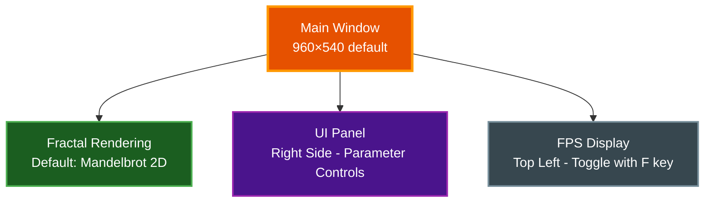

# Quick Start Guide

Get up and running with Par Fractal in minutes and start exploring beautiful mathematical fractals.

## Table of Contents
- [Prerequisites](#prerequisites)
- [Installation](#installation)
- [First Launch](#first-launch)
- [Basic Controls](#basic-controls)
- [Your First Fractal](#your-first-fractal)
- [Exploring 2D Fractals](#exploring-2d-fractals)
- [Exploring 3D Fractals](#exploring-3d-fractals)
- [Taking Screenshots](#taking-screenshots)
- [Common Issues](#common-issues)
- [Next Steps](#next-steps)
- [Related Documentation](#related-documentation)

## Prerequisites

**Required:**
- Rust 1.70+
- Modern GPU with driver support for Vulkan, Metal, or DirectX 12

**Platform-Specific:**
- **Linux:** Vulkan drivers installed
- **macOS:** Metal support (macOS 10.13+)
- **Windows:** DirectX 12 or Vulkan drivers

**Check Rust Installation:**
```bash
$ rustc --version
rustc 1.70.0 (or higher)
```

**Install Rust (if needed):**
```bash
$ curl --proto '=https' --tlsv1.2 -sSf https://sh.rustup.rs | sh
```

## Installation

### Option 1: Install from Crates.io (Recommended)

Install directly from crates.io:

```bash
# Install the latest version
$ cargo install par-fractal

# Run from anywhere
$ par-fractal
```

Requires Rust 1.70+ and Cargo. Install from [rustup.rs](https://rustup.rs/).

### Option 2: Build from Source

```bash
# Clone the repository
$ git clone https://github.com/paulrobello/par-fractal.git
$ cd par-fractal

# Build in release mode for best performance
$ make build-release
# or
$ cargo build --release
```

**Build time:** Approximately 2-5 minutes on first build

### Option 3: Quick Build with Makefile

```bash
# View all available commands
$ make help

# Build and run in one step
$ make r
# or full command
$ make run-release
```

### Option 4: Install to System from Source

```bash
# Install to ~/.cargo/bin
$ make install

# Run from anywhere
$ par-fractal
```

## First Launch

### Running the Application

**Using Makefile (recommended):**
```bash
$ make r
```

**Using Cargo:**
```bash
$ cargo run --release
```

**If installed:**
```bash
$ par-fractal
```

### What You'll See

When Par Fractal launches, you'll see:

1. **Main Window** (960×540 default) - Rendering the default Mandelbrot fractal
2. **UI Panel** (right side) - Parameter controls and settings
3. **FPS Counter** (top left, press **F** to toggle) - Performance metrics

### Initial View



## Basic Controls

### Essential Keyboard Shortcuts

| Key | Action | Description |
|-----|--------|-------------|
| **H** | Toggle UI | Hide/show the parameter panel |
| **R** | Reset View | Return to default camera position |
| **F12** | Screenshot | Capture current view as PNG |
| **F** | Toggle FPS | Show/hide FPS counter |
| **/** | Command Palette | Quick access to all features |
| **Ctrl/Cmd+K** | Command Palette | Alternative shortcut (VS Code style) |
| **Esc** | Close/Cancel | Close dialogs or exit fullscreen |

### Quick Fractal Switching

**2D Fractals (Digit keys 0-9):**

| Key | Fractal | Key | Fractal |
|-----|---------|-----|---------|
| **1** | Mandelbrot | **6** | Phoenix |
| **2** | Julia Set | **7** | Celtic |
| **3** | Sierpinski | **8** | Newton |
| **4** | Burning Ship | **9** | Lyapunov |
| **5** | Tricorn | **0** | Nova |

**3D Fractals (Function keys F1-F10):**

| Key | Fractal | Key | Fractal |
|-----|---------|-----|---------|
| **F1** | Mandelbulb | **F6** | Octahedral IFS |
| **F2** | Menger Sponge | **F7** | Icosahedral IFS |
| **F3** | Sierpinski Pyramid | **F8** | Apollonian Gasket |
| **F4** | Julia Set 3D | **F9** | Kleinian |
| **F5** | Mandelbox | **F10** | Hybrid Mandelbulb-Julia |

**Note:** The following fractals are accessible via UI or command palette only:
- **2D:** Magnet, Collatz, Sierpinski Triangle, Hopalong, Martin, Gingerbreadman, Chip, Quadruptwo, Threeply
- **3D:** Quaternion Cubic, Sierpinski Gasket, Pickover, Lorenz, Rossler

### Color Palette Cycling

| Key | Action |
|-----|--------|
| **P** | Next palette |

## Your First Fractal

### Step 1: Explore the Default Mandelbrot

The Mandelbrot set is loaded by default. Let's explore it:

**Zoom In:**
```bash
# Using mouse wheel
Scroll Up → Zoom In
Scroll Down → Zoom Out
```

**Pan Around:**
```bash
# Using mouse drag
Click and Drag → Move view
```

**Try This:**
1. Zoom into the edge of the main black circle
2. Keep zooming - you'll see infinite detail!
3. Find interesting spirals and buds
4. Press **F12** to save your favorite views

### Step 2: Switch to Julia Set

```bash
# Press the '2' key
```

The Julia set will appear with beautiful symmetric patterns.

**Experiment:**
1. Open UI panel (press **H** if hidden)
2. Find "Julia Constant" sliders
3. Adjust `julia_c.x` and `julia_c.y`
4. Watch the fractal transform in real-time!

### Step 3: Try a 3D Fractal

```bash
# Press the 'F1' key for Mandelbulb
```

You're now in 3D mode with full camera controls!

**Move Around:**
```bash
W → Forward
S → Backward
A → Strafe Left
D → Strafe Right
E → Move Up (world Y-axis)
Q → Move Down (world Y-axis)
Mouse Drag → Look around
Mouse Wheel → Adjust camera speed
```

## Exploring 2D Fractals

### Navigation Techniques

**Zoom to Cursor:**
```bash
# Position mouse over interesting area
# Scroll wheel to zoom
# The fractal zooms centered on your cursor!
```

**Precise Positioning:**
1. Use mouse drag to pan
2. Position target in center
3. Zoom in with scroll wheel
4. Repeat for deeper exploration

**Finding Interesting Regions:**
- Edges of the main set
- Spiral tendrils
- Buds and mini-Mandelbrots
- Connection points

### Adjusting Quality

**In the UI Panel:**

1. **Max Iterations** (2D) / **Max Steps** (3D) - Higher = more detail
   - Low values: Fast, less detail
   - High values: Slow, more detail
   - Keyboard: `-` to decrease by 32 (2D) or 10 (3D), `+/=` to increase

2. **Color Palette** - Choose visual style
   - 48 built-in palettes including:
     - Classic: Fire, Ocean, Rainbow, Forest, Sunset, Grayscale
     - Scientific: Viridis, Plasma, Inferno, Magma, Copper, Cool, Hot
     - Artistic: Neon, Purple Dream, Earth, Ice, Lava, Galaxy, Mint, Cherry
     - Xfractint: 27 classic fractal palettes (Altern, Blues, Chroma, Default, Fire Storm, Froth, Gamma, Glasses, etc.)
   - Custom palette support via YAML or .pal file import
   - Keyboard: `P` to cycle forward through palettes

**Performance Tip:**
- Start with default settings
- Increase quality gradually if needed
- Reduce if FPS drops below 30

## Exploring 3D Fractals

### Camera Movement

**WASD Controls:**
```bash
W → Move forward (into the fractal)
S → Move backward (away from fractal)
A → Strafe left
D → Strafe right
```

**Vertical Movement:**
```bash
E → Move up (world Y-axis)
Q → Move down (world Y-axis)
```

**Looking Around:**
```bash
Mouse Drag → Rotate camera view (yaw and pitch)
Mouse Wheel → Adjust camera movement speed
```

### Finding Good Views

**Recommended Sequence:**

1. **Start Outside** - Default camera position
2. **Rotate View** - Drag mouse to see structure
3. **Move Closer** - Press W to approach
4. **Circle Around** - Use A/D while looking at center
5. **Find Detail** - Get close and look for interesting patterns

### Visual Effects

**In the UI Panel, try toggling:**

1. **Ambient Occlusion** - Adds depth shadows
2. **Soft Shadows** - Realistic lighting
3. **Depth of Field** - Focus effect (adjust focal length)

**Shading Models:**
- **Blinn-Phong** - Classic, fast
- **PBR** - Realistic, slower

### Camera Bookmarks

Save favorite views:

1. Navigate to desired position
2. Click "Save Camera Bookmark" in UI
3. Name your bookmark
4. Click "Load Camera Bookmark" to return

## Taking Screenshots

### Quick Screenshot

```bash
# Press F12
```

**What Happens:**
- Screenshot saved to current directory
- Console message confirms capture
- File named: `{fractal}_{resolution}_{timestamp}.png`

### High-Resolution Captures

**For Wallpapers:**

1. Open UI Panel
2. Go to "Capture" section
3. Select resolution preset:
   - 1920×1080 (Full HD)
   - 2560×1440 (2K)
   - 3840×2160 (4K)
   - Or enter custom resolution
4. Click "Capture at Resolution"

**Monitor-Specific:**
1. Click "Detect Monitors"
2. Select your monitor
3. Click "Capture for Monitor"
4. Image rendered at native resolution

### Screenshot Best Practices

**For Best Results:**
1. Position fractal view carefully
2. Adjust color palette
3. Hide UI (press **H**)
4. Hide FPS counter (press **F**)
5. Wait for high quality render (LOD settles to full quality)
6. Take screenshot (press **F12**)

## Common Issues

### Issue: Black Screen

**Symptom:** Window opens but shows only black

**Solutions:**
1. Check GPU drivers are up to date
2. Try different graphics backend:
   ```bash
   # Linux - force Vulkan
   $ WGPU_BACKEND=vulkan cargo run --release

   # macOS - force Metal (default)
   $ cargo run --release
   ```
3. Reduce quality settings in UI
4. Check system meets GPU requirements

### Issue: Low FPS (< 30)

**Symptom:** Choppy, slow rendering

**Solutions:**
1. **Reduce Iterations** - Lower max_iterations to 200
2. **Disable Effects** - Turn off AO, soft shadows, DoF
3. **Use Blinn-Phong** - Instead of PBR shading
4. **Enable LOD** - In performance settings
5. **Lower Resolution** - Reduce window size

### Issue: Mouse Controls Not Working

**Symptom:** Can't pan or look around

**Solutions:**
1. Ensure UI panel isn't capturing mouse
2. Click on fractal area first
3. Check mouse is inside window
4. Try pressing **R** to reset view

### Issue: UI Panel Missing

**Symptom:** No controls visible

**Solution:**
```bash
# Press H to toggle UI
```

### Issue: Crashes on Startup

**Symptom:** Application exits immediately

**Solutions:**
1. Build in release mode: `cargo build --release`
2. Check Rust version: `rustc --version` (need 1.70+)
3. Update GPU drivers
4. Check console for error messages:
   ```bash
   $ RUST_LOG=debug cargo run --release
   ```

## Next Steps

### Learn More

**Explore Documentation:**
- [2D Fractals Guide](FRACTALS2D.md) - Deep dive into Mandelbrot, Julia
- [3D Fractals Guide](FRACTALS3D.md) - Mandelbulb, Menger Sponge details
- [Controls Reference](CONTROLS.md) - Complete keyboard/mouse reference
- [Architecture](ARCHITECTURE.md) - How Par Fractal works internally

### Experiment with Features

**Try These:**
1. **Command Palette** (`/` or `Ctrl/Cmd+K`)
   - Quick access to all 34 fractal types (19 2D + 15 3D)
   - Toggle effects (AO, shadows, DoF, fog, bloom, FXAA)
   - Switch color modes and LOD profiles
   - Fuzzy search matching for fast command filtering

2. **Preset System**
   - Load built-in presets
   - Save your favorite configurations
   - Share presets with others

3. **Video Recording**
   - Record fractal animations
   - Export as MP4, WebM, or GIF
   - Configurable quality and duration

4. **Camera Bookmarks** (3D mode)
   - Save favorite camera positions
   - Quick recall of interesting views
   - Share coordinates with others

### Community and Support

**Get Help:**
- GitHub Issues - Bug reports and feature requests
- Discussions - Share your creations
- Examples - Browse the preset gallery

**Share Your Work:**
- Use `#parfractal` hashtag
- Share interesting coordinates
- Contribute presets

## Related Documentation

- [2D Fractals](FRACTALS2D.md) - Complete guide to 2D fractal types
- [3D Fractals](FRACTALS3D.md) - Complete guide to 3D fractal types
- [Controls Reference](CONTROLS.md) - All keyboard and mouse controls
- [Architecture](ARCHITECTURE.md) - System design and internals
- [Main README](../README.md) - Project overview
