# Par Fractal Documentation

Welcome to the comprehensive documentation for Par Fractal, a high-performance GPU-accelerated fractal renderer built with Rust and WebGPU.

## Table of Contents
- [Documentation Overview](#documentation-overview)
- [Getting Started](#getting-started)
- [User Guides](#user-guides)
- [Technical Documentation](#technical-documentation)
- [Reference Materials](#reference-materials)
- [Additional Resources](#additional-resources)

## Documentation Overview

This documentation provides complete coverage of Par Fractal's features, architecture, and usage patterns. Whether you're a first-time user or an advanced developer, you'll find the information you need here.

### Documentation Structure

```mermaid
graph TD
    Index[📚 Documentation Index<br/>YOU ARE HERE]
    Quick[🚀 Quick Start<br/>Installation & Basics]
    Arch[🏗️ Architecture<br/>System Design]
    Fractals2D[🎨 2D Fractals<br/>Mandelbrot, Julia, etc.]
    Fractals3D[🌌 3D Fractals<br/>Mandelbulb, Menger, etc.]
    Controls[🎮 Controls<br/>Keyboard & Mouse]
    Style[📝 Style Guide<br/>Documentation Standards]

    Index --> Quick
    Index --> Arch
    Index --> Fractals2D
    Index --> Fractals3D
    Index --> Controls
    Index --> Style

    Quick -.-> Fractals2D
    Quick -.-> Fractals3D
    Quick -.-> Controls

    Fractals2D -.-> Controls
    Fractals3D -.-> Controls

    Arch -.-> Fractals2D
    Arch -.-> Fractals3D

    style Index fill:#e65100,stroke:#ff9800,stroke-width:3px,color:#ffffff
    style Quick fill:#1b5e20,stroke:#4caf50,stroke-width:2px,color:#ffffff
    style Arch fill:#0d47a1,stroke:#2196f3,stroke-width:2px,color:#ffffff
    style Fractals2D fill:#4a148c,stroke:#9c27b0,stroke-width:2px,color:#ffffff
    style Fractals3D fill:#880e4f,stroke:#c2185b,stroke-width:2px,color:#ffffff
    style Controls fill:#ff6f00,stroke:#ffa726,stroke-width:2px,color:#ffffff
    style Style fill:#37474f,stroke:#78909c,stroke-width:2px,color:#ffffff
```



## Getting Started

### For New Users

If you're new to Par Fractal, start here:

1. **[Quick Start Guide](QUICKSTART.md)** - Install and run Par Fractal in minutes
   - Prerequisites and installation
   - First launch walkthrough
   - Basic controls and navigation
   - Taking your first screenshot
   - Common troubleshooting

**Estimated time:** 15-30 minutes

### Your First Fractal

After installation, follow these steps:

```bash
# Run Par Fractal
make r

# Or if using cargo directly
cargo run --release
```

**What to try first:**
1. Press `1` to view Mandelbrot set
2. Use mouse wheel to zoom in
3. Drag to pan around
4. Press `P` to change colors
5. Press `F12` to take a screenshot

## User Guides

### 2D Fractal Exploration

**[2D Fractals Guide](FRACTALS2D.md)** - Complete guide to 2D fractals

**Covers:**
- Mandelbrot Set - The classic infinite fractal
- Julia Set - Symmetric patterns with adjustable parameters
- Burning Ship - Ship-like structures
- Tricorn - Three-fold symmetry
- Phoenix - Unique iteration formula
- Celtic - Knot-like patterns
- Newton - Root-finding visualization
- Strange Attractors - Hopalong, Martin, Gingerbreadman, and more
- And more...

**Topics:**
- Mathematical foundations
- Escape-time algorithm
- Navigation techniques
- Color palette usage
- Deep zoom strategies
- Screenshot best practices

**Best for:** Users who want to explore classic fractal mathematics and create stunning 2D visualizations.

### 3D Fractal Exploration

**[3D Fractals Guide](FRACTALS3D.md)** - Complete guide to 3D fractals

**Covers:**
- Mandelbulb - 3D Mandelbrot extension
- Menger Sponge - Recursive cube structure
- Sierpinski Pyramid - Tetrahedral fractal
- Julia Set 3D - Quaternion mathematics
- Mandelbox - Folding operations
- Apollonian Gasket - Sphere packing
- Strange Attractors - Lorenz, Rossler, Pickover systems
- And more...

**Topics:**
- Ray marching fundamentals
- Distance estimation
- Camera navigation (WASD controls)
- Shading models (Blinn-Phong, PBR)
- Visual effects (AO, shadows, DoF)
- Lighting techniques
- Performance optimization

**Best for:** Users who want to explore immersive 3D fractal structures with advanced rendering techniques.

### Controls and Navigation

**[Controls Reference](CONTROLS.md)** - Complete keyboard and mouse reference

**Covers:**
- Global controls (all modes)
- 2D mode navigation
- 3D mode camera controls
- UI panel interactions
- Command palette usage
- Keyboard shortcuts
- Mouse controls
- Customization options

**Best for:** Quick reference for all available controls and shortcuts.

## Technical Documentation

### System Architecture

**[Architecture Guide](ARCHITECTURE.md)** - System design and implementation

**Covers:**
- High-level component architecture
- Core data structures
- GPU pipeline design
- Uniform buffer synchronization
- Rendering modes (2D vs 3D)
- Ray marching implementation
- Shading models
- LOD system
- Performance optimizations

**Topics:**
- Application layer
- Rendering layer
- Computation layer (GPU shaders)
- UI layer (EGUI)
- Data flow and state management
- WebGPU integration
- Cross-platform considerations

**Best for:** Developers who want to understand the internal architecture, contribute to the project, or build similar applications.

### Key Architectural Concepts

**Component Hierarchy:**
```
main.rs → app.rs → {renderer.rs, fractal.rs, camera.rs, ui.rs}
                 → GPU shaders (fractal.wgsl)
```

**Data Flow:**
```
User Input → UI → FractalParams → Uniforms → GPU → Rendered Frame
```

**Critical Synchronization:**
- Rust `FractalUniforms` ↔ WGSL `Uniforms`
- Both must maintain identical memory layout
- Currently 784 bytes (49 × 16-byte alignment)

## Reference Materials

### Documentation Style Guide

**[Style Guide](DOCUMENTATION_STYLE_GUIDE.md)** - Standards for this documentation

**Covers:**
- Document structure requirements
- Writing style guidelines
- Mermaid diagram standards
- Color scheme for diagrams
- Code example formatting
- API documentation templates
- File organization
- Review checklist

**Best for:** Contributors writing or updating documentation.

### Color Palettes

**Built-in Palettes (47 static + 12 procedural):**

Par Fractal includes 47 professionally-designed static color palettes and 12 procedural palettes optimized for fractal visualization:

**Classic Palettes (6):**
- **Fire** - Black → Purple → Red → Orange → Yellow (High contrast, classic look)
- **Ocean** - Deep Blue → Light Blue → Cyan (Cool, ethereal atmosphere)
- **Rainbow** - Full spectrum (Maximum color variation)
- **Forest** - Dark Green → Light Green → Yellow (Natural, organic feel)
- **Sunset** - Purple → Pink → Orange → Yellow (Warm, vibrant scenes)
- **Grayscale** - Black → White (Classic, minimalist)

**Scientific Visualization (4):**
- Viridis, Plasma, Inferno, Magma

**Artistic Themes (10):**
- Copper, Cool, Hot, Neon, Purple Dream, Earth, Ice, Lava, Galaxy, Mint, Cherry

**Xfractint Palettes (27):**
- Alternating Grey, Blues, Chromatic, Default, Default White
- Fire Storm, Froth 3, Froth 3-16, Froth 6, Froth 6-16
- Gamma 1, Gamma 2, 3D Glasses 1, 3D Glasses 2, Good EGA
- Green, Grey, Grid, Headache, Headache 2
- Landscape, Lyapunov, XF Neon, PaintJet, Royal, Topo, Volcano

**Procedural Palettes (12):**
- Fire Storm, Rainbow, Electric, Sunset, Forest, Ocean, Grayscale, Hot, Cool, Plasma, Viridis, Custom
- Generated mathematically using cosine-based formulas for smooth, continuous gradients

**Custom Palettes:**
- Create in UI panel
- Import from files
- Export for sharing

### Fractal Type Reference

**2D Fractals (19 types):**

*Escape-Time Fractals (13):*
- Mandelbrot2D, Julia2D, Sierpinski2D, SierpinskiTriangle2D
- BurningShip2D, Tricorn2D, Phoenix2D
- Celtic2D, Newton2D, Lyapunov2D
- Nova2D, Magnet2D, Collatz2D

*Strange Attractors (6):*
- Hopalong2D, Martin2D, Gingerbreadman2D
- Chip2D, Quadruptwo2D, Threeply2D

**3D Fractals (15 types):**

*Ray-Marched Fractals (12):*
- Mandelbulb3D, MengerSponge3D, SierpinskiPyramid3D, SierpinskiGasket3D
- JuliaSet3D, Mandelbox3D
- OctahedralIFS3D, IcosahedralIFS3D
- ApollonianGasket3D, Kleinian3D
- HybridMandelbulbJulia3D, QuaternionCubic3D

*Strange Attractors (3):*
- Pickover3D, Lorenz3D, Rossler3D

**Total:** 34 fractal types (19 2D + 15 3D)

### Command-Line Interface

**Available Options:**

```bash
par-fractal [OPTIONS]

Options:
  --clear-settings         Clear all saved settings
  --preset <name>          Load preset on startup
  --list-presets           List all available presets
  --screenshot-delay <s>   Auto-screenshot after N seconds
  --exit-delay <s>         Auto-exit after N seconds
  --help, -h               Show help message
```

**Examples:**

```bash
# List all presets
par-fractal --list-presets

# Load specific preset
par-fractal --preset "Mandelbulb Power 8"

# Automated screenshot capture
par-fractal --preset "Ocean Julia" --screenshot-delay 5 --exit-delay 6
```

## Additional Resources

### Main Project Documentation

**[Main README](../README.md)** - Project overview

**Covers:**
- Feature summary
- Installation from source
- Makefile commands
- Platform support
- Technology stack
- Contributing guidelines
- License information

### GitHub Resources

**Repository:** [github.com/paulrobello/par-fractal](https://github.com/paulrobello/par-fractal)

**Available:**
- Source code
- Issue tracker
- Discussions
- Release downloads
- Contribution guidelines

### Community

**Share Your Work:**
- Use `#parfractal` hashtag
- Post interesting coordinates
- Share custom presets
- Submit screenshots

**Get Help:**
- GitHub Issues - Bug reports
- GitHub Discussions - Questions and ideas
- Documentation - Search here first

### Learning Path

**Beginner Path:**
1. [Quick Start Guide](QUICKSTART.md) - Installation and basics
2. [2D Fractals](FRACTALS2D.md) - Explore Mandelbrot and Julia
3. [Controls Reference](CONTROLS.md) - Learn keyboard shortcuts
4. Experiment with color palettes
5. Save your favorite views as presets

**Intermediate Path:**
1. [3D Fractals](FRACTALS3D.md) - Master 3D navigation
2. Learn camera bookmark system
3. Experiment with visual effects (AO, shadows)
4. Try different shading models
5. Create high-resolution screenshots

**Advanced Path:**
1. [Architecture](ARCHITECTURE.md) - Understand internals
2. Optimize performance settings
3. Create custom color palettes
4. Build preset collections
5. Record fractal animations
6. Contribute to the project

### Quick Links

**Documentation Files:**

| Document | Purpose | Audience |
|----------|---------|----------|
| [QUICKSTART.md](QUICKSTART.md) | Get started fast | New users |
| [ARCHITECTURE.md](ARCHITECTURE.md) | System design | Developers |
| [FRACTALS2D.md](FRACTALS2D.md) | 2D fractal guide | All users |
| [FRACTALS3D.md](FRACTALS3D.md) | 3D fractal guide | All users |
| [CONTROLS.md](CONTROLS.md) | Control reference | All users |
| [DOCUMENTATION_STYLE_GUIDE.md](DOCUMENTATION_STYLE_GUIDE.md) | Documentation standards | Contributors |

**External Links:**
- [Main README](../README.md) - Project overview
- [GitHub Repository](https://github.com/paulrobello/par-fractal) - Source code
- [Crates.io](https://crates.io/crates/par-fractal) - Rust package
- [WebGPU](https://www.w3.org/TR/webgpu/) - Graphics API specification

## Documentation Maintenance

### Version Information

**Documentation Version:** 1.2.0
**Project Version:** 0.6.0
**Last Updated:** 2025-11-26

### Contributing to Documentation

We welcome documentation improvements! Please see:
- [Documentation Style Guide](DOCUMENTATION_STYLE_GUIDE.md) for writing standards
- Main project README for contribution guidelines
- GitHub Issues for documentation requests

**Common Improvements:**
- Fixing typos and grammar
- Adding examples
- Clarifying explanations
- Updating screenshots
- Adding new sections

### Feedback

Found an issue or have a suggestion?
- Open a GitHub Issue with the "documentation" label
- Submit a pull request with improvements
- Start a discussion in GitHub Discussions

---

**Explore the infinite complexity of mathematics through the power of GPU rendering!**

*Made with ❤️ using Rust, WebGPU, and mathematical beauty.*
